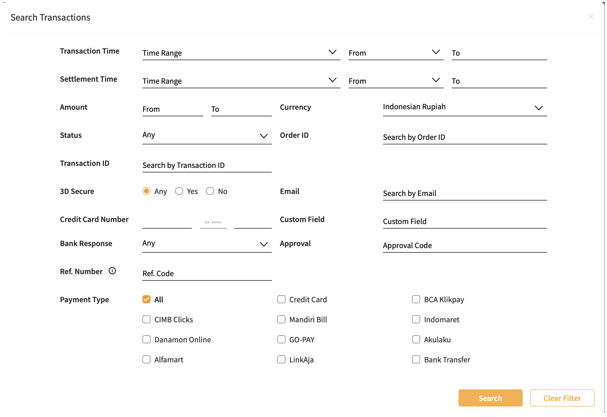
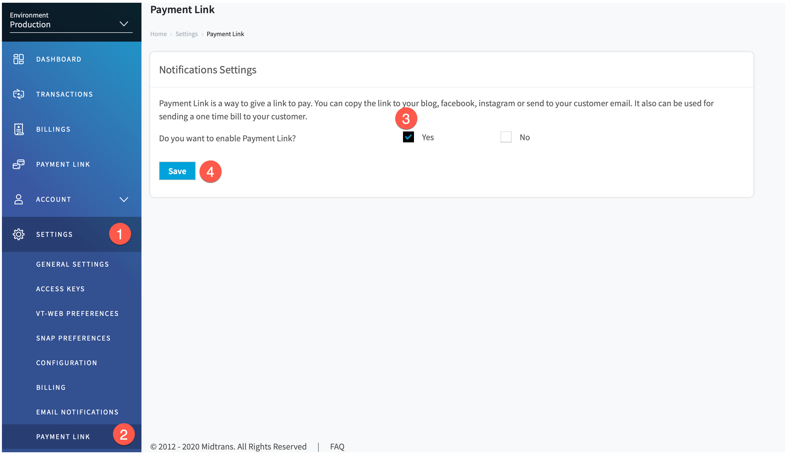
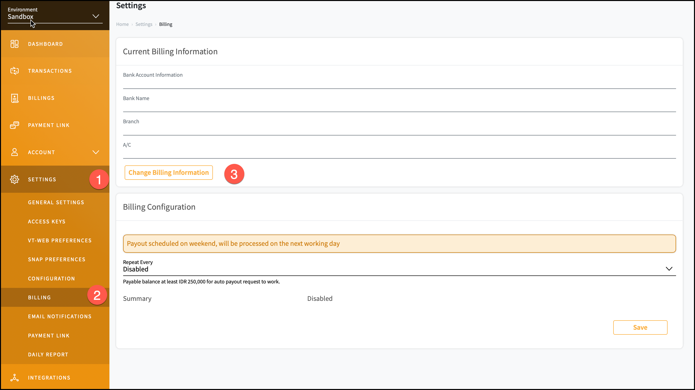

# Midtrans Dashboard Usage
You can register to the Merchant Administration Portal (MAP) and login to your account. By default, the *Dashboard* is displayed. On the *Dashboard*, you can see all your transaction details at-a-glance.

## Dashboard

To view *Dashboard*, follow the steps given below.

1. Login to your MAP account.
2. On the home page, click **Dashboard**.
  
  *Dashboard* pane is displayed.

>***Notes***:
>
>* After login, you are automatically redirected to the *Dashboard* pane.
>* You can click Midtrans logo, to navigate to the Dashboard pane from any other pane.
>* Transaction data is retained on MAP for 6 months. Please contact your Midtrans PIC if you are looking for data beyond that limit.
The table given below describes the fields and icons on the *Dashboard*.

| Label | Field                      | Description                                                  | Remarks                                                      |
| ----- | -------------------------- | ------------------------------------------------------------ | ------------------------------------------------------------ |
| 1     | Expand or Shrink button    | It shrinks or expands the sidebar menu                       | You can click to shrink or expand the sidebar menu. This can be used to expand the visibility of the dashboard if required. |
| 2     | Environment drop-down list | It displays the current environment.                         | To change environment, click and select the required environment from the drop-down list. |
| 3     | Merchant Name              | It displays the name of the merchant.                        | Your name entered while registering to the MAP is displayed here. |
| 4     | Search Box                 | It helps you to search for a particular transaction details. | You will be directed to the *Transactions* page for the search criteria. |
| 5     | Notification icon          | It helps to see the transaction notifications.               | You can click on the icon to see transaction notifications.  |
| 6     | Email Address              | It displays the email address used to login.                 | Your email address used to login to MAP account is displayed here. |
| 7     | Account Information        | It helps you to manage the settings of your account, as well as to log out from the application. | You can click here to see your account information, set your language preferences, contact us and to log out from your account. |
| 8     | Summary pane               | The summary of account transactions till date is displayed here. | You can see the total volume of transaction in Indonesian Rupiah (IDR), total number of transactions, and total amount for payouts (in IDR) for the current date. |
| 9     | Date Filter                | It helps you to filter the data for specific date or duration. | You can click the arrow to select from the drop-down list.   |
| 10    | Transaction Volume pane    | It displays a graphical representation of the volume of successful transaction for each payment method, in Indonesian Rupiah. | Transaction volume on your account is represented as a graph for easy visualization. |
| 11    | Card Acceptance Rate pane  | It displays a graphical representation of successful transactions through card payment. | You can click on any part of the graph to be directed to the *Transactions* page with the specific search criteria. |
| 12    | Top Issuing Bank pane      | It displays a graphical representation of the banks, issuing the card, used for transactions. | You can click on any part of the graph to be directed to the *Transactions* page with the specific search criteria. |
| 13    | Payment Type pane          | It displays a graphical representation of payment type used for the transactions. | You can click on any part of the graph to be directed to the *Transactions* page with the specific search criteria. |

## Transaction

### Viewing Transaction Details

All the transactions recorded on MAP can be viewed on the *Transactions* page. The following details are displayed on *Transition* page.

- Payment type
- Date and time of transaction
- Order ID
- Email id of the customer
- Amount of transaction
- Status of transactions

To view all the transactions on your account, follow the steps given below.

1. Login to your MAP account.
2. On the home page, click **TRANSACTIONS**.
  
  *Transactions* pane is displayed.
   
The table given below describes the fields and buttons on *Transactions* pane.

| Label | Field                  | Description                                                  |
| ----- | ---------------------- | ------------------------------------------------------------ |
| 1     | Search field           | It helps to search for a specific transaction using the order id, status, and so on. |
| 2     | Send to Email          | It helps to send a copy of the report to your email as XSL or CSV file. |
| 3     | Status column          | The status of transactions is displayed here. The status of the transaction can be *Cancel*, *Failure*, *Settlement*. |
| 4     | Number of Transactions | It helps to see the total number of transactions.            |
| 5     | Page Navigation        | It helps to navigate to pages by clicking on the arrows. By default, 20 transaction details are displayed on a page. |

​	The table given below describes the transaction status and their description.

| Status             | Description                                                  |
| ------------------ | ------------------------------------------------------------ |
| Authorize          | The transaction is authorized.                               |
| Cancel             | The transaction is cancelled by you or by the customer.      |
| Challenge          | The transaction is flagged by Midtrans Fraud Detection System. You need to respond immediately. In case of your delayed response, the system denies the transaction. |
| Chargeback         | Transaction is marked to be charged back.                    |
| Failure            | The transaction status is caused by unexpected error during transaction processing.  Failure transaction can be caused by various reasons. Most of the time, it is caused when bank fails to respond.  This occurs rarely. |
| Partial settlement | The transaction status is caused when the transaction is not complete, it is partially settled.   |
| Pending            | The transaction is waiting for approval.                     |
| Settlement         | The transaction is successfully settled. Funds have been received. |
| Success            | The transaction is successful.                               |

### Searching for Transaction

You can filter the transactions by criteria, using search feature.

To search for any transactions, follow the steps given below.

1. Login to your MAP account.
2. On the home page, click **TRANSACTIONS**.
  *Transactions pane* is displayed.
3. Click **Search**.
  
  *Search Transactions* screen is displayed.
4. Enter the search criteria. Refer to the table given below for description of search fields. 
5. Click **Search**.
  The search results are displayed in the *Transactions* pane.

>***Notes***:
>
>* To clear all the fields you have filled, Click **Clear Filter** .
>* to cancel search, Click **[x]** anytime.

The table given below describes the fields on *Search Transactions* screen.

| Field              | Description                                                  |
| ------------------ | ------------------------------------------------------------ |
| Transaction Time   | Select the transaction time from drop-down box. Select the *From* and *To* time. |
| Settlement Time    | Select the settlement time from drop-down list box. Select the *From* and *To* time. |
| Amount             | Enter the range of amount of transaction.                    |
| Currency           | Select the currency from drop-down list.                     |
| Status             | Select the status of transaction from drop-down list.        |
| Order ID           | Enter the order ID.                                          |
| transaction ID     | Enter the transaction ID.                                    |
| 3D Secure          | Click to select 3D Secure radio button.                      |
| Email              | Enter the customer's email id.                               |
| Credit card Number | Enter the credit card number.                                |
| Custom Field       | Any specific information for that particular transaction.    |
| Bank Response      | Select any bank response from drop-down list.                |
| Approval           | Enter approval code.                                         |
| Reference Number   | Enter account number, transaction number or tracking reference. Click ⓘ for more details. |
| Payment Type       | Select the appropriate check box for payment type.           |

> ***Note***: You do not have to enter all the fields for search. However, more criteria for search will help to narrow down the results.

### Sending Transaction Report to Email

The details of the transaction like payment information, payment details, customer information, item details, and promo details can be sent as XLS or CSV file to your email address. You can easily customize these details to suit your requirement by selecting the various check boxes. 

The table given below describes the fields and description on *Send Transactions to Email* screen.

| Field           | Description                                                  |
| --------------- | ------------------------------------------------------------ |
| Payment Info    | Under Payment Info, click the appropriate check box like Order ID, Payment type, Currency, Amount, Transaction ID, Transaction status, Transaction Time, Settlement time, Custom Fields, Expired time, FDS Reasons, Mdr amount, Cross reference, and Pop name. The selected information is included in the report. Click **Payment Info** check box to include all of the payment information in the report. |
| Payment Details | Under Payment Details, click the appropriate  check box like Credit card details or Other Payment Type Details. Click the drop-down arrow and select specific details. The selected information is included in the report. Click **Payment Details** check box to include all  Payment Details in the report. |
| Customer        | Under Customer, click the appropriate  check box like Customer email, Customer name, Customer phone, and Shipping address. The selected information is included in the report. Click **Customer** check box to include all the customer details in the report. |
| Item Details    | Under Item Details, click the appropriate check box like Item ID, Item name, Item price, Item quantity, Item subtotal. The selected information is included in the report. Click **Item Details** check box to include all the item details in the report. |
| Promo Details   | Under Promo Details, click the appropriate  check box like Promo code and Promo original amount. The selected information is included in the report. Click **Promo Details** check box to include Promo code and Other Promo original amount in the report. |

####  Sending Transaction Report as XSL file

To send the transaction report to your email, follow the steps given below.

1. Login to your MAP account.
2. On the home page, click **TRANSACTIONS**.
  *Transactions* pane is displayed.
  
3. Click **Send to Email**.
  *Send Transactions to Email* screen is displayed.
  
4. Select the required fields.
5. Click **Send to Email as Excel**.
  The report is sent to your email as XSL file.

>***Notes***:
>
>* Click [x] anytime, to cancel sending report.
>* Please check your spam folder if you cannot find the report in your inbox.
>* If you do not receive your report within 30 minutes, please retry or contact support@midtrans.com.

#### Sending Transaction Report as CSV file
To send the transaction report to your email, follow the steps given below.

1. Login to your MAP account.
2. On the home page, click **TRANSACTIONS**.
  *Transactions* pane is displayed.
3. Click **Send to Email**.
  **Send Transactions to Email** screen is displayed.
  
4. Select the required fields.
5. Click **Send to Email as CSV**.
  The report is sent to your email as CSV file.

> ***Notes***:
>
>* Click [x] anytime, to cancel sending report.
>* Please check your spam folder if you cannot find the report in your inbox.
>* If you do not receive your report within 30 minutes, please retry or contact support@midtrans.com.

### Viewing Transaction Details
You can see the transaction details of a specific order ID.

To view the transaction details, follow the steps given below.

1. Login to your MAP account.
2. On the home page, click **TRANSACTIONS**.
  *Transactions* pane is displayed.
3. Click the specific **ORDER ID**.
  *Transaction* pane is displayed.
  Details of the transaction are displayed on different panes.
  

The table given below describes the different sections on *Transaction* pane.

| Label | Section Name        | Description                                                  |
| ----- | ------------------- | ------------------------------------------------------------ |
| 1     | Transaction Action  | The transaction is flagged for any further action to be taken by you. |
| 2     | Payment information | Order Id, Amount paid, Payment method, and Transaction Status are displayed here. |
| 3     | Order details       | Order ID, Payment type, Amount, Transaction ID, Time, and Status are displayed here. |
| 4     | Customer details    | Name of the customer, Phone Number, Email address, and Postal address are displayed here. |
| 5     | Payment details     | Payment reference number and Expiry time are displayed here. |
| 6     | Item details        | Item number, Product name, Quantity, Price, and Total amount are displayed here. |
| 7     | Payment history     | Any history of earlier payments done by the same customer is displayed here. |

###  Handling Fraudulent Transaction

When a transaction triggers indication of potential fraud activity, it is detected by Midtrans FDS (Fraud Detection System). **Challenge** status is returned when a transaction has been successfully authorized, but it is flagged by our fraud prevention system. This  does not always mean that the transaction is fraudulent. But it may require further review. You can accept the transaction if you trust it.

#### Accepting Fraudulent Transaction
To accept a fraudulent transaction, follow the steps given below.

1. Login to your MAP account.
2. On the home page, click **TRANSACTIONS**.
  *Transactions* pane is displayed.
3. Click **ORDER ID**.
  *Transaction* pane is displayed.
4. Click the ⓘ to see the reason for the **Transaction Challenge** status.
5. After reviewing the transaction, click **Accept**.
   
  The transaction is Accepted.

>***Notes***:
>
>* If transactions with a **Challenge** status is neither accepted nor denied by you, it will be denied by Midtrans at the default settlement time or a custom settlement time defined by you.
>* The default settlement time is scheduled on the same day at 12:00 a.m. or the next day at 4:00 p.m. 

####  Denying Fraudulent Transaction
To deny a fraudulent transaction, follow the steps given below.

1. Login to your MAP account.
2. On the home page, click **TRANSACTIONS**.
  *Transactions* pane is displayed.
3. Click **ORDER ID**.
  *Transaction* pane is displayed.
4. Click the ⓘ to see the reason for the **Transaction Challenge** status.
5. After reviewing the transaction, click **Deny**.
   
  The transaction is Denied.

>***Notes***:
>
>* If transactions with a **Challenge** status is neither accepted nor denied by you, it will be denied by Midtrans at the default settlement time or a custom settlement time defined by you.
>* The default settlement time is scheduled on the same day at 12:00 a.m. or the next day at 4:00 p.m. 

#### Refunding the Transaction Amount
The transaction amount can be refunded to the customer.

To refund a transaction, follow the steps given below.

1. Login to your MAP account.
2. On the home page, click **TRANSACTIONS**.
  *Transactions* pane is displayed.
3. Click **ORDER ID**.
  *Transaction* pane is displayed.
4. Click **Refund**.
  *Refund Details* screen is displayed.
5. Enter the **Amount** in Indonesian Rupiah to specify the refund amount.
6. Enter the **Reason**. This is optional.
7. Click **Proceed**.
  
  The amount is refunded to the customer's account.

***Note***: Not every transactions type is refundable from the *Dashboard*. To know more about types of transactions that are refundable from *Dashboard*, please contact your Midtrans PIC.

#### Cancelling Transactions

After a successful transaction,  you can choose to cancel the transaction. For this, the transaction status should be **Success** or **Pending**.

To cancel a transaction, follow the steps given below.

1. Login to your MAP account.
2. On the home page, click **TRANSACTIONS**.
  *Transactions* pane is displayed.
3. Click **ORDER ID**.
  *Transaction* pane is displayed.
4. Click **Cancel**.
  
  A warning message is displayed.
5. Click **OK**.
  The transaction is cancelled.

## API & Product Configuration

### Accessing Client and Server Keys
To communicate with the Midtrans API, you have to use *Client Key* and *Server Key*.

To get access to the *Client Key* and *Server Key*, follow the steps given below.

1. Login to your MAP account.
2. On the home page, go to **SETTINGS > ACCESS KEYS**.
  *Access Keys* page is displayed.
  
  Users with appropriate permissions, can access *Merchant ID*, *Client Key*, and *Server Key*. Read more about [retrieving API access keys](/en/midtrans-account/overview.md#retrieving-api-access-keys).

### Customizing VT Web Preferences
If you are using our older integration method - VT web, you can customize VT web preferences from the *Dashboard*.

The following VT web preferences can be customized.

- Display Name
- Color Scheme
- Merchant Logo
- Google analytics
- Language Settings

To customize VT Web preferences, follow the steps given below.

1. Login to your MAP account.
2. On the home page, go to **SETTINGS > VT-WEB PREFERENCES**.
  *VT-Web Settings* page is displayed.
3. Edit the required fields.
4. Select the **Color Scheme**.
5. Click to choose logo image.
  The image appears in the **Merchant Logo** field.
  
6. Enter **Google analytics code**.
7. Select a language from **Language** drop-down list.
8. Click **Save Preferences**.
  
  VT Web Preferences are updated.

> ***Notes***:
>
>* Logo area is resized to Height: 50 pixels & width: 600 pixels.
>* Use PNG24 transparent image instead of GIF for transparent logo.
>* Logo file size must not exceed 1 MB.

#### Changing VT-WEB Payment Page Logo

To change VT Web payment page logo, follow the steps given below.

1. Login to your MAP account.
2. On the home page, go to **SETTINGS > VT-WEB PREFERENCES**.
  *VT-Web Settings* page is displayed.
3. Click **Remove/Change Logo**. 
4. Click to choose logo image.
  The image appears in the **Merchant Logo** field.  
5. Click **Save Preferences**.
  
  The page logo is updated.

### Snap Preferences
You can customize preference for SNAP Payment pages. You can upload logo, change theme color, activate/deactivate payment methods, and change language preference.

#### Customizing **Snap** Payment Page
You can change the *Display name*, *Logo*,*Theme Color*, and *Language* for **Snap**.

To edit and reset the **Snap** payment page, follow the steps given below.

1. Login to your MAP account.
2. On the home page, go to **SETTINGS > SNAP PREFERENCES**.
  *SNAP Preferences* page is displayed.
3. Select **Theme and Logo** tab.
4. Enter the **Display Name** field to edit the display name.
5. Click or drag-and-drop, to choose your logo.
6. Select a **Theme Color** from the options.
7. Select a language from **Language** drop-down list..
  A preview of your **Snap** payment page is displayed in the *preview* pane.
8. Click **Save**.
  The Snap Preferences are updated.
   

#### Theme and Logo

Midtrans provides various colors for SNAP payment page, you can also add your business logo.

#### Managing Active Payment Methods on Snap
You can set Enable Payment with Snap Preference on Midtrans Dashboard. This gets applied to all Snap transactions for your account.

The list of payment methods available are given below.

- Credit/Debit Card
- ATM/Bank Transfer
- GoPay
- BCA KlickPay
- CIMB Clicks
- Danamon Online
- Indomaret
- Alfamart
- Akulaku

To manage active payment methods, follow the steps given below.

1. Login to your MAP account.
2. On the home page, go to **SETTINGS > SNAP PREFERENCES**.
  *SNAP Preferences* page is displayed.
3. Select **Payment Channels** tab.
  A list of payment methods is displayed.
4. On the *Preview* window, click [x] to disable any payment channel.
  Click **Apply Recommended Sorting** to use our recommendation sorting. You can drag and drop manually to sorting payment channel list.
5. Click ➕ to add to active payment channels.
6. Click **Save**.
  
  Snap active payment preferences are configured.

#### Bank Transfer: Bank List
Currently Midtrans supports Bank Transfers via several banks (BCA, BNI, Mandiri, Permata) and payment through the ATM Bersama, ALTO and Prima networks. You can configure the bank payment methods to Bank Transfer. It is possible to change the ATM bank processor on Payment channel of **Other Bank**.

To configure bank transfer, follow the steps given below.

1. Login to your MAP account.
2. On the home page, go to **SETTINGS > SNAP PREFERENCES**.
  *SNAP Preferences* page is displayed.
3. Select **Bank List** tab.
4. Select **Other Bank/ATM Bank Processor** from the drop-down list.
5. Click **Save**.
  
  The table given below describes the Payment List and Payment Methods on Snap. 

| Payment List on Snap       | Payment Method          | Description                                      |
| -------------------------- | ----------------------- | ------------------------------------------------ |
| Bank Transfer - BCA        | BCA Virtual Account     | Payment via BCA Channel                          |
| Bank Transfer - Mandiri    | Mandiri Bill Payment    | Payment via Mandiri Channel                      |
| Bank Transfer - Permata    | Permata Virtual Account | Payment via Permata Channel                      |
| Bank Transfer - BNI        | BNI Virtual Account     | Payment via BNI Channel                          |
| Bank Transfer - Other Bank | Permata VA / BNI VA     | Payment via ATM Bersama, ALTO and Prima networks |

#### Configuring Custom Payment Expiry Settings on Snap
You can set custom preferences for payment expiry on **Snap** payment page.

To set the payment expiry to a custom duration, follow the steps given below.

1. Login to your MAP account.
2. On the home page, go to **SETTINGS > SNAP PREFERENCES**.
  *SNAP Preferences* page is displayed.
3. Click **System Settings** tab.
4. Select **custom** check box.
5. Click to enter the duration.
6. Click the arrow to select the **Units of duration** drop-down list.
7. Click **Save**.
  
  Snap is configured for custom payment expiry date settings.

> ***Notes***: 
>
> - The default settings for GoPay is 15 Minutes.
> - The default settings for other payment methods is one day.

#### Configuring Default Payment Expiry Settings on Snap
You can set preferences for payment expiry on **Snap** payment Page.

To set the payment expiry to a default, follow the steps given below.

1. Login to your MAP account.
2. On the home page, go to **SETTINGS > SNAP PREFERENCES**.
  *SNAP Preferences* page is displayed.
3. Select **System Settings** tab.
4. Select **Default** check box.
5. Click **Save**.
  
  Snap is configured for default payment expiry date settings.

### Enabling Payment Link
Customers can make payments to you through links sent to the them through blogs, Facebook, Instagram, or Email.

To configure the payment link, follow the steps given below.

1. Login to your MAP account.
2. On the home page, go to **SETTINGS > PAYMENT LINK**.
  *Notifications Settings* page is displayed.
3. Select the **Yes** check box to enable payment link.
4. Click **Save**.
  
  A message to confirm your action is displayed.
5. Click **OK**.
  The payment link is enabled.

#### Disabling Payment Link
To disable payment link, follow the steps given below.

1. Login to your MAP account.
2. On the home page, go to **SETTINGS > PAYMENT LINK**.
  *Notifications Settings* is displayed.
3. Select the **No** check box to disable payment link.
4. Click **Save**.
  A message to confirm your action is displayed.
5. Click **OK**.
  The payment link is disabled.

## Settings

### Editing General Settings
You can edit the general settings on your account. The following details can be edited.

-  Merchant Name
-  Official Merch. Name
-  Director Name
-  Director Phone Number
-  Fax
-  NPWP (Nomor Pokok Wajib Pajak)
-  NPWP Name
-  URL Merchant
-  Merchant email
-  Timezone
-  Business Address
-  Branch Address

To edit, follow the steps given below.

1. Login to your MAP account.
2. On the home page, go to **SETTINGS > GENERAL SETTINGS**.
  *General Settings* page is displayed.
3. Enter the required details on *Business Settings* pane.
4. Click **Save**.
 
 Your settings are updated.
 > ***Note***: You can hover over ⓘ to learn more about the respective fields.
   

### Editing Interface Settings
Custom Fields is a feature that enables you to charge a transaction with unique data according to your need. Custom field allows you to send your own (custom) data to Core API. This data is then sent back from Midtrans to your backend on HTTP notification. It is displayed on Dashboard under the order detail.

To edit the interface settings, follow the steps given below.

1. Login to your MAP account.
2. On the home page, go to **SETTINGS > GENERAL SETTINGS**.
  *General Settings* page is displayed.
3. Enter the **Custom field 1 label**.
4. Enter the **Custom field 2 label**.
5. Enter the **Custom field 3 label**.
6. Click **Save**.
7. Click **Enable Beta Release**.
  
  The interface settings are updated.

### Update Billing Information
You can configure the billing information such as bank name, branch name, and account number.

To update and configure billing information, follow the steps given below.

1. Login to your MAP account.
2. On the home page, go to **SETTINGS > BILLING**.
  *Current billing information*  is displayed.
3. Click **Change Billing Information**.
  
​  *Current billing information* screen is displayed.
4. Enter **Account Name**.
5. Enter **Account number**.
6. Enter **Bank name**.
7. Enter **Branch Name**.
8. Click **Save**.
  
  A message to confirm your actions is displayed.
9. Click **OK**.
  The billing information is updated.

### Scheduling Automated Payouts
On MAP, you can configure the frequency of payout, so that payouts occur automatically according to the schedule. This makes sure that you do not miss any deadline for payouts.

To configure the frequency of payout, follow the steps given below.

1. Login to your MAP account.
2. On the home page, go to **SETTINGS > BILLING**.
  *Billing Configuration*  is displayed.
3. Click to select the **Repeat Every** drop-down list.
4. Click **Save**.
  
  The frequency of payout is configured.

   

### Configuring Email Notifications
Midtrans provides email notification for you and your customers to receive the transaction status. Our system sends **Email Notification** to the email address configured on MAP whenever the transaction status changes. This feature is enabled by default.
To configure email notifications, follow the steps given below.

1. Login to your MAP account.
2. On the home page, go to **SETTINGS > EMAIL NOTIFICATIONS**.
  *Email Notifications* page is displayed.
3. Select the **Send email to customer** check box, to enable email notification to the customer. When transaction status changes, customers will receive email notification about the transaction.
4. Select the **Send email to me** check box, to receive email notifications whenever a transaction occurs.
5. Enter email address on which to receive notifications of transactions, in the **Email Notification** field. Use comma as a separator, to include multiple email addresses. Example: `email-id-1@myemail.com, email-id-2@myemail.com`
6. Enter the email address of the sender (that would appear in the email notifications sent to the customer) in the **Email Support** field.
7. The email address in **Email development** field receives notifications in case of validation errors.
8. Enter the email address of finance department in **Email Finance**.
9. In **Email Payout Report** enter the email address to receive pay out reports.
10. Select language from the **Email Language** drop-down.
11. Enter phone number in **Customer Service Number**, to receive phone calls from customers.
12. Click **Save Preferences**.
  
  A message to confirm your actions is displayed,
13. Click **OK**.
  The email notifications are configured.

### Configuring Daily Report
You can customize and choose the information to be available in the daily report. The daily reports can be configured to be sent to several email addresses at the same time. You can also disable the daily report feature.

#### Enabling Daily Report
To receive transaction report daily, follow the steps given below.

1. Login to your MAP account.
2. On the home page, go to **SETTINGS > DAILY REPORT**.
  *Daily Report* page is displayed.
3. Under the *Report Configurations* section, select the **Yes** check box to enable email daily report. 
4. Enter the **email address** to receive the daily report. To send the daily report to multiple emails, separate the email addresses with comma. Example: `email-id-1@myemail.com, email-id-2@myemail.com`
5. Select the check box to include relevant details in the daily report.
  Click **Add More** to add more metadata.
6. Click **Save Preferences**.
  
  A message to confirm your action is displayed.
7. Click **OK**.
  The daily report is configured. Regular email reports are sent to the address.

#### Disabling Daily Report
To stop receiving the daily report, follow the steps given below.

1. Login to your MAP account.
2. On the home page, go to **SETTINGS > DAILY REPORT**.
  *Daily Report* page is displayed.
3. Under *Report Configurations* section, select the **No** check box to disable email daily report.
4. Click **Save Preferences**.
  
  A message to confirm your action is displayed.
5. Click **OK**.
   The daily report is disabled.

#### Resending Daily Report
To resend a daily report for a particular day, follow the steps given below.

1. Login to your MAP account.
2. On the home page, go to **SETTINGS > DAILY REPORT**.
  *Daily Report* page is displayed.
3. Under the *Resend Daily Report* section, enter the **Date** in `DD/MM/YYYY` form.
4. Click **Send**.
  
  A message to confirm your action is displayed.
5. Click **OK**.
   The Daily transaction report of the specified date is delivered to your email id. Please check your inbox.

## Account

The *Account* menu has some important functionalities that can help you manage your account. You can edit and manage the following:

- User Profile
- IP whitelisting
- Manage users
- Change roles
- View activity log

### Updating User Profile
You can update your profile details such as your full name, email address, and phone number. You can also reset your password.

#### Updating User Profile from Accounts Menu
To edit or update your profile, follow the steps given below.

1. Login to your MAP account.
2. On the home page, go to **ACCOUNTS > USER PROFILE**.
  *User Profile* page is displayed.
3. Edit the required fields.
4. Click **Save Changes**.
  
  The profile is updated successfully.

#### Updating User Profile from Account Information  
To edit your profile from the Account Information, follow the steps given below.

1. Login to your MAP account.
2. Click on your *Account* *Information* icon.
  Drop-down menu appears.
3. Click the settings icon.
  *User Profile* page is displayed.
4. Follow steps 3 and 4 from [*Updating User Profile from Accounts Menu*](#updating-user-profile-from-accounts-menu).
  
​  The profile is updated successfully.

### Resetting Password
To reset your password, follow the steps given below.

1. Login to your MAP account.
2. On the home page, go to **ACCOUNTS > USER PROFILE**.
  *User Profile* page is displayed.
3. Enter **Current Password**.
4. Enter the **New Password**. 
5. Enter **New Password Conformation**.
6. Select the **Enable Two-factor authentication**  check box. 
7. Click **Save Changes**.
  
  Your password is changed successfully.

>***Notes***: 
>
>* Make sure your password has at least eight characters, including minimum of one number, one lowercase letter, and one uppercase letter.
>* The Two-Factor Authentication (2FA) is an additional security feature to authenticate the user. Install Google Authenticator on your Android or iOS enabled device and scan the barcode.
   
     

### IP Whitelisting
IP whitelisting is an additional security feature often used for limiting and controlling the access to trusted users only. IP whitelisting allows MAP to be accessible only through the specified IP addresses. If someone tries to login with an IP address other than the one specified here, the access is denied.

To whitelist an IP address, follow the steps given below.

1. Login to your MAP account.
2. On the home page, go to **ACCOUNTS > IP WHITELIST**.
  *Setting IP* page is displayed. 
  Enter the IP address in **IP Address Whitelist** field.
3. Click **Add**.
  
  A message to confirm your action is displayed.
4. Click **Ok**.
  The new IP address is whitelisted. Any access to the MAP account from any other IP address is prohibited.

   

>***Note***: 
>
>Make sure that you are using **static IP address** from your internet provider. If you use **dynamic IP address**, your **access to the MAP might be denied**, because your IP address may be changed depending on the Internet provider assignment.

### Managing Other Users on your Account

MAP allows you to add new users and manage the accessibilities of these users. You can also edit or delete a user.

To view and manage users, follow the steps given below.

1. Login to your MAP account.
2. On the home page, go to **ACCOUNTS > USER MANAGEMENT**.
  
  *User Management* page is displayed.
   
The table given below describes the different panes on *User Management* pane.

| Label | Name                 | Description                                                  |
| ----- | -------------------- | ------------------------------------------------------------ |
| 1     | User List Pane       | It has a list of different users in your account with their User ID, Full Name, Role, and Action.  You can also edit or delete the users here. |
| 2     | Create New User Pane | You can create new users on your account and allow different accessibilities. |

The table given below describes different roles and their accessibilities.

| Role                 | Access                                                       |
| -------------------- | ------------------------------------------------------------ |
| Administrator        | The super user with complete access rights. It is usually reserved for business owner/CEO/GM. |
| Operation Staff      | They can Cancel/Accept/Deny transaction.                     |
| Finance Staff        | They can manage payout and edit billing information.         |
| Developer / IT Staff | They can access technical configurations.                    |
| Customer Service     | They can access transaction status only.                     |
| Sandbox IT Staff     | They have access to technical configuration in *Sandbox* environment only. |

### Creating New Users

To create a new user, follow the steps given below.

1. Login to your MAP account.
2. On the home page, go to **ACCOUNT > USER MANAGEMENT**.
  *Create New User* pane is displayed.
3. Enter the **Full Name**.
4. Enter the **Email Address**.
5. To **Activate Account**, select *Yes*; select *No* otherwise.
6. Select the appropriate **Role** check box. 
7. Click **Create User**.
  
  A message to confirm your action is displayed.
8. Click Ok.
  The new user is created and listed in the *User List* pane.

### Editing User Details

To edit the details of a user, follow the steps given below.

1. Login to your MAP account.
2. On the home page, go to **ACCOUNT > USER MANAGEMENT**.
  *User Management* page is displayed.
3. Click the specific **User ID**.
   **Or**
   Click **Edit** under *Action* corresponding to the *User ID* you want to edit.
  
  *Edit User Form* is displayed.
4. Edit the required fields.
5. Click **Update User**.
  
  A message to confirm your action is displayed.
6. Click **OK**.
  User details are updated. The *User List* pane is updated with the new details.

### Deleting User Details
To delete the user details, follow the steps given below.

1. Login to your MAP account.
2. On the home page, go to **ACCOUNT > USER MANAGEMENT**.
  *User Management* page is displayed.
3. Click **Delete** under *Action*, corresponding to the *User ID* you want to delete.
  
  A message to confirm your action is displayed.
4. Click **OK**.
  The user details are deleted. The updated *User List* is displayed.

### Monitoring Activities of Users
You can monitor the following details of activities of different users on your account:

- User name
- IP address used to access the account
- Action taken after login
- Time of login (Western Indonesian Time)

To monitor the activities of the users, follow the steps given below.

1. Login to your MAP account.
2. On the home page, go to **ACCOUNT > ACTIVITY LOG**.
  *Activity Log* page is displayed.
  
  Log record of all the activities on the account is displayed on the *Log* pane. 
  The table given below describes different panes on *Activity Log* page.

| Label | Name      | Description                                                  |
| ----- | --------- | ------------------------------------------------------------ |
| 1     | Pencarian | Search activity of other users using email address, email id or action |
| 2     | Log       | Log of all the activities on the account is displayed with User name, IP address, action taken, and time |

### Searching for Activity Log
Search feature makes it easier for you to find activity logs of specific accounts. You can either search using email address, IP address, or action.

To search an activity, follow the steps given below.

1. Login to your MAP account.
2. On the home page, go to **ACCOUNT > ACTIVITY LOG**.
  *Activity Log* page is displayed.
3. Enter the search criteria (**Email address**, **User name**, **IP Address**, or **Action**).
4. Click **Search**.
  The result is displayed in the *Log* pane.

  > ***Note***: 
  >
  > You do not have to enter all the fields for search. But it will help you to narrow down your search results. 
  For example, the image below shows the search result for the *User name*: Asri. 
  

## Contact Us
To send us your questions, concerns or feedbacks from *Dashboard*.

1. Login to your MAP account.
2. Click on your profile icon.
3. Click **Contact Us**.
  *Contact Us* page is displayed.
4. Enter the **Subject**.
5. Enter the **Description**. 
6. Click **Submit**.
  
  The message is sent to Midtrans. Our technical support team will contact you soon.
