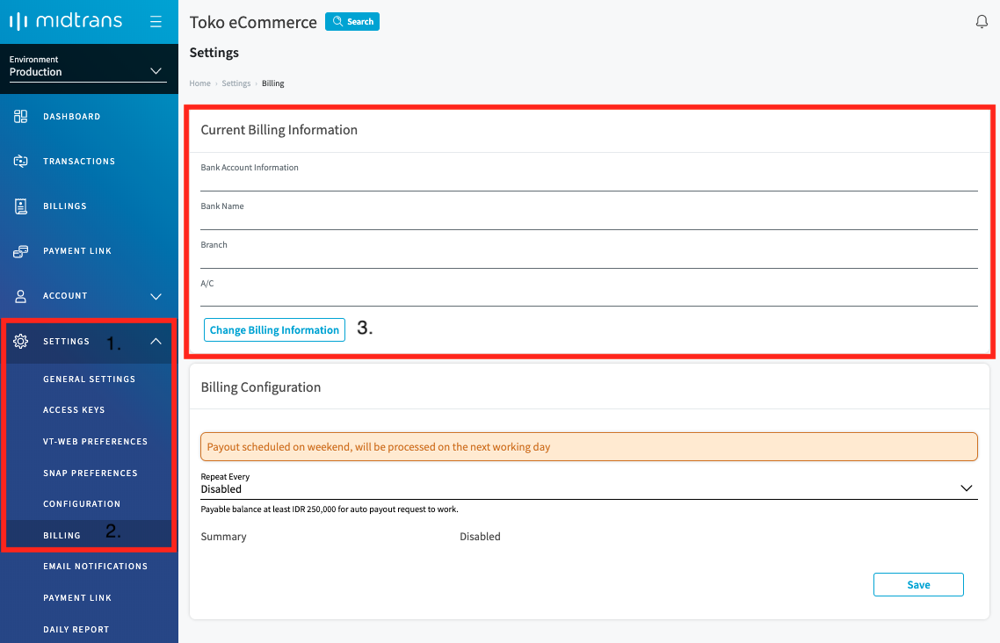
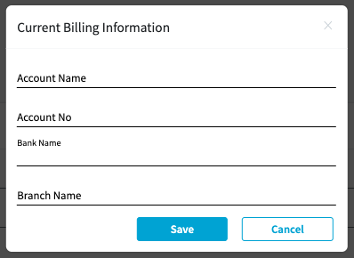
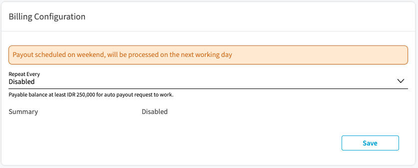
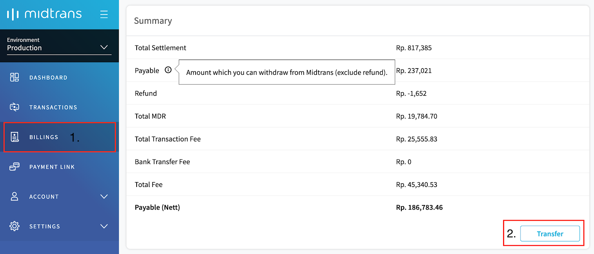
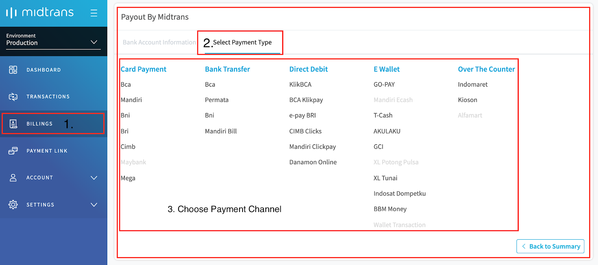
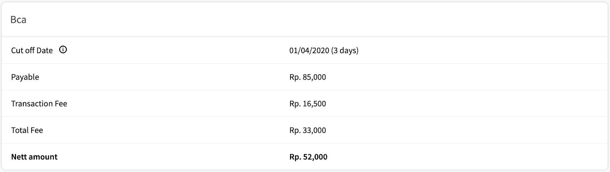
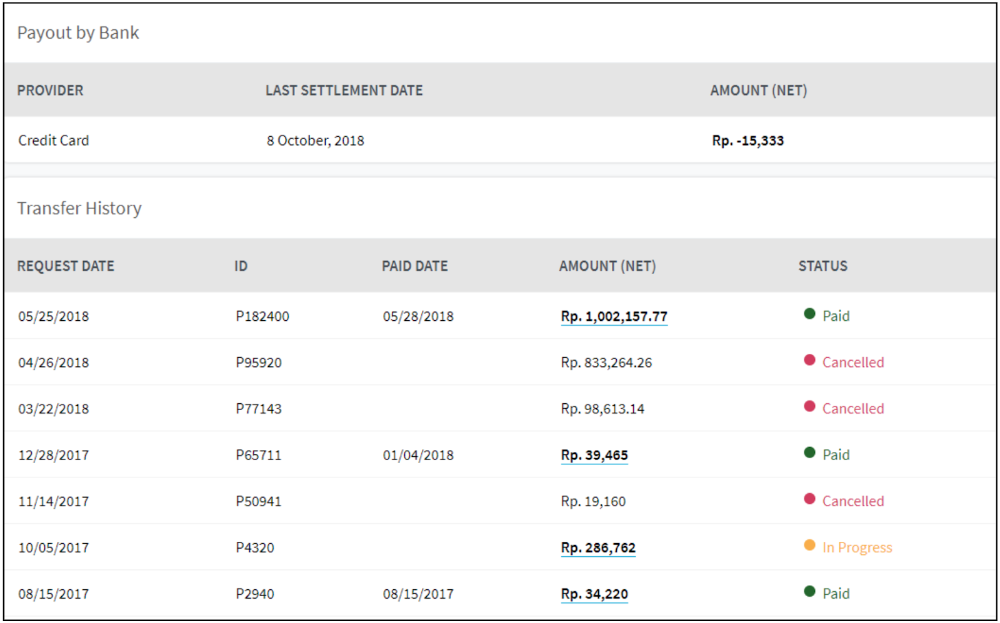

# Receiving Your Fund as Payout

## Billings Page
Billings page displays the financial information between merchant and Midtrans. 

This pages displays 

* The amount of funds that can be withdrawn 
* The bank account information to which the funds are disbursed
* The history of payouts

### Configure Billing Information
Midtrans will only payout funds to the account configured on the MAP. Please ensure that the account listed on MAP is in accordance with the Agreement (PKS). Make sure to fill out your Billing Information properly. You can change the destination account on the bank account information. You can change billing account from **BILLINGS** menu or **SETTINGS > BILLING**

To configure the billing information, follow the steps given below.
1. Login to your Midtrans Account Portal. 

2. Click **SETTINGS** (1) > **BILLING** (2)

3. Click **Change Billing Information** (3) to change the Billing Information.

   

   *Current Billing Information* screen is displayed.

   4. Enter the **Account Name**.

   5. Enter the **Account No**. 

   6. Select the **Bank Name** from the drop-down.

   7. Enter the **Branch Name**.

   8. Click **Save**.

      

      A confirmation message is displayed.

   9. Click **OK** to update the billing information.
   
      Upon successful update, *Success saved* message is displayed on the Billing screen.
   
   If you want to configure the billing information from the **BILLINGS** menu, you can click **Change Bank Account** then you will be redirected to **Settings > Billing** menu to follow the same steps above.

### Scheduled Payout
Midtrans provides feature to schedule automated payout, that can be set as daily, weekly or monthly.

?> The condition for scheduled payout is, The minimum amount of funds being disbursed should be IDR 250,000. If the amount of funds to disburse has not reached IDR. 250,000, the system waits until the minimum is reached. If the amount is reached before the next schedule, the disbursement is processed on the next schedule.

### Manual Payout
You can manually withdraw funds from Midtrans. To withdraw funds, follow the steps given below.

1.  From the Dashboard, go to **Billings** menu (1).

   Summary of the funds is displayed. 

2. Click **Transfer** (2).

   

   The amount is transferred to the specified account. 

#### Detail Field Description

Field | Description
--- | ---
Total Settlement | Amount of transaction funds that have been settled.
Payable | Amount of funds that can be withdrawn excluding pending-refund. 
Refund | The amount of approved refund.
Total MDR | Total transaction fee (bank) for credit card payment methods.
Total Transaction Fee | Total transaction fee (Midtrans) for all payment methods, excluding MDR.
Bank Transfer Fee | Transfer fee if the payout account is on a different bank than Midtrans.
Total Fee | Total amount of fee of transactions.
Payable (Nett) | The amount of funds that can be disbursed after deducting the transaction fee.
Cut off Date | You can only withdraw funds from the transactions received before the displayed date. 

### Transaction Fund Details Per Payment Method
To see transactions fund break down by certain payment method, follow the steps given below.

1.  Go to **BILLINGS**. 
2. Switch to **Select Payment Type** tab.
3. Select the particular payment method from the options provided.

The summary of transaction is displayed as shown in the figure below.

### Payout History
Midtrans keeps a history of payout. If you click on the amount of funds, a detailed list of transactions (as source of fund) of that particular payout, is displayed.

- **Payout by Bank**: Amount of payout funds sent directly by the bank (for the facilitator business model).
- **Transfer History**: History of payout funds transfer sent by Midtrans (for the aggregator business model).