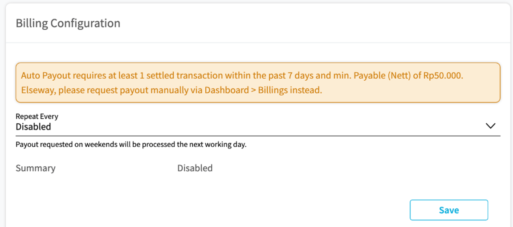

## Billings Page
Billings page is a page to view financial information between merchant and Midtrans. On this page merchant can find out the amount of funds that can be withdrawn to merchant (payout), the bank account information to which the funds are disbursed, and the history of payouts.

### Configure billing information
Midtrans will only payout funds to the account configured on the MAP. Please ensure that the account listed on MAP is in accordance with the Agreement (PKS). Make sure you fill out your Billing Information properly. You can change the destination account on the bank account information. Merchant can change billing account from **Billings** menu or **Settings > Billings**

Configure the billing information on **Settings > Billing** in MAP:
1. Login to your Midtrans Account Portal. 
2. Click **Settings** (1)  > **Billing** (2)
3. Click **Change Billing Information** (3) to change Billing Information.
4. On the pop-up, please make sure to submit Billing Information properly.
Click **Save**.

If you want to configure the billing information from the **Billing** menu, you can click **Change Bank Account** then you will be redirected to **Settings > Billing** menu to follow the same step above.

### Scheduled Payout
Feature to schedule automated payout, that can be set as daily, weekly or monthly.

In order to be processed by scheduled payout, certain conditions must be met, including:
1. The minimum requirement of funds being disbursed is at minimum IDR 250,000. If the amount of funds has not reached IDR. 250,000, it will wait until the minimum is reached on the next schedule, then the funds will be processed.

### Manual Payout
Merchant can simply click **Transfer** button to withdraw funds, Go to **Billings** menu (1), it will display detailed information about the funds that will be disbursed. Click **Transfer** (2)

#### Detail Field Description

Field | Description
--- | ---
Total Settlement | Amount of transaction funds that have been settled.
Payable | Amount of funds that can be withdrawn excluding pending-refund, before deducted by transaction fee
Refund | The amount of approved refund.
Total MDR | Total transaction fee (bank) for credit card payment methods.
Total Transaction Fee | Total transaction fee (Midtrans) for all payment methods, excluding MDR.
Bank Transfer Fee | Transfer fee if the payout account is on a different bank than Midtrans.
Total Fee | Total amount of fee of transactions.
Payable (Nett) | The amount of funds that can be disbursed after deducting the transaction fee.
Cut off Date | Merchant can only withdraw funds from the transaction that received before the displayed date

### Transaction Fund Details Per Payment Methods
To see transactions fund break down by certain payment method, you can use tab **Select Payment Type**, then choose the particular payment methods

### Payout History
Midtrans will keep a history of payout. If you click on the amount of funds, a detailed list of transactions (as source of fund) of that particular payout will be displayed.

- **Payout by Bank**: Amount of payout funds sent directly by the bank (for the facilitator business model).
- **Transfer History**: History of payout funds transfer sent by Midtrans (for the aggregator business model).