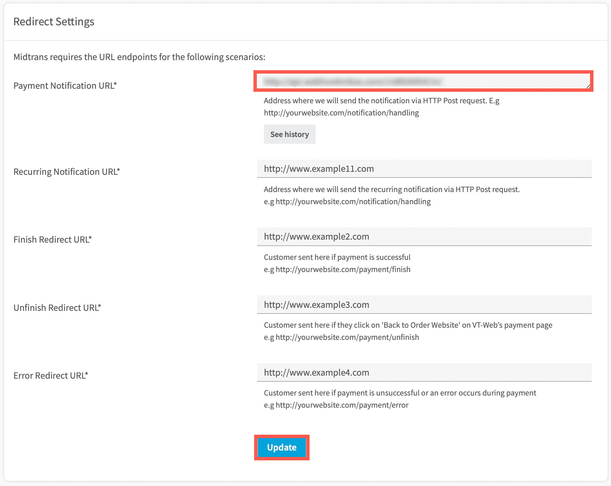

# Cardless Credit Payment Integration
<hr>
<i>Cardless Credit</i> is one of the payment methods offered by Midtrans. Using this payment method, the customers can shop online and make payments in installments. Midtrans sends real-time notifications to you when the customer completes the payment.

Currently, Midtrans can integrate with [Akulaku Inc](https://www.akulaku.com).


<details>
<summary><b>Sequence Diagram Transaction Flow</b></summary>
<article>


</article>
</details>

## Sandbox Environment
The steps given below uses [Midtrans *Sandbox* environment](https://account.midtrans.com/) to test the integration process. Please make sure that you use the *Server Key* and *Client Key* for the *Sandbox* environment. For more details, refer to [Retrieving API Access Keys](/en/midtrans-account/overview.md#retrieving-api-access-keys).

### Steps for integration
To integrate with *Cardless Credit* payment method, follow the steps given below.

#### 1. Sending transaction data to Charge API

The *Charge API* request is sent with the transaction details, from the merchant backend.

#### Endpoints

| Environment | Method | URL                                        |
| ----------- | ------ | ------------------------------------------ |
| Sandbox     | POST   | https://api.sandbox.midtrans.com/v2/charge |
| Production  | POST   | https://api.midtrans.com/v2/charge         |

#### Headers

| Header Name   | Description                                            | Required | Values                |
| ------------- | ------------------------------------------------------ | -------- | --------------------- |
| Accept        | The format of the data to be returned.                 | Required | application/json      |
| Content-Type  | The format of the data to be posted.                   | Required | application/json      |
| Authorization | The authentication method used to access the resource. | Required | Basic **AUTH_STRING** |

**AUTH_STRING**: Base64(`ServerKey + :`)<br>Midtrans API validates HTTP request by using Basic Authentication method. The username is your *Server Key* while the password is empty. The authorization header value is represented by AUTH_STRING. AUTH_STRING is base-64 encoded string of your username & password separated by a colon symbol (**:**). For more details, refer to [ API Authorization and Headers](https://docs.midtrans.com/en/technical-reference/api-header).

?> ***Note***: *Server Key* is required to authenticate the request. For more details, refer to [HTTPS Header](https://api-docs.midtrans.com/#http-s-header).

#### POST Body

| Element             | Description                                                  | Type   | Required |
| ------------------- | ------------------------------------------------------------ | ------ | -------- |
| payment_type        | Cardless Credit payment type.                                | String | Required |
| transaction_details | The details of the transaction like the order_id and gross_amount. | -      | Required |
| order_id            | The order_id of the transaction.                             | String | Required |
| gross_amount        | The total amount of transaction.                             | Long   | Required |

#### Sample Request
The sample CURL request for *Charge API* for Akulaku *Cardless Credit* payment method, is shown below. You may implement according to your backend language. For more details, refer to available [Language Libraries](/en/technical-reference/library-plugin.md#language-library).

**<!-- tabs:start -->**

#### **Akulaku**

```bash
curl -X POST \
  https://api.sandbox.midtrans.com/v2/charge \
  -H 'Accept: application/json' \
  -H 'Authorization: Basic <YOUR SERVER KEY ENCODED in Base64>' \
  -H 'Content-Type: application/json' \
  -d '{
  "payment_type": "akulaku",
  "transaction_details": {
      "order_id": "order-101",
      "gross_amount": 44000
  }
}'
```
<!-- tabs:end -->

?>***Tips***: You can customize the `transaction_details` to include more information like `customer_details`, `item_details`, and so on. For more details, refer to [Transaction Details Object](https://api-docs.midtrans.com/#json-object).<br>It is recommended to add more details regarding transaction, so that these details can get added to the report. This report can be viewed from the dashboard.

#### Sample Response and Response Body
The sample response and description of response body for Akulaku *Cardless Credit* payment method is shown below.

#### **Akulaku**

**Sample Response**
```json
{
    "status_code": "201",
    "status_message": "Success, Akulaku transaction is created",
    "transaction_id": "fa05cba0-8ea3-4e46-a2b1-daea2a01785c",
    "order_id": "order-101-1578567480",
    "redirect_url": "https://api.sandbox.midtrans.com/v2/akulaku/redirect/fa05cba0-8ea3-4e46-a2b1-daea2a01785c",
    "merchant_id": "G812785002",
    "gross_amount": "11000.00",
    "currency": "IDR",
    "payment_type": "akulaku",
    "transaction_time": "2020-01-09 17:58:00",
    "transaction_status": "pending",
    "fraud_status": "accept"
}
```


<details>
<summary><b>Response Body</b></summary>
<article>

| Element            | Description                                                  | Type   | Notes                                                        |
| ------------------ | ------------------------------------------------------------ | ------ | ------------------------------------------------------------ |
| status_code        | This is the status of the API call.                          | String | For more details, refer to [Status Codes and Error](/en/technical-reference/error-response-code.md#status-codes-and-errors). |
| status_message     | A message describing the status of the transaction from Akulaku. | String |                                                              |
| transaction_id     | The *Transaction ID* of the specific transaction.            | String |                                                              |
| order_id           | The specific *Order ID*.                                     | String |                                                              |
| redirect_url       | The URL to which the customer is redirected from the bank's website. | String |                                                              |
| merchant_id        | Your merchant ID.                                            | String |                                                              |
| gross_amount       | The total amount of transaction for the specific order.      | String |                                                              |
| currency           | The unit of currency used for the transaction.               | String |                                                              |
| payment_type       | The type of payment method used by the customer for the transaction. | String |                                                              |
| transaction_time   | The date and time at which the transaction occurred.         | String | It is in the format, *YYYY-MM-DD* *HH:MM:SS.*<br>Time zone: Western Indonesian Time (GMT+7) |
| transaction_status | The status of the transaction.                               | String | For more details, refer to [Transaction Status](/en/after-payment/get-status.md#transaction-status). |
| fraud_status       | The fraud status of the transaction.                         | String | For more details, refer to [Fraud Status](/en/after-payment/get-status.md#fraud-status). |

</article>
</details>

?>***Note***: The `redirect_url` attribute for the transaction is received.

#### Status Codes and Errors

| Code | Description                            | Notes                                                     |
| ---- | -------------------------------------- | --------------------------------------------------------- |
| 201  | Successful transaction.                | –                                                         |
| 400  | The `transaction_details` are missing. | Make sure the `order_id` and `gross_amount` are included. |
| 413  | Syntax error.                          | Check the syntax.                                         |
| 500  | Internal system error occurred.        | You can try again later.                                  |


#### 2. Redirecting customer to Cardless Credit Website
The `redirect_url` retrieved from [Sending transaction data to API](/en/technical-reference/core-api/cardless-credit.md#sending-transaction-data-to-api) is used to redirect the customer to the bank's website.
The customer is then redirected through server-side redirect, using JavaScript like `window.location=[REDIRECT URL]`, or using HTML link `<a href="[REDIRECT URL]">Pay Here!</a>`.
The customer can complete the payment on this page.

For more details, refer to [Testing Payment on Sandbox](/en/technical-reference/sandbox-test.md#cardless-credit).

#### 3. Configuring landing page

After the customer completes the payment, the bank's website redirects the customer to *Finish Redirect URL* which can be configured on MAP (Merchant Administration Portal).

<details>
<summary><b>Configuring Finish Redirect URL</b></summary>
<article>

To configure the *Finish Redirect URL*, follow the steps given below.

1. Login to your MAP account.

2. On the Home page, go to **SETTINGS > CONFIGURATION**.
   *Configuration* page is displayed.
   
3. Enter **Finish Redirect URL** with your landing page endpoint.

4. Click **Update**.
   A confirmation message is displayed.

   

   The *Finish Redirect URL* is configured.
   
   </article>
   </details>

?>***Note***: Please make sure the *Finish Redirect URL* endpoint can receive the POST request .

The sample code in *Native PHP* is given below. Please adjust the code to your own environment.

#### Sample Code
```php
<?php
    $response = $_POST['response']; //get the json response
    $decoded_response = json_decode($response);
    $order_id = $decoded_response->order_id;//how to access
?>
```
#### Sample Response
```json
{
    "status_code": "201",
    "status_message": "Success, Akulaku transaction is created",
    "transaction_id": "fa05cba0-8ea3-4e46-a2b1-daea2a01785c",
    "order_id": "order-101-1578567480",
    "redirect_url": "https://api.sandbox.midtrans.com/v2/akulaku/redirect/fa05cba0-8ea3-4e46-a2b1-daea2a01785c",
    "merchant_id": "G812785002",
    "gross_amount": "11000.00",
    "currency": "IDR",
    "payment_type": "akulaku",
    "transaction_time": "2020-01-09 17:58:00",
    "transaction_status": "pending",
    "fraud_status": "accept"
}
```
#### 4. Handling post-transaction
When the transaction status changes, Midtrans notifies you at the redirect URL and sends HTTP notification to the merchant backend. This ensures that you are updated of the transaction status securely.

HTTP POST request with JSON body will be sent to your *Payment Notification URL* configured on dashboard.

<details>
<summary><b>Configuring Payment Notification URL</b></summary>
<article>

To configure the Payment Notification URL, follow the steps given below.

1. Login to your MAP account.

2. On the Home page, go to **SETTINGS > CONFIGURATION**.
 *Configuration* page is displayed.
 
3. Enter **Payment Notification URL**.

4. Click **Update**.
   A confirmation message is displayed.

   

   The *Payment Notification URL* is configured.
   
   </article>
   </details>

The sample HTTP notification request received at merchant backend for Akulaku *Cardless Credit* payment method is given below.

<!-- tabs:start -->

#### **Akulaku**
```json
{
  "transaction_time": "2020-01-09 17:58:00",
  "transaction_status": "settlement",
  "transaction_id": "fa05cba0-8ea3-4e46-a2b1-daea2a01785c",
  "status_message": "midtrans payment notification",
  "status_code": "200",
  "signature_key": "331d8619f0c53ce97abf4cfc91fae8d8d0b11da1640b5bb136b0cfbc0da161d50fc6d0dd0d7f893977881710a2d2c174d9e036aaaa772e80fdeac6e9fb60e6b9",
  "settlement_time": "2020-01-09 18:00:48",
  "payment_type": "akulaku",
  "order_id": "order-101-1578567480",
  "merchant_id": "G812785002",
  "gross_amount": "11000.00",
  "fraud_status": "accept",
  "currency": "IDR"
}
```

<!-- tabs:end -->

<div class="my-card">

#### [Handling Webhook HTTP Notification](/en/after-payment/http-notification.md)
</div>

## Switching to Production Environment
Follow the steps given below to switch to Midtrans *Production* environment and to accept real payments from real customers.

1. Change API domain URL from `api.sandbox.midtrans.com` to `api.midtrans.com`.
2. Use *Client Key* and *Server Key* for *Production* environment. For more details, refer to [Retrieving API Access Keys](/en/midtrans-account/overview.md#retrieving-api-access-keys).


## Next Step:
<br>

<div class="my-card">

#### [Taking Action of Payment](/en/after-payment/overview.md)
</div>

<div class="my-card">

#### [Core API Advanced Feature](/en/core-api/advanced-features.md)
</div>

<div class="my-card">

#### [Transaction Status Cycle and Action](/en/after-payment/status-cycle.md)
</div>

<hr>

