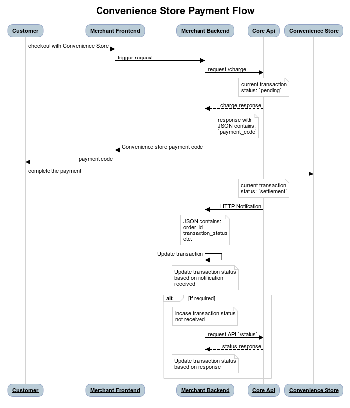
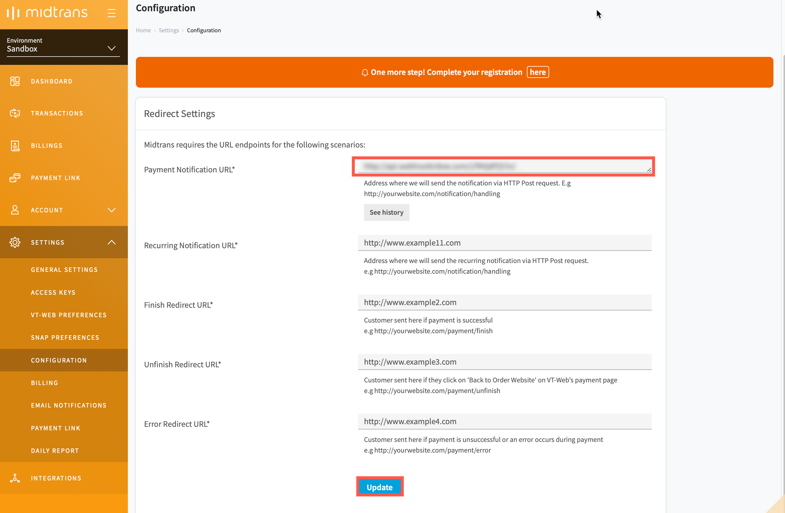

# Over the Counter Payment Integration
<hr>
<i>Over the Counter</i> is one of the payment methods offered by Midtrans. Using this payment method, customers can shop online and make payments at a nearest convenience store. Midtrans sends you real-time notifications when the customer completes the payment.

Currently, Midtrans has integrated with the convenience stores like Alfamart and Indomaret.


<br>


<details>
<summary><b>Sequence Diagram Transaction Flow</b></summary>
<article>



</article>
</details>

## Sandbox Environment
The steps given below uses [Midtrans *Sandbox* environment](https://account.midtrans.com/) to test the integration process. Please make sure that you use the *Server Key* and *Client Key* for the *Sandbox* environment. For more details, refer to [Retrieving API Access Keys](/en/midtrans-account/overview.md#retrieving-api-access-keys).

### Steps for Integration
To integrate with *Over the Counter* payment method, follow the steps given below.

#### 1. Sending transaction data to Charge API 
The *Charge API* request is sent with the transaction details, from the merchant backend.

#### Endpoints

| Environment | Method | URL                                        |
| ----------- | ------ | ------------------------------------------ |
| Sandbox     | POST   | https://api.sandbox.midtrans.com/v2/charge |
| Production  | POST   | https://api.midtrans.com/v2/charge         |

#### Headers

| Header Name   | Description                                            | Required | Values                |
| ------------- | ------------------------------------------------------ | -------- | --------------------- |
| Accept        | The format of the data to be returned.                 | Required | application/json      |
| Content-Type  | The format of the data to be posted.                   | Required | application/json      |
| Authorization | The authentication method used to access the resource. | Required | Basic **AUTH_STRING** |

**AUTH_STRING**: Base64(`ServerKey + :`)<br>Midtrans API validates HTTP request by using Basic Authentication method. The username is your *Server Key* while the password is empty. The authorization header value is represented by AUTH_STRING. AUTH_STRING is base-64 encoded string of your username & password separated by a colon symbol (**:**). For more details, refer to [ API Authorization and Headers](https://docs.midtrans.com/en/technical-reference/api-header).

?> ***Note***: *Server Key* is required to authenticate the request. For more details, refer to [HTTPS Header](https://api-docs.midtrans.com/#http-s-header).

#### Sample Request and Request Body
The sample CURL request for *Charge API* for *Over the Counter* payment method is shown below. You may  implement according to your backend language. For more details, refer to available [Language Libraries](/en/technical-reference/library-plugin.md#language-library).  <!-- tabs:start -->

#### **Alfamart**
**Sample Request**
```bash
curl -X POST \
  https://api.sandbox.midtrans.com/v2/charge \
  -H 'Accept: application/json' \
  -H 'Authorization: Basic <YOUR SERVER KEY ENCODED in Base64>' \
  -H 'Content-Type: application/json' \
  -d '{
  "payment_type": "cstore",
  "transaction_details": {
      "order_id": "order-101",
      "gross_amount": 44000
  }
  "cstore" : {
    "store" : "alfamart",
    "message" : "Messeage ",
    "alfamart_free_text_1": "1st row of receipt,",
    "alfamart_free_text_2": "This is the 2nd row,",
    "alfamart_free_text_3": "3rd row. The end."
  }
}'
```
<details>
<summary><b>Request Body</b></summary>
<article>

| Element              | Description                                                  | Type   | Required |
| -------------------- | ------------------------------------------------------------ | ------ | -------- |
| payment_type         | Direct Debit payment type.                                   | String | Required |
| transaction_details  | The details of the transaction like the order_id and gross_amount. | -      | Required |
| order_id             | The order_id of the transaction.                             | String | Required |
| gross_amount         | The total amount of transaction.                             | Long   | Required |
| cstore               | Convenience store details                                    |        |          |
| store                | The name of the convenience store.                           | String | Required |
| message              | Label displayed in Alfamart POS.                             | String | Optional |
| alfamart_free_text_1 | Customizable first row of text on the printed receipt.       | String | Optional |
| alfamart_free_text_2 | Customizable second row of text on the printed receipt.      | String | Optional |
| alfamart_free_text_3 | Customizable third row of text on the printed receipt.       | String | Optional |

</article>
</details>

#### **Indomaret**

**Sample Request**

```bash
curl -X POST \
  https://api.sandbox.midtrans.com/v2/charge \
  -H 'Accept: application/json' \
  -H 'Authorization: Basic <YOUR SERVER KEY ENCODED in Base64>' \
  -H 'Content-Type: application/json' \
  -d '{
  "payment_type": "cstore",
  "transaction_details": {
      "order_id": "order-101",
      "gross_amount": 44000
  },
  "cstore" : {
    "store" : "indomaret",
    "message" : "Message to display"
  }
}'
```
<details>
<summary><b>Request Body</b></summary>
<article>

| Element             | Description                                                  | Type        | Required |
| ------------------- | ------------------------------------------------------------ | ----------- | -------- |
| payment_type        | Direct Debit payment type.                                   | String      | Required |
| transaction_details | The details of the transaction like the order_id and gross_amount. | -           | Required |
| order_id            | The order_id of the transaction.                             | String      | Required |
| gross_amount        | The total amount of transaction.                             | Long        | Required |
| cstore              | Convenience store details.                                   | Object      |          |
| store               | The name of the convenience store.                           | String (20) | Required |
| message             | Label to be displayed in Indromaret POS.                     | String (20) | Optional |

</article>
</details>

<!-- tabs:end -->

?>***Tips***: You can customize the `transaction_details` to include more information like `customer_details`, `item_details`, and so on. For more details, refer to [Transaction Details Object](https://api-docs.midtrans.com/#json-object).<br>It is recommended to add more details regarding transaction, so that these details can get added to the report. This report can be viewed on the dashboard.

#### Sample Response and Response Body
The sample API responses and a description of the response body for the *Over the Counter* payment method are shown below.
<!-- tabs:start -->

#### **Alfamart**
**Sample Response**
```json
{
    "status_code": "201",
    "status_message": "Success, cstore transaction is successful",
    "transaction_id": "d615df87-c96f-4f5c-9d35-2d740d54c1a9",
    "order_id": "order-101o-1578557780",
    "merchant_id": "G812785002",
    "gross_amount": "162500.00",
    "currency": "IDR",
    "payment_type": "cstore",
    "transaction_time": "2020-01-09 15:16:19",
    "transaction_status": "pending",
    "fraud_status": "accept",
    "payment_code": "8127740588870520",
    "store": "alfamart"
}
```
<details>
<summary><b>Response Body</b></summary>
<article>

| Element            | Description                                                  | Type   | Notes                                                        |
| ------------------ | ------------------------------------------------------------ | ------ | ------------------------------------------------------------ |
| status_code        | This is the status of the API call.                          | String | For more details, refer to [Status Codes and Error](/en/technical-reference/error-response-code.md#status-codes-and-errors). |
| status_message     | A message describing the status of the transaction.          | String |                                                              |
| transaction_id     | The *Transaction ID* of the specific transaction.            | String |                                                              |
| order_id           | The specific *Order ID*.                                     | String |                                                              |
| gross_amount       | The total amount of transaction for the specific order.      | String |                                                              |
| currency           | The unit of currency used for the transaction.               | String |                                                              |
| payment_type       | The type of payment method used by the customer for the transaction. | String |                                                              |
| transaction_time   | The date and time at which the transaction occurred.         | String | It is in the format, *YYYY-MM-DD* *HH:MM:SS.*<br>Time zone: Western Indonesian Time (GMT+7) |
| transaction_status | The status of the transaction.                               | String | For more details, refer to [Transaction Status](/en/after-payment/get-status.md#transaction-status). |
| merchant_id        | Your merchant ID.                                            | String |                                                              |
| payment_code       | The code required for making payment at the convenience store. | String |                                                              |
| store              | The name of the conenience store.                            | String |                                                              |

</article>
</details>

#### **Indomaret**

**Sample Response**

```json
{
  "status_code": "201",
  "status_message": "Success, cstore transaction is successful",
  "transaction_id": "9b3951a4-da50-4089-86df-161d3e9251df",
  "order_id": "order-101n-1578557719",
  "gross_amount": "44000.00",
  "currency": "IDR",
  "payment_type": "cstore",
  "transaction_time": "2020-01-09 15:15:19",
  "transaction_status": "pending",
  "merchant_id": "G812785002",
  "payment_code": "578112341234",
  "store": "indomaret"
}
```
<details>
<summary><b>Response Body</b></summary>
<article>

| Element            | Description                                                  | Type   | Notes                                                        |
| ------------------ | ------------------------------------------------------------ | ------ | ------------------------------------------------------------ |
| status_code        | This is the status of the API call.                          | String | For more details, refer to [Status Codes and Error](/en/technical-reference/error-response-code.md#status-codes-and-errors). |
| status_message     | A message describing the status of the transaction.          | String |                                                              |
| transaction_id     | The *Transaction ID* of the specific transaction.            | String |                                                              |
| order_id           | The specific *Order ID*.                                     | String |                                                              |
| gross_amount       | The total amount of transaction for the specific order.      | String |                                                              |
| currency           | The unit of currency used for the transaction.               | String |                                                              |
| payment_type       | The type of payment method used by the customer for the transaction. | String |                                                              |
| transaction_time   | The date and time at which the transaction occurred.         | String | It is in the format, *YYYY-MM-DD* *HH:MM:SS.*<br>Time zone: Western Indonesian Time (GMT+7) |
| transaction_status | The status of the transaction.                               | String | For more details, refer to [Transaction Status](/en/after-payment/get-status.md#transaction-status). |
| merchant_id        | Your merchant ID.                                            | String |                                                              |
| payment_code       | The code required for making payment at the convenience store. | String |                                                              |
| store              | The name of the conenience store.                            | String |                                                              |

</article>
</details>

<!-- tabs:end -->
?>***Note***: The `payment_code` attribute for the transaction is received.

#### Status Codes and Errors

| Code | Description                            | Notes                                                     |
| ---- | -------------------------------------- | --------------------------------------------------------- |
| 201  | Successful transaction.                | –                                                         |
| 400  | The `transaction_details` are missing. | Make sure the `order_id` and `gross_amount` are included. |
| 413  | There is syntax error.                 | Check the syntax.                                         |
| 500  | Internal system error occurred.        | You can try again later.                                  |

#### 2. Displaying payment code
To display the payment code on your frontend, use `payment_code` retrieved from [Sending Transaction Data to API Charge](/en/technical-reference/core-api/convenience-store.md#sending-transaction-data-to-api).
The customer can proceed with actual payment, at the nearest convenience store by confirming the payment code and the transaction amount. The payment code is shown on merchant website or apps.

For more details, refer to [Testing Payment on Sandbox](/en/technical-reference/sandbox-test.md#convenience-store).

#### 3. Handling transaction notification
When the transaction status changes, Midtrans notifies you at the redirect URL and sends HTTP notification to the merchant backend. This ensures that you are updated of the transaction status securely.

HTTP POST request with JSON body will be sent to your *Payment Notification URL* configured on dashboard.

<details>
<summary><b>Configuring Payment Notification URL</b></summary>
<article>

To configure the Payment Notification URL, follow the steps given below.
1. Login to your MAP account.

2. On the Home page, go to **SETTINGS > CONFIGURATION**.
   *Configuration* page is displayed.
   
3. Enter **Payment Notification URL**.

4. Click **Update**.
   A confirmation message is displayed.

   

   The *Payment Notification URL* is configured.
   
   </article>
   </details>

The sample HTTP notification request received at merchant backend for *Over the Counter* payment method is given below.

<!-- tabs:start -->

#### **Alfamart**
```json
{
  "transaction_time": "2020-01-09 15:16:19",
  "transaction_status": "settlement",
  "transaction_id": "d615df87-c96f-4f5c-9d35-2d740d54c1a9",
  "store": "alfamart",
  "status_message": "midtrans payment notification",
  "status_code": "200",
  "signature_key": "6fd1210e6e4b60d7cc3862780016b110f9d3d56e291172c69b0bbfd60d380be22ad02f1d48bbabeeb81a882d7abbd3d6fa94207bede9132adc1a773489dfd0c8",
  "settlement_time": "2020-01-09 15:20:09",
  "payment_type": "cstore",
  "payment_code": "8127740588870520",
  "order_id": "order-101o-1578557780",
  "merchant_id": "G812785002",
  "gross_amount": "162500.00",
  "fraud_status": "accept",
  "currency": "IDR"
}
```

#### **Indomaret**
```json
{
  "transaction_time": "2020-01-09 15:15:19",
  "transaction_status": "settlement",
  "transaction_id": "9b3951a4-da50-4089-86df-161d3e9251df",
  "store": "indomaret",
  "status_message": "midtrans payment notification",
  "status_code": "200",
  "signature_key": "82faa4ab71128bf8f1b13359003688409e5656bae0bb2f39669f7685e3af26ce6f676384fd05cca9349d155ab8b08789761cb399e5530bf2e68d414b8856be0d",
  "settlement_time": "2020-01-09 15:22:07",
  "payment_type": "cstore",
  "payment_code": "578112341234",
  "order_id": "order-101n-1578557719",
  "merchant_id": "G812785002",
  "gross_amount": "44000.00",
  "currency": "IDR",
  "approval_code": "45682001084123432248"
}
```
<!-- tabs:end -->

<div class="my-card">

#### [Handling Webhook HTTP Notification](/en/after-payment/http-notification.md)
</div>

## Switching to Production Environment
Follow the steps given below to switch to Midtrans *Production* environment and to accept real payments from real customers.
1. Change API domain URL from `api.sandbox.midtrans.com` to `api.midtrans.com`.
2. Use *Client Key* and *Server Key* for *Production* environment. For more details, refer to [Retrieving API Access Keys](/en/midtrans-account/overview.md#retrieving-api-access-keys).

## Next Step:
<br>

<div class="my-card">

#### [Taking Action of Payment](/en/after-payment/overview.md)
</div>

<div class="my-card">

#### [Core API Advanced Feature](/en/core-api/advanced-features.md)
</div>

<div class="my-card">

#### [Transaction Status Cycle and Action](/en/after-payment/status-cycle.md)
</div>

<hr>

