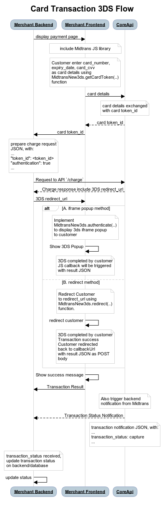

<!-- TODO: explain it also accept Debit card -->
<!-- TODO: explain when the card is checked for balance/limit, after 3DS -->

# Card Payment Integration
<hr>


*Card* payment is one of the payment methods offered by Midtrans. Using this payment method, customers can make payments using a credit card or any online-transaction-capable debit card within Visa, MasterCard, JCB, or Amex network. Midtrans sends real-time notification when the customer completes the payment.

<div class="cards-r-4">
  <div>


  </div>
  <div>
    

  </div>
  <div>
    

  </div>
  <div>
    

  </div>
</div> 


?> Please create a Midtrans [Merchant Administrative Portal (MAP) account](/en/midtrans-account/overview.md) before proceeding to the integration process.

<details>
<summary><b>Sequence Diagram</b></summary>
<article>
The end-to-end payment process for Card Transaction (3DS) is illustrated in the sequence diagram given below.




</article>
</details>

## Steps for Integration
To integrate with *Card* payment method, follow the steps given below.

## 1. Getting the Card Token
Card `token_id` is a representation of customer's card information used for the transaction. `token_id` should be retrieved using [MidtransNew3ds JS library](https://api.midtrans.com/v2/assets/js/midtrans-new-3ds.min.js) on merchant frontend. Merchant frontend JavaScript securely transmits card information to Midtrans Core API in exchange of card `token_id`. This avoids the risk of card information being transmitted to merchant backend.

#### Including Midtrans JS Library
Midtrans JS library can be included on your implementation of payment page's HTML, by adding the following script tag.

```html
<script id="midtrans-script" type="text/javascript"
src="https://api.midtrans.com/v2/assets/js/midtrans-new-3ds.min.js"
data-environment="sandbox"
data-client-key="<INSERT YOUR CLIENT KEY HERE>"></script>
```

Enter the values of attributes as given below.

| Attribute | Value | Note |
|-----------|-------|-------|
| `data-environment`| `sandbox` or `production` | Enter the values depending on the environment. |
| `data-client-key`| Client key | For more details, refer to [Retrieving API Access Keys](/en/midtrans-account/overview.md#retrieving-api-access-keys). |

For more details about the API, refer to [Get Token](https://api-docs.midtrans.com/#get-token).

Note: If you are using frontend framework such as ReactJS and struggling to include the script tag, please [refer to this recommendation](/en/other/faq/technical?id=my-developer-uses-react-js-frontend-framework-and-is-unable-to-use-midtransminjssnapjs-what-should-i-do).

#### Get Card Token JS Implementation

Midtrans uses `MidtransNew3ds.getCardToken` function to retrieve card `token_id`. Implement the following JavaScript on your payment page's HTML.

```javascript
// card data from customer input, for example
var cardData = {
  "card_number": 4811111111111114,
  "card_exp_month": 02,
  "card_exp_year": 2025,
  "card_cvv": 123,
};

// callback functions
var options = {
  onSuccess: function(response){
    // Success to get card token_id, implement as you wish here
    console.log('Success to get card token_id, response:', response);
    var token_id = response.token_id;

    console.log('This is the card token_id:', token_id);
    // Implement sending the token_id to backend to proceed to next step
  },
  onFailure: function(response){
    // Fail to get card token_id, implement as you wish here
    console.log('Fail to get card token_id, response:', response);

    // you may want to implement displaying failure message to customer.
    // Also record the error message to your log, so you can review
    // what causing failure on this transaction.
  }
};

// trigger `getCardToken` function
MidtransNew3ds.getCardToken(cardData, options);
```

Use the following credentials to test the *Card* payment method.

Name | Value
--- | ---
Card Number | `4811 1111 1111 1114`
CVV | `123`
Exp Month | Any month in MM format. For example, `02`.
Exp Year | Any future year, in YYYY format. For example, `2025`. 
OTP/3DS | `112233`

For more details, refer to [Testing Payments on Sandbox](/en/technical-reference/sandbox-test.md).

#### Get Card Token Response
The `token_id` retrieved from `response` object inside `onSuccess` callback function, is used as one of JSON parameters for [Charge API Request](/en/core-api/credit-card.md#sample-request).

`token_id` is then passed from frontend to backend. It can be done using AJAX via JavaScript, HTML POST or any other implementation of your choice.

?>***Note***: The `token_id` is valid for one transaction only. The process of getting `token_id` is repeated for every transaction, to ensure secure transmission of card data. To save card token, you may use [One-click](https://api-docs.midtrans.com/#card-features-one-click) / [Two-clicks](https://api-docs.midtrans.com/#card-features-two-clicks) feature.

<details>
<summary><b>Sample Get Token Response</b></summary>
<article>

<!-- tabs:start -->
#### **Success Response**
A sample of onSuccess `response` object is shown below.
```json
{
  "status_code": "200",
  "status_message": "Credit card token is created as Token ID.",
  "token_id": "481111-1114-77328ff4-eba6-4201-b31a-1070d8f19ae9",
  "hash": "481111-1114-xxxx"
}
```

#### **Failure Response**
A sample of onFailure `response` object is shown below. It contains the `validation_messages` that describes the reason for failure.
```json
{
  "status_code": "400",
  "status_message": "One or more parameters in the payload is invalid.",
  "validation_messages": [
    "This card is not supported for online transactions. Please contact your bank",
    "card_number does not match with Luhn algorithm"
  ],
  "id": "02197189-7cab-4006-8379-51edcd0a253b"
}
```

<!-- tabs:end -->

</article>
</details>

## 2. Sending Transaction Data to Charge API
The `token_id` received from the previous step, is used by the merchant backend to send [Charge API Request](#sample-request) to Midtrans. The 3DS `redirect_url` is received in the response. This URL is required for [Opening 3DS authentication page](/en/core-api/credit-card.md#_3-opening-3DS-authentication-page).
The *Charge API* request is sent from the merchant backend, with the `transaction_details` and the `token_id`.

The table given below describes some required components.

| Element        | Description                                                  | Type    |
| -------------- | ------------------------------------------------------------ | ------- |
| Server Key     | The unique ID retrieved from *Dashboard*. For more details, refer to [Retrieving API Access Keys](/en/midtrans-account/overview.md#retrieving-api-access-keys). | String  |
| order_id       | The order_id of the transaction.                             | String  |
| gross_amount   | The total amount of transaction.                             | Long Int|
| token_id       | The token_id retrieved from [Getting the Card Token](/en/core-api/credit-card.md#_1-getting-the-card-token). | String  |
| authentication | Flag to enable the 3D secure authentication.                 | Boolean |

?> **Note**: For better security and fraud prevention, set `authentication` to `true`. Set the `authentication` to `false` only after confirming with Midtrans and the acquiring bank.

#### Sample Request
The sample requests for *Charge API* for *Card* payment method are shown below. You may implement according to your backend language. For more details, refer to available [Language Libraries](/en/technical-reference/library-plugin.md#language-library).

<!-- tabs:start -->

#### **CURL**

#### Endpoints

| Environment | Method | URL                                        |
| ----------- | ------ | ------------------------------------------ |
| Sandbox     | POST   | https://api.sandbox.midtrans.com/v2/charge |
| Production  | POST   | https://api.midtrans.com/v2/charge         |

#### HTTP Headers

```text
Accept: application/json
Content-Type: application/json
Authorization: Basic AUTH_STRING
```

**AUTH_STRING**: Base64Encode(`"YourServerKey"+":"`)

?> Midtrans API validates HTTP request by using Basic Authentication method. The username is your **Server Key** while the password is empty. The authorization header value is represented by AUTH_STRING. AUTH_STRING is base-64 encoded string of your username and password separated by colon symbol (**:**). For more details, refer to [ API Authorization and Headers](/en/technical-reference/api-header.md).

#### Sample Request
```bash
curl -X POST \
  https://api.sandbox.midtrans.com/v2/charge \
  -H 'Accept: application/json'\
  -H 'Authorization: Basic <YOUR SERVER KEY ENCODED in Base64>' \
  -H 'Content-Type: application/json' \
  -d '{
  	"payment_type": "credit_card",
  	"transaction_details": {
    	"order_id": "order102",
    	"gross_amount": 789000
  	},
  	"credit_card": {
    	"token_id": "<token_id from Get Card Token Step>",
    	"authentication": true,
  	}
    "customer_details": {
        "first_name": "budi",
        "last_name": "pratama",
        "email": "budi.pra@example.com",
        "phone": "08111222333"
    }
}'
```

#### **PHP**

Install [**midtrans-php**](https://github.com/Midtrans/midtrans-php) library.
```bash
composer require midtrans/midtrans-php
```

> Alternatively, if you are not using **Composer**, you can [download midtrans-php library](https://github.com/Midtrans/midtrans-php/archive/master.zip), and then require the file manually.
> ```php
> require_once dirname(__FILE__) . '/pathofproject/Midtrans.php';
> ```


**Sample Request**

```php
// Set your Merchant Server Key
\Midtrans\Config::$serverKey = 'YOUR_SERVER_KEY';

$params = array(
    'transaction_details' => array(
        'order_id' => rand(),
        'gross_amount' => 10000,
    ),
	'payment_type' => 'credit_card',
    'credit_card'  => array(
        'token_id'      => $_POST['token_id'],
        'authentication'=> true,
    ),
    'customer_details' => array(
        'first_name' => 'budi',
        'last_name' => 'pratama',
        'email' => 'budi.pra@example.com',
        'phone' => '08111222333',
    ),
);

$response = \Midtrans\CoreApi::charge($params);
```

#### **Node JS**

Install [**midtrans-client**](https://github.com/Midtrans/midtrans-nodejs-client) NPM package.
```bash
npm install --save midtrans-client
```

**Sample Request**

```javascript
const midtransClient = require('midtrans-client');
// Create Core API instance
let core = new midtransClient.CoreApi({
        isProduction : false,
        serverKey : 'YOUR_SERVER_KEY',
        clientKey : 'YOUR_CLIENT_KEY'
    });

let parameter = {
    "payment_type": "credit_card",
    "transaction_details": {
        "gross_amount": 12145,
        "order_id": "test-transaction-54321",
    },
    "credit_card":{
        "token_id": 'CREDIT_CARD_TOKEN', // change with your card token
        "authentication": true
    }
};

// charge transaction
core.charge(parameter)
    .then((chargeResponse)=>{
        console.log('chargeResponse:');
        console.log(chargeResponse);
    });
```

#### **Java**

Install [**midtrans-java**](https://github.com/Midtrans/midtrans-java) library.

<details>
<summary><b>Maven</b></summary>
<article>

If you are using Maven as the build automation tool for your project, please add the following dependency to your project's build definition (pom.xml).

```xml
<dependencies>
    <dependency>
      <groupId>com.midtrans</groupId>
      <artifactId>java-library</artifactId>
      <version>3.0.0</version>
    </dependency>
</dependencies>
```

</article>

</details>

<details>
<summary><b>Gradle</b></summary>
<article>

If you are using Gradle as the build tool for your project, please add the following dependency to your project's build definition (build.gradle).

```bash
dependencies {
	implementation 'com.midtrans:java-library:3.0.0'
}
```

</article>
</details>

**Sample Request**

You can also check the [functional tests](https://github.com/Midtrans/midtrans-java/blob/master/library/src/test/java/com/midtrans/java/CoreApiTest.java) for more examples.


```java
import com.midtrans.Midtrans;
import com.midtrans.httpclient.SnapApi;
import com.midtrans.httpclient.error.MidtransError;

import java.util.HashMap;
import java.util.Map;
import java.util.UUID;
import org.json.JSONObject;


public class MidtransExample {

    public static void main(String[] args) throws MidtransError {
      // Set serverKey to Midtrans global config
      Midtrans.serverKey = "YOUR_SERVER_KEY";

      // Set value to true if you want Production Environment (accept real transaction).
      Midtrans.isProduction = false;

		// Create Function JSON Raw Object
		public Map<String, Object> requestBody() {
		    UUID idRand = UUID.randomUUID();
		    Map<String, Object> params = new HashMap<>();

		    Map<String, String> transactionDetails = new HashMap<>();
		    transactionDetails.put("order_id", idRand);
		    transactionDetails.put("gross_amount", "265000");

		    Map<String, String> creditCard = new HashMap<>();
		    creditCard.put("token_id", YOUR_CARD_TOKEN_ID);
		    creditCard.put("authentication", "true");

		    params.put("transaction_details", transactionDetails);
		    params.put("credit_card", creditCard);

		    return params;
		}

		// charge transaction
		JSONObject result = CoreApi.chargeTransaction(requestBody());
		System.out.println(result);
    }
}
```

#### **Python**

Install [**midtransclient**](https://github.com/Midtrans/midtrans-python-client) PIP package
```bash
pip install midtransclient
```

**Sample Request**

```python
import midtransclient
# Create Core API instance
core_api = midtransclient.CoreApi(
    is_production=False,
    server_key='YOUR_SERVER_KEY',
    client_key='YOUR_CLIENT_KEY'
)
# Build API parameter
param = {
    "payment_type": "credit_card",
    "transaction_details": {
        "gross_amount": 12145,
        "order_id": "test-transaction-54321",
    },
    "credit_card":{
        "token_id": 'CREDIT_CARD_TOKEN', # change with your card token
        "authentication": True
    }
}

# charge transaction
charge_response = core_api.charge(param)
```

<!-- @TODO: add Golang code example tab here-->
#### **Other**

- Please check Midtrans [available **language libraries**](/en/technical-reference/library-plugin.md)

<!-- tabs:end -->

?>***Tips***: You can [include more information](/en/core-api/advanced-features.md#recommended-parameters) such as `customer_details`, `item_details`, and so on. It is recommended to send more details regarding the transaction, so that these details will be captured on the transaction record. Which can be [viewed on the Midtrans Dashboard](/en/after-payment/dashboard-usage.md#transaction).

#### Sample Response
A sample API response for *Card* payment method is shown below.

```json
{
  "status_code": "201",
  "status_message": "Success, Credit Card transaction is successful",
  "transaction_id": "0bb563a9-ebea-41f7-ae9f-d99ec5f9700a",
  "order_id": "order102",
  "redirect_url": "https://api.sandbox.veritrans.co.id/v2/token/rba/redirect/481111-1114-0bb563a9-ebea-41f7-ae9f-d99ec5f9700a",
  "gross_amount": "789000.00",
  "currency": "IDR",
  "payment_type": "credit_card",
  "transaction_time": "2019-08-27 15:50:54",
  "transaction_status": "pending",
  "fraud_status": "accept",
  "masked_card": "481111-1114",
  "bank": "bni",
  "card_type": "credit"
}
```

<details>
<summary><b>Response Body JSON Attribute Description</b></summary>
<article>


| Element            | Description                                                  | Type   | Notes                                                        |
| ------------------ | ------------------------------------------------------------ | ------ | ------------------------------------------------------------ |
| status_code        | The status of the API call.                                  | String | For more details, refer to [Error Code and Response Code](/en/technical-reference/error-response-code.md#status-codes-and-errors). |
| status_message     | A message describing the status of the transaction.          | String | --                                                           |
| transaction_id     | The *Transaction ID* of the specific transaction.            | String | --                                                           |
| order_id           | The specific *Order ID*.                                     | String | --                                                           |
| redirect_url       | The redirect URL.                                            | String | --                                                           |
| gross_amount       | The total transaction amount for the specific order.         | String | --                                                           |
| currency           | The unit of currency used for the transaction.               | String | --                                                           |
| payment_type       | The type of payment method used by the customer for the transaction. | String | --                                                           |
| transaction_time   | The date and time at which the transaction occurred.         | String | It is in the format, *YYYY-MM-DD* *HH:MM:SS.*<br>Time zone: Western Indonesian Time (GMT+7). |
| transaction_status | The status of the transaction.                               | String | For more details, refer to [Transaction Status](/en/after-payment/get-status.md#transaction-status). |
| fraud_status       | The fraud_status of the transaction.                         | String | --                                                           |
| masked_card        | The partial card number of the custo.                        | String | --                                                           |
| bank               | The name of the acquiring bank which process the transaction.| String | --                                                           |
| card_type          | The type of the card.                                        | String | --                                                           |

</article>
</details>

The `redirect_url` attribute for the transaction is received.

?> ***Notes***: If the `transaction_status` is `capture` and `fraud_status` is `accept`, it means that the transaction does not requires 3DS. The transaction is successfully completed.<br>If the `transaction_status` is `pending` and `redirect_url` exists, it means the transaction requires 3DS. Open 3DS authentication page.

####  Status Codes and Errors

Status Code | Description | Sample Response Message
--- | --- | ---
200 | Successful transaction (non 3DS transaction). | "transaction_status": "capture"
201 | Need to open the redirect_url (3DS transaction). | "https://api.sandbox.veritrans.co.id/v2/token/rba/redirect/481111-1114-f424a955-ed0f-4a64-88ea-60cdc9655984 "
401 | Failed transaction. Wrong authorization details sent. | "Access denied, please check client or server key"
4xx | Failed transaction. Wrong parameter sent. Follow the `error_message` and check your parameter. | "transaction_details.gross_amount is not equal to the sum of item_details"
5xx | Failed transaction. Midtrans internal error. This is temporary. Retry again later. | "Sorry, we encountered internal server error. We will fix this soon."

## 3. Opening 3DS Authentication Page
To open 3DS authentication page on merchant frontend, display the `redirect_url` retrieved from previous step. The redirect URL is displayed using `MidtransNew3ds.authenticate` or `MidtransNew3ds.redirect` function in [MidtransNew3DS JS library](https://api.midtrans.com/v2/assets/js/midtrans-new-3ds.min.js).

#### Open 3DS Authentication Page JS Implementation
```javascript
var redirect_url = '<redirect_url Retrieved from Charge Response>';

// callback functions
var options = {
  performAuthentication: function(redirect_url){
    // Implement how you will open iframe to display 3ds authentication redirect_url to customer
    popupModal.openPopup(redirect_url);
  },
  onSuccess: function(response){
    // 3ds authentication success, implement payment success scenario
    console.log('response:',response);
    popupModal.closePopup();
  },
  onFailure: function(response){
    // 3ds authentication failure, implement payment failure scenario
    console.log('response:',response);
    popupModal.closePopup();
  },
  onPending: function(response){
    // transaction is pending, transaction result will be notified later via 
    // HTTP POST notification, implement as you wish here
    console.log('response:',response);
    popupModal.closePopup();
  }
};

// trigger `authenticate` function
MidtransNew3ds.authenticate(redirect_url, options);

/**
 * Example helper functions to open Iframe popup, you may replace this with your own 
 * method of open iframe. In this example, PicoModal library is used by including 
 * this script tag on the HTML:
 * <script src="https://cdnjs.cloudflare.com/ajax/libs/picomodal/3.0.0/picoModal.js"></script>
 */
var popupModal = (function(){
  var modal = null;
  return {
    openPopup(url){
      modal = picoModal({
        content:'<iframe frameborder="0" style="height:90vh; width:100%;" src="'+url+'"></iframe>',
        width: "75%",
        closeButton: false,
        overlayClose: false,
        escCloses: false
      }).show();
    },
    closePopup(){
      try{
        modal.close();
      } catch(e) {}
    }
  }
}());

/**
 * Alternatively, instead of opening 3ds authentication redirect_url using iframe,
 * you can also redirect customer using:
 * MidtransNew3ds.redirect( redirect_url, { callbackUrl : 'https://mywebsite.com/finish_3ds' });
 **/
```

#### 3DS Authentication Page JSON Response
On the JS callback function, we will get the transaction details as JSON response as given below.

<!-- tabs:start -->
#### **Success Response**
A sample of successful transaction callback response, is shown below.
```json
{
  "status_code": "200",
  "status_message": "Success, Credit Card transaction is successful",
  "channel_response_code": "00",
  "channel_response_message": "Approved",
  "bank": "bni",
  "eci": "05",
  "transaction_id": "405d27d5-5ad9-43ac-bdd6-0ccbde7d7dda",
  "order_id": "test-transaction-54321",
  "merchant_id": "G490526303",
  "gross_amount": "100000.00",
  "currency": "IDR",
  "payment_type": "credit_card",
  "transaction_time": "2020-08-12 16:04:23",
  "transaction_status": "capture",
  "fraud_status": "accept",
  "approval_code": "1597223068747",
  "masked_card": "481111-1114",
  "card_type": "credit"
}
```

#### **Failure Response**
Sample of failure transaction callback response, is shown below.
```json
{
  "status_code": "202",
  "status_message": "Card is not authenticated.",
  "bank": "bni",
  "eci": "07",
  "transaction_id": "1063cc1f-f07e-4755-ab85-19a4592de097",
  "order_id": "test-transaction-54321",
  "merchant_id": "G490526303",
  "gross_amount": "100000.00",
  "currency": "IDR",
  "payment_type": "credit_card",
  "transaction_time": "2020-08-12 16:03:49",
  "transaction_status": "deny",
  "fraud_status": "accept",
  "masked_card": "481111-1114",
}
```
<!-- tabs:end -->

If the `transaction_status` is `capture` and `fraud_status` is `accept`, it means the transaction is successfully completed.

?>***NOTE*** : To update the *Transaction Status* on merchant backend/database, DO NOT solely rely on frontend callbacks. For security reasons, make sure that the *Transaction Status* is authentically coming from Midtrans. Update *Transaction Status* based on HTTP Notification or [API Get Status](https://api-docs.midtrans.com/#get-transaction-status) only.

## 4. Handling After Payment
When the *Transaction Status* changes, Midtrans notifies you at the redirect URL and sends HTTP notification to the merchant backend. This ensures that you are updated of the transaction status securely.
HTTP POST request with JSON body will be sent to your *Payment Notification URL* configured on *Dashboard*.

<details>
<summary><b>Configuring Payment Notification URL</b></summary>
<article>

To configure the Payment Notification URL, follow the steps given below.
1. Login to your MAP account.
2. On the Home page, go to **SETTINGS > CONFIGURATION**.
   *Configuration* page is displayed.
3. Enter **Payment Notification URL**.
4. Click **Update**.
   A confirmation message is displayed.

   

   The *Payment Notification URL* is configured.
</article>
</details>
<br>

<div class="my-card">

#### [HTTP(S) Notification/Webhooks](/en/after-payment/http-notification.md)
</div>

## Description of Transaction Status
The table given below, describes the `transaction_status`.

| Transaction Status | Description |
| ------------------ | ----------- |
| `capture` | The transaction is successful. Funds have been deducted from the customers' account. |
| `pending` | The transaction is initiated and is waiting for further action by customer (3DS). |
| `deny` | The transaction is denied. <br>Check `channel_response_message` or `fraud_status` for details. |
| `expire` | The transaction failed, because customer did not complete 3DS within the expiry time. |

For more details, refer to [Midtrans Transaction Status Cycle Description](/en/after-payment/status-cycle.md).

## Next Step:
<br>

<div class="my-card">

#### [Taking Action of Payment](/en/after-payment/overview.md)
</div>

<div class="my-card">

#### [Core API Advanced Feature](/en/core-api/advanced-features.md)
</div>

<div class="my-card">

#### [Transaction Status Cycle and Action](/en/after-payment/status-cycle.md)
</div>

<hr>

#### Reference:

> You can also refer to this sample implementation:
>	- [NodeJS - Express](https://github.com/Midtrans/midtrans-nodejs-client/blob/master/examples/expressApp/views/simple_core_api_checkout.ejs)
>	- [Python - Flask](https://github.com/Midtrans/midtrans-python-client/blob/master/examples/flask_app/templates/simple_core_api_checkout.html)

For more details, refer to [Complete Core API documentation](https://api-docs.midtrans.com/)
