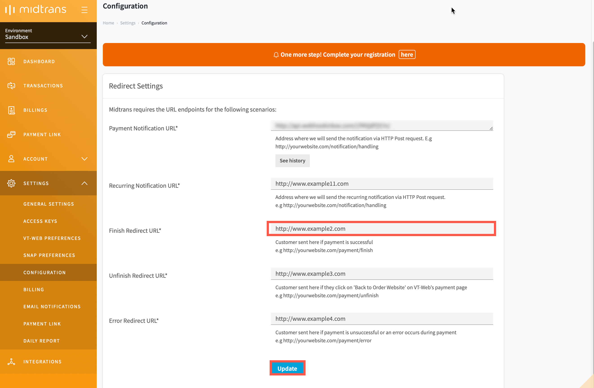

# Direct Debit Payment Integration
<hr>
<i>Direct Debit</i> is one of the payment methods offered by Midtrans. Using this payment method, the customer can authorize you to withdraw funds from the bank account. It is usually done for recurring payments, where the payment amount varies from one payment to another. This payment method can also be used for irregular payments such as for mail order transactions or at a point of sale (POS). Midtrans sends real-time notifications when the customer completes the payment.


Currently, Midtrans can integrate with the following *Direct Debit* payment methods like BCA KlikPay, CIMB Clicks, Danamon Online Banking, and e-Pay BRI.

 <br>
 <br>
 <br>
 <br>

<details>
<summary><b>Sequence Diagram Transaction Flow</b></summary>
<article>


</article>
</details>

## Sandbox Environment
The steps given below uses [Midtrans *Sandbox* environment](https://account.midtrans.com/) to test the integration process. Please make sure that you use the *Server Key* and *Client Key* for the *Sandbox* environment. For more details, refer to [Retrieving API Access Keys](/en/midtrans-account/overview.md#retrieving-api-access-keys).

### Steps for Integration
To integrate with *Direct Debit* payment method, follow the steps given below.

#### 1. Sending transaction data to Charge API 
The *Charge API* request is sent with the transaction details, from the merchant backend.

#### Endpoints
| Environment | Method | URL                                        |
| ----------- | ------ | ------------------------------------------ |
| Sandbox     | POST   | https://api.sandbox.midtrans.com/v2/charge |
| Production  | POST   | https://api.midtrans.com/v2/charge         |

#### Headers
| Header Name   | Description                                            | Required | Values                |
| ------------- | ------------------------------------------------------ | -------- | --------------------- |
| Accept        | The format of the data to be returned.                 | Required | application/json      |
| Content-Type  | The format of the data to be posted.                   | Required | application/json      |
| Authorization | The authentication method used to access the resource. | Required | Basic **AUTH_STRING** |

**AUTH_STRING**: Base64(`ServerKey + :`)<br>Midtrans API validates HTTP request by using Basic Authentication method. The username is your *Server Key* while the password is empty. The authorization header value is represented by AUTH_STRING. AUTH_STRING is base-64 encoded string of your username & password separated by a colon symbol (**:**). For more details, refer to [ API Authorization and Headers](https://docs.midtrans.com/en/technical-reference/api-header).

?> ***Note***: *Server Key* is required to authenticate the request. For more details, refer to [HTTPS Header](https://api-docs.midtrans.com/#http-s-header).

#### POST Body

| Element  | Description | Type   | Required |
| ------- | ------- | ------ | -------- |
| payment_type        | Direct Debit payment type.                                   | String | Required |
| transaction_details | The details of the transaction like the order_id and gross_amount. | -      | Required |
| order_id            | The order_id of the transaction.                             | String | Required |
| gross_amount        | The total amount of transaction.                             | Long   | Required |

#### Sample Request
The sample CURL request for *Charge API* for *Direct Debit* payment methods are shown below. You may implement according to your backend language. For more details, refer to available [Language Libraries](/en/technical-reference/library-plugin.md#language-library).
<!-- tabs:start -->

#### **BCA Kilkpay**
```bash
curl -X POST \
  https://api.sandbox.midtrans.com/v2/charge \
  -H 'Accept: application/json' \
  -H 'Authorization: Basic <YOUR SERVER KEY ENCODED in Base64>' \
  -H 'Content-Type: application/json' \
  -d '{
  "payment_type": "bca_klikpay",
  "transaction_details": {
      "order_id": "order-101",
      "gross_amount": 44000
  }
  "bca_klikpay": {
      "description": "Pembelian Barang"
  }
}'
```

#### **CIMB Clicks**
```bash
curl -X POST \
  https://api.sandbox.midtrans.com/v2/charge \
  -H 'Accept: application/json' \
  -H 'Authorization: Basic <YOUR SERVER KEY ENCODED in Base64>' \
  -H 'Content-Type: application/json' \
  -d '{
  "payment_type": "cimb_clicks",
  "transaction_details": {
      "order_id": "order-101",
      "gross_amount": 44000
  },
  "cimb_clicks": {
      "description": "Purchase of a Food Delivery"
  }
}'
```

#### **Danamon Online Banking**
```bash
curl -X POST \
  https://api.sandbox.midtrans.com/v2/charge \
  -H 'Accept: application/json' \
  -H 'Authorization: Basic <YOUR SERVER KEY ENCODED in Base64>' \
  -H 'Content-Type: application/json' \
  -d '{
  "payment_type": "danamon_online",
  "transaction_details": {
      "order_id": "order-101",
      "gross_amount": 44000
  }
}'
```
#### **e-Pay BRI**
```bash
curl -X POST \
  https://api.sandbox.midtrans.com/v2/charge \
  -H 'Accept: application/json' \
  -H 'Authorization: Basic <YOUR SERVER KEY ENCODED in Base64>' \
  -H 'Content-Type: application/json' \
  -d '{
  "payment_type": "bri_epay",
  "transaction_details": {
      "order_id": "order-101",
      "gross_amount": 44000
  }
}'
```
<!-- tabs:end -->

?>***Tips***: You can customize the `transaction_details` to include more information like `customer_details`, `item_details`, and so on. For more details, refer to [Transaction Details Object](https://api-docs.midtrans.com/#json-object).<br>It is recommended to add more details regarding transaction, so that these details can get added to the report. This report can be viewed from the dashboard.

#### Sample Response and Response Body
The sample API responses and a description of the response body for the available *Direct Debit* payment methods are shown below.
<!-- tabs:start -->

#### **BCA Kilkpay**

**Sample Response**
```json
{
    "status_code": "201",
    "status_message": "OK, BCA KlikPay transaction is successful",
    "transaction_id": "d19a4bcd-ae30-49dc-bde7-57749aede090",
    "order_id": "order-101",
    "redirect_url": "https://api.sandbox.veritrans.co.id/v3/bca/klikpay/redirect/d19a4bcd-ae30-49dc-bde7-57749aede090",
    "merchant_id": "G812785002",
    "gross_amount": "44000.00",
    "currency": "IDR",
    "payment_type": "bca_klikpay",
    "transaction_time": "2019-12-12 11:03:55",
    "transaction_status": "pending",
    "fraud_status": "accept",
    "redirect_data": {
        "url": "https://simulator.sandbox.midtrans.com/bca/klikpay/index",
        "method": "post",
        "params": {
            "klikPayCode": "03KHAN816197673",
            "transactionNo": "92396",
            "totalAmount": "44000",
            "currency": "IDR",
            "payType": "01",
            "callback": "https://example.com?id=d19a4bcd-ae30-49dc-bde7-57749aede090",
            "transactionDate": "11/11/2019 11:03:55",
            "descp": "Pembelian Barang",
            "miscFee": "0.00",
            "signature": "239297204"
        }
    }
}
```

<details>
<summary><b>Response Body</b></summary>
<article>

| Element    | Description    | Type   | Notes   |
| ------------------ | ------------------------------------------------------------ | ------ | ------------------------------------------------------------ |
| status_code        | This is the status of the API call.                          | String | For more details, refer to [Status Codes and Error](/en/technical-reference/error-response-code.md#status-codes-and-errors). |
| status_message     | A message from BCA KlikPay describing the status of the transaction. | String |                                                              |
| transaction_id     | The *Transaction ID* of the specific transaction.            | String |                                                              |
| order_id           | The specific *Order ID*.                                     | String |                                                              |
| redirect_url       | The URL to which the customer is redirected from the bank's website. | String |                                                              |
| merchant_id        | Your merchant ID.                                            | String |                                                              |
| gross_amount       | The total amount of transaction for the specific order.      | String |                                                              |
| currency           | The unit of currency used for the transaction.               | String |                                                              |
| payment_type       | The type of payment method used.                             | String |                                                              |
| transaction_time   | The date and time at which the transaction occurred.         | String | It is in the format, *YYYY-MM-DD* *HH:MM:SS.*<br>Time zone: Western Indonesian Time (GMT+7). |
| transaction_status | The transaction status of the transaction.                   | String | For more details, refer to [Transaction Status](/en/after-payment/get-status.md#transaction-status). |
| fraud_status       | The fraud status of the transaction.                         | String | For more details, refer to [Fraud Status](/en/after-payment/get-status.md#fraud-status). |
| redirect_data      | These are some technical information from BCA.                | Object |                                                              |

</article>
</details>

#### **CIMB Clicks**

**Sample Response**
```json
{
    "status_code": "201",
    "status_message": "Success, CIMB Clicks transaction is successful",
    "redirect_url": "https://api.sandbox.veritrans.co.id/cimb-clicks/request?id=2e8f8ddd-c61a-4d5f-83ad-429432383057",
    "transaction_id": "2e8f8ddd-c61a-4d5f-83ad-429432383057",
    "order_id": "order-101i-1576124787",
    "gross_amount": "44000.00",
    "currency": "IDR",
    "payment_type": "cimb_clicks",
    "transaction_time": "2019-11-11 11:26:27",
    "transaction_status": "pending",
    "merchant_id": "G812785002"
}
```

<details>
<summary><b>Response Body</b></summary>
<article>

| Element            | Description                                                  | Type   | Notes                                                        |
| ------------------ | ------------------------------------------------------------ | ------ | ------------------------------------------------------------ |
| status_code        | This is the status of the API call.                          | String | For more details, refer to [Status Codes and Error](/en/technical-reference/error-response-code.md#status-codes-and-errors). |
| status_message     | A message from CIMB Clicks describing the status of the transaction. | String |                                                              |
| redirect_url       | The URL to which the customer is redirected from the bank's website. | String |                                                              |
| transaction_id     | The *Transaction ID* of the specific transaction.            | String |                                                              |
| order_id           | The specific *Order ID*.                                     | String |                                                              |
| gross_amount       | The total amount of transaction for the specific order.      | String |                                                              |
| currency           | The unit of currency used for the transaction.               | String |                                                              |
| payment_type       | The type of payment method used by the customer for the transaction. | String |                                                              |
| transaction_time   | The date and time at which the transaction occurred.         | String | It is in the format, *YYYY-MM-DD* *HH:MM:SS.*<br>Time zone: Western Indonesian Time (GMT+7). |
| transaction_status | The status of the transaction.                               | String | For more details, refer to [Transaction Status](/en/after-payment/get-status.md#transaction-status). |
| merchant_id        | Your merchant ID.                                            | String |                                                              |

</article>
</details>

#### **Danamon Online Banking**

**Sample Response**

```json
{
    "status_code": "201",
    "status_message": "Success, Danamon Online transaction is successful",
    "transaction_id": "9da1c095-81b2-40d3-8285-8d27c60ae56e",
    "order_id": "order-101p-1576124871",
    "redirect_url": "https://api.sandbox.veritrans.co.id/v2/danamon/online/redirect/9da1c095-81b2-40d3-8285-8d27c60ae56e",
    "merchant_id": "G812785002",
    "gross_amount": "44000.00",
    "currency": "IDR",
    "payment_type": "danamon_online",
    "transaction_time": "2019-11-11 11:27:50",
    "transaction_status": "pending",
    "fraud_status": "accept"
}
```
<details>
<summary><b>Response Body</b></summary>
<article>

| Element            | Description                                                  | Type   | Notes                                                        |
| ------------------ | ------------------------------------------------------------ | ------ | ------------------------------------------------------------ |
| status_code        | This is the status of the API call.                          | String | For more details, refer to [Status Codes and Error](/en/technical-reference/error-response-code.md#status-codes-and-errors). |
| status_message     | A message from Danamon Online Bank describing the status of the transaction. | String |                                                              |
| transaction_id     | The *Transaction ID* of the specific transaction.            | String |                                                              |
| order_id           | The specific *Order ID*.                                     | String |                                                              |
| redirect_url       | The URL to which the customer is redirected from the bank's website. | String |                                                              |
| merchant_id        | Your merchant ID.                                            | String |                                                              |
| gross_amount       | The total amount of transaction for the specific order.      | String |                                                              |
| currency           | The unit of currency used for the transaction.               | String |                                                              |
| payment_type       | The type of payment method used by the customer for the transaction. | String |                                                              |
| transaction_time   | The date and time at which the transaction occurred.         | String | It is in the format, *YYYY-MM-DD* *HH:MM:SS.*<br>Time zone: Western Indonesian Time (GMT+7). |
| transaction_status | The status of the transaction.                               | String | For more details, refer to [Transaction Status](/en/after-payment/get-status.md#transaction-status). |
| fraud_status       | The fraud status of the transaction.                         | String | For more details, refer to [Fraud Status](/en/after-payment/get-status.md#fraud-status). |

</article>
</details>

#### **e-Pay BRI**

**Sample Response**

```json
{
    "status_code": "201",
    "status_message": "Success, BRI E-Pay transaction is successful",
    "transaction_id": "01c03b08-5e77-40d3-b1df-972f20a92e09",
    "order_id": "order-101",
    "redirect_url": "https://api.sandbox.veritrans.co.id/v3/bri/epay/redirect/01c03b08-5e77-40d3-b1df-972f20a92e09",
    "merchant_id": "G812785002",
    "gross_amount": "44000.00",
    "currency": "IDR",
    "payment_type": "bri_epay",
    "transaction_time": "2019-11-11 15:09:35",
    "transaction_status": "pending",
    "fraud_status": "accept"
}
```
<details>
<summary><b>Response Body</b></summary>
<article>

| Element            | Description                                                  | Type         | Notes                                                        |
| ------------------ | ------------------------------------------------------------ | ------------ | ------------------------------------------------------------ |
| status_code        | This is the status of the API call.                          | String       | For more details, refer to [Status Codes and Error](/en/technical-reference/error-response-code.md#status-codes-and-errors). |
| status_message     | A message from ePay BRI describing the status of the transaction. | StringString |                                                              |
| transaction_id     | The *Transaction ID* of the specific transaction.            | String       |                                                              |
| order_id           | The specific *Order ID*.                                     | String       |                                                              |
| redirect_url       | The URL to which the customer is redirected from the bank's website. | String       |                                                              |
| merchant_id        | Your merchant ID                                             | String       |                                                              |
| gross_amount       | The total amount of transaction for the specific order.      | String       |                                                              |
| currency           | The unit of currency used for the transaction.               | String       |                                                              |
| payment_type       | The type of payment method used by the customer for the transaction. | String       |                                                              |
| transaction_time   | The date and time at which the transaction occurred.         | String       | It is in the format, *YYYY-MM-DD* *HH:MM:SS.*<br>Time zone: Western Indonesian Time (GMT+7). |
| transaction_status | The transaction status of the transaction.                   | String       | For more details, refer to [Transaction Status](/en/after-payment/get-status.md#transaction-status). |
| fraud_status       | The fraud status of the transaction.                         | String       | For more details, refer to [Fraud Status](/en/after-payment/get-status.md#fraud-status). |

</article>
</details>

<!-- tabs:end -->
?>***Note***: The `redirect_url` attribute for the transaction is received.

#### Status Codes and Errors
| Code | Description                            | Notes                                                     |
| ---- | -------------------------------------- | --------------------------------------------------------- |
| 201  | Successful transaction                 | –                                                         |
| 400  | The `transaction_details` are missing. | Make sure the `order_id` and `gross_amount` are included. |
| 413  | There is syntax error.                 | Check the syntax.                                         |
| 500  | Internal system error occurred.        | You can try again later.                                  |

#### 2. Redirecting the customer to bank's website
The `redirect_url` retrieved from [Sending transaction data to API](/en/technical-reference/core-api/direct-debit.md#sending-transaction-data-to-api) is used to redirect the customer to the bank's website.
The customer is redirected through server-side redirect, using JavaScript like `window.location=[REDIRECT URL]`, or using HTML link `<a href="[REDIRECT URL]">Pay Here!</a>`.
The customer can complete the payment on this page.

For more details, refer to [Testing Payment on Sandbox](/en/technical-reference/sandbox-test.md#cardless-credit).

#### 3. Configuring landing page
After the customer completes the payment, the bank's website redirects the customer to *Finish Redirect URL* which can be configured on MAP (Merchant Administration Portal).

<details>
<summary><b>Configuring Finish Redirect URL</b></summary>
<article>

To configure the *Finish Redirect URL*, follow the steps given below.
1. Login to your MAP account.

2. On the Home page, go to **SETTINGS > CONFIGURATION**.
   *Configuration* page is displayed.
   
3. Enter **Finish Redirect URL** with your landing page endpoint.

4. Click **Update**.
   A confirmation message is displayed.

   

   The *Finish Redirect URL* is configured.
   
   </article> 
   
   </details>

?>***Note***: Please make sure the *Finish Redirect URL* endpoint can receive the POST request .

The sample code in *Native PHP* is given below. Please make appropriate changes according to your environment.

#### Sample Code
```php
<?php
    $response = $_POST['response']; //get the json response
    $decoded_response = json_decode($response);
    $order_id = $decoded_response->order_id;//how to access
?>
```
#### Sample Response
```json
{
    "status_code" : "200",
    "status_message" : "Success, transaction is found",
    "transaction_id" : "58b48d1c-3e51-46f8-a2fb-ad5fa668f534",
    "order_id" : "34",
    "gross_amount" : "19999998.00",
    "payment_type" : "cimb_clicks",
    "transaction_time" : "2018-01-26 08:57:45",
    "transaction_status" : "settlement",
    "approval_code" : "1516957074590",
    "signature_key" : "30b048ffff95e08c34cf265268224f0b6460d7716b3d70424a7203609a78b335280fe6137a9938cd3af24533fdafcfe8771203f6f30f21fd141a378bba1685fb"
}
```

#### 4. Handling post-transaction
When the transaction status changes, you are directly notified about the changes in the transaction through redirect URL and also on merchant backend. Midtrans sends HTTP notification to merchant backend. This ensures that you are updated of the transaction status securely.

HTTP POST request with JSON body will be sent to your *Payment Notification URL* configured on dashboard.

<details>
<summary><b>Configuring Payment Notification URL</b></summary>
<article>

To configure the Payment Notification URL, follow the steps given below.

1. Login to your MAP account.
2. On the Home page, go to **SETTINGS > CONFIGURATION**.
   *Configuration* page is displayed.
3. Enter **Payment Notification URL**.
4. Click **Update**.
   A confirmation message is displayed.

   


   The *Payment Notification URL* is configured.

</article> 

</details>

The sample HTTP notification request received at merchant backend for *Direct Debit* payment method is given below.

<!-- tabs:start -->

#### **BCA Kilkpay**
```json
{
  "transaction_time": "2019-12-11 16:20:48",
  "transaction_status": "settlement",
  "transaction_id": "34be81bd-1e4f-46b6-80f0-3e0f29776c63",
  "status_message": "midtrans payment notification",
  "status_code": "200",
  "signature_key": "f75192079b47bb2a55d8307d443388f418d139bd13b447b2521fd9fe7b33ffddf9435afaa212f4ef67452fb2f2f109c1852ddd7567bb2d74cefeb2f5aa995de6",
  "settlement_time": "2019-12-11 16:21:38",
  "payment_type": "bca_klikpay",
  "order_id": "order-101",
  "merchant_id": "G812785002",
  "gross_amount": "44000.00",
  "fraud_status": "accept",
  "currency": "IDR",
  "approval_code": "112233"
}
```

#### **CIMB Clicks**
```json
{
  "transaction_time": "2019-12-11 16:23:18",
  "transaction_status": "settlement",
  "transaction_id": "89cb0bfd-675b-4d4a-942c-7e19ba66d442",
  "status_message": "midtrans payment notification",
  "status_code": "200",
  "signature_key": "65e02e423cca2618a8d9ec201768438684bbf7218b27ab6f05a2197ce5b3c44fc9f4a157dce5a42d49f3ed6b88ac7a163f7e6b532d876d57a4a9297c5802639c",
  "settlement_time": "2019-12-11 16:24:00",
  "payment_type": "cimb_clicks",
  "order_id": "order-101",
  "merchant_id": "G812785002",
  "gross_amount": "44000.00",
  "currency": "IDR",
  "approval_code": "1576142640542"
}
```

#### **Danamon Online Banking**
```json
{
   "transaction_time": "2019-12-11 16:25:34",
   "transaction_status": "settlement",
   "transaction_id": "e7eb187b-c54c-4960-8558-a995253d61ca",
   "status_message": "midtrans payment notification",
   "status_code": "200",
   "signature_key": "928775783adf67b0578340dc616a30d2c2b307350475fbfbcc5bc1a5ac94892bb6bb972b7fe2394509c32fd431fd3494a358f25e24456f7414b473989ab1e66f",
   "settlement_time": "2019-12-11 16:25:49",
   "payment_type": "danamon_online",
   "order_id": "order-101p-1576142735",
   "merchant_id": "G812785002",
   "gross_amount": "44000.00",
   "fraud_status": "accept",
   "currency": "IDR",
   "approval_code": "uRaSu1XAnIm56i"
 }
```
#### **e-Pay BRI**
```json
{
  "transaction_time": "2019-11-11 15:09:35",
  "transaction_status": "settlement",
  "transaction_id": "01c03b08-5e77-40d3-b1df-972f20a92e09",
  "status_message": "midtrans payment notification",
  "status_code": "200",
  "signature_key": "f0abe6507f42019839e028f9c5da723ff7c220c962af1f1f8fc25ac5a773c1123fd680602443e7cece83d059b9f9c13078d74cc4a79948214059394ec5d18c4b",
  "settlement_time": "2019-11-11 15:13:51",
  "payment_type": "bri_epay",
  "order_id": "order-101h-1576483775",
  "merchant_id": "G812785002",
  "gross_amount": "44000.00",
  "fraud_status": "accept",
  "currency": "IDR",
  "approval_code": "1576483775235"
}
```
<!-- tabs:end -->

<div class="my-card">

#### [Handling Webhook HTTP Notification](/en/after-payment/http-notification.md)
</div>


## Switching to Production Environment
Follow the steps given below to switch to Midtrans *Production* environment and to accept real payments from real customers.
1. Change API domain URL from `api.sandbox.midtrans.com` to `api.midtrans.com`.
2. Use *Client Key* and *Server Key* for *Production* environment. For more details, refer to [Retrieving API Access Keys](/en/midtrans-account/overview.md#retrieving-api-access-keys).


## Next Step:
<br>

<div class="my-card">

#### [Taking Action of Payment](/en/after-payment/overview.md)
</div>

<div class="my-card">

#### [Core API Advanced Feature](/en/core-api/advanced-features.md)
</div>

<div class="my-card">

#### [Transaction Status Cycle and Action](/en/after-payment/status-cycle.md)
</div>

<hr>

