# Midtrans Iris Disbursement Account & Dashboard Usage

## Account

Before using Iris, you need to register for your Iris Account. Please get in touch with our activation team. After completing the registration you will be given access to your [Iris Dashboard](https://app.sandbox.midtrans.com/iris). The account will also have access to sandbox environment for testing purposes. 

**Sandbox Environment** can be used to create "testing" transactions (usually performed from your development/testing environment). All transaction made within this environment mode is not "real", and does not require "real fund". This environment is created automatically when you are signing up, and free to use.

Iris have two main user role accounts **Creator** and **Approver** account. Each of the roles capability is explained in this table:

| Action                  | Creator | Approver |
| ------------------------| --------|----------|
| Create Payout           | ✅      | ❌      |
| Release Payout          | ❌      | ✅      |
| View/inquire Balance    | ✅      | ✅      |
| View/inquire Statements | ✅      | ✅      |

The main idea is to separate authority between who can create the disbursement, and who can approve the disbursement, as these two major roles are separated as part of compliance in most organizations.

<!-- @TODO: add section on how to add users -->

## Dashboard
Midtrans Iris provides a Dashboard (also known as portal) to manage all your Payouts. You, as a partner, can see transaction history as well as the reports of payouts/transfer activities. The Iris Dashboard can also be used to create transfer/payout requests, validating accounts, approving/rejecting payout, managing beneficiaries. Some operations also support bulk actions via CSV file upload.

### Accessing Iris Dashboard
Access Iris login page at:
- http://app.midtrans.com/iris for production use or 
- http://app.sandbox.midtrans.com/iris for sandbox environment. 

You can login with your registered email and password.

> ***Note:*** Midtrans do the following to maintain the security of your account.
> 
> * If there is no activity on Iris Portal for 15 minutes, the account will automatically be logged out.
> * an account will be required to update their password at least every 90 days.
> * After three failed Login attempts, you will be temporarily locked out from trying to log in. When your account is locked, you will not be able to log in even with the correct password.
> * If the account is locked, you can't process anything with the associated Iris API key. The API request will be responded with `HTTP Basic: Access denied`

### Unlocking a locked account
Midtrans provides up to 3x (three times) failure login attempts for Iris Portal. If the limit is exceeded, the account will be locked automatically. This is to protect your account from illegitimate access.

To unlock the account, please inform the locked account to support@midtrans.com (or your Midtrans activation team representative) to begin the unlock process. After the account has been unlocked, please log into the Iris account using your previous password. Alternatively, you can also [reset your password](#reset-password) to regain access.

### Reset Password
If you forgot your Iris account password, you can reset the password by clicking the `Forgot Password` button on the login page.

### Retrieving API Access Keys
API Access Keys will be used to access Iris' API. You can find them on the profile sidebar menu. Hover and click your username on the right top of the bar.

> API Keys and Merchant Key are unique for every Iris partner. Please always keep the Key confidential. Key Explanation:
> 
> * API Key: Used for authorization while calling Iris API from backend.
> 
> * Merchant Key: Used to validate whether the notification authentic coming from Midtrans or not.
> 

### Displaying Statements
Midtrans Iris provides a history of transactions or also known as Statements. When filtering your statements, you can specify the start date and also end date of the statements history. You can also export them as CSV/Excel file format, by clicking the download button on the bottom of the page. You will receive it as an e-mail with the exported file, please check your registered email’s Inbox (or Spam folder in case it flagged as spam).

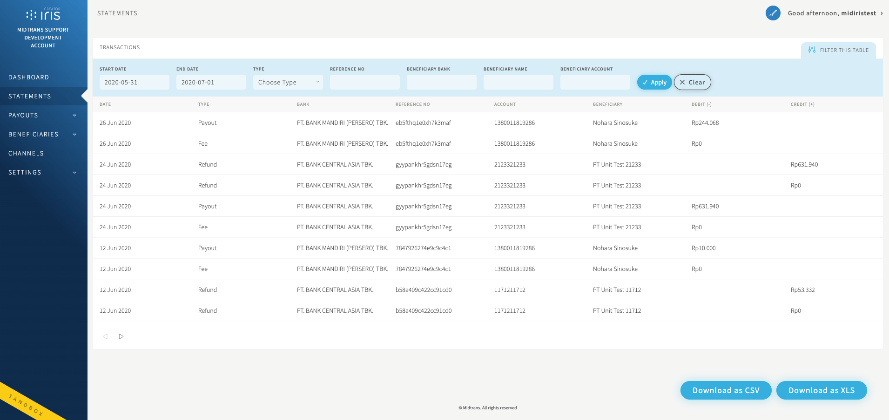

### Managing Beneficiary
If you need to frequently payout/transfer funds to the same bank account, you can save the destination bank account as a Beneficiary. Beneficiary is representation of a destination bank account you are going to payout/transfer the funds to. To create a new beneficiary you need to input some details explained below.

| Column | Description |
| -------- | -------- |
| Name     | `String` Name of the destination bank account owner     |
| Account  | `Number` Valid bank account number of the Beneficiary. Length should be within 6 to 20 characters    |
| Bank     | `String` Bank name used by the Beneficiary     |
| Alias Name     | `String` Your own custom defined alias name to represent the Beneficiary. Length should be less than or equal to 20 characters. Only alphanumeric characters are allowed. Alias name is unique.  |
| Email     | `Optional` `String` Valid Email address of the Beneficiary  |

#### 1. Add a Single Benefciary
To add a single beneficiary follow the below process.

1. log in to Iris Portal and go to `ADD BENEFICAIRES` and select tab `ADD SINGLE BENEFICIARIES`.
2. Please enter your beneficiary details in the fields provided.
3. Make sure all details is correct, confirm with click button `Add Beneficiaries`.

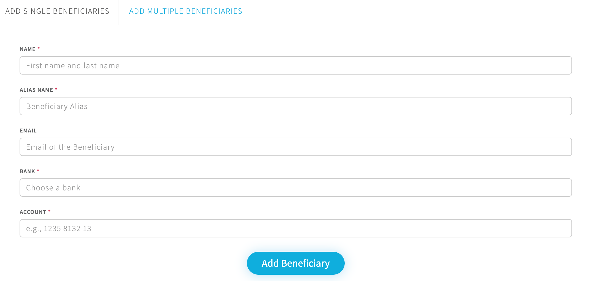
> ***Note:*** Fields marked with asterisks (\*) are mandatory fields. 

#### 2. Add Multiple Beneficiaries
To add multiple beneficiaries follow the below process.

1. log in to Iris Portal and go to `ADD BENEFICAIRES` and select tab `ADD MULTIPLE BENEFICIARIES`.
2. Click `download sample`.
3. Open and modify the sample CSV file, and input your beneficiary details on the file. Then save the file.
4. Make sure all details in CSV file is correct, upload the CSV file with click button `+ Add CSV File`.
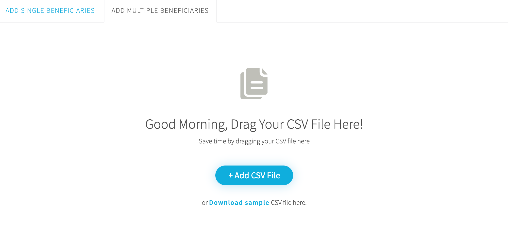
> ***Note:*** Make sure the alias name in the CSV file does not contain space and any symbol. 

#### Beneficiaries List
The Beneficiary List menu is an easy way for you to view, edit, and delete your beneficiaries.

1. Click `Edit` button if you want to edit data of the beneficiary, then click `Update Beneficiary` button after you have updated the beneficiary data.
2. Click `Delete` button in case you want to remove the beneficiary. The Iris portal will show confirmation pop-up.

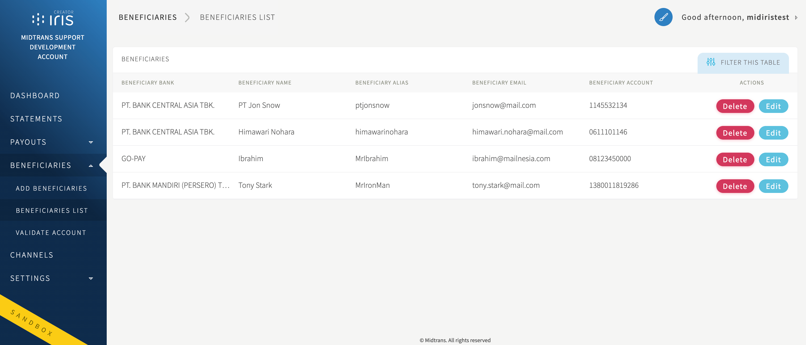

#### Bank account number validation
Iris can validate bank accounts from all officially registered Indonesian banks. You can validate bank accounts from Iris Portal or integrate with the Iris API from your system.

To validate from Iris portal:

1. Login to Iris portal. Go to the `Beneficaries` menu, and click `Validate Account`.
2. Choose the bank name from the supported bank drop down, then fill the bank account number and click `Submit` button.
3. Iris portal will then give you the result.

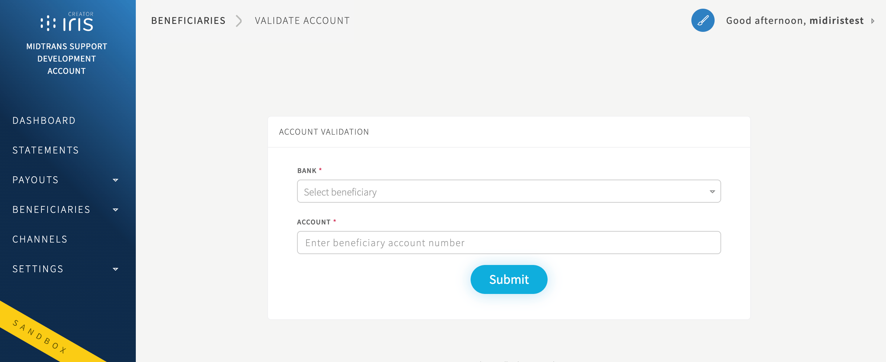

Success result example:
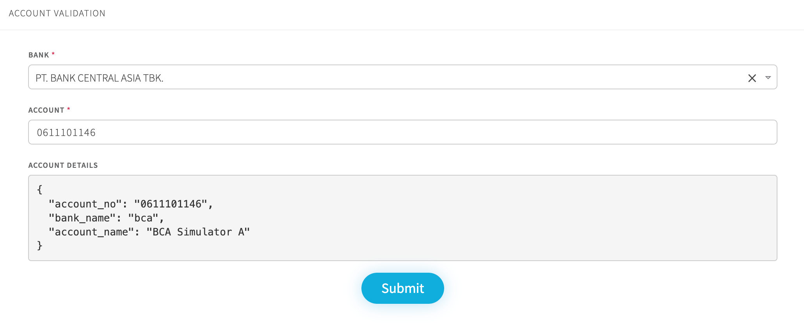

### Creating Payout via Dashboard
When you are logged in as a Creator user role, you can create payout/transfer via dashboard. It supports single payout and multiple payouts. You can only create payouts with total amounts according to the available balance. 

This guide walks you through how to create payout to transfer funds into Beneficiaries account. In this example, the fund is transferred from your Iris account balance to a single beneficiary.

To create payout, 
1. Open the **Add Payout** menu. 
2. Select the beneficiary from the saved beneficiary list or you can input a new beneficiary while creating a single payout.
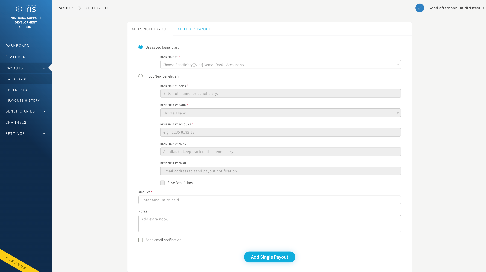

Then you can:
* [Create single payout](#single-payout), or
* [Create bulk (multiple) payouts](#bulk-payout)

#### Single Payout
You can choose from the saved beneficiary account (which added previously [from beneficiaries menu](#managing-benefciary)).
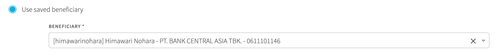

If the beneficiary isn’t on the list, you can input new beneficiary accounts and save it to beneficiary list while creating a single payout
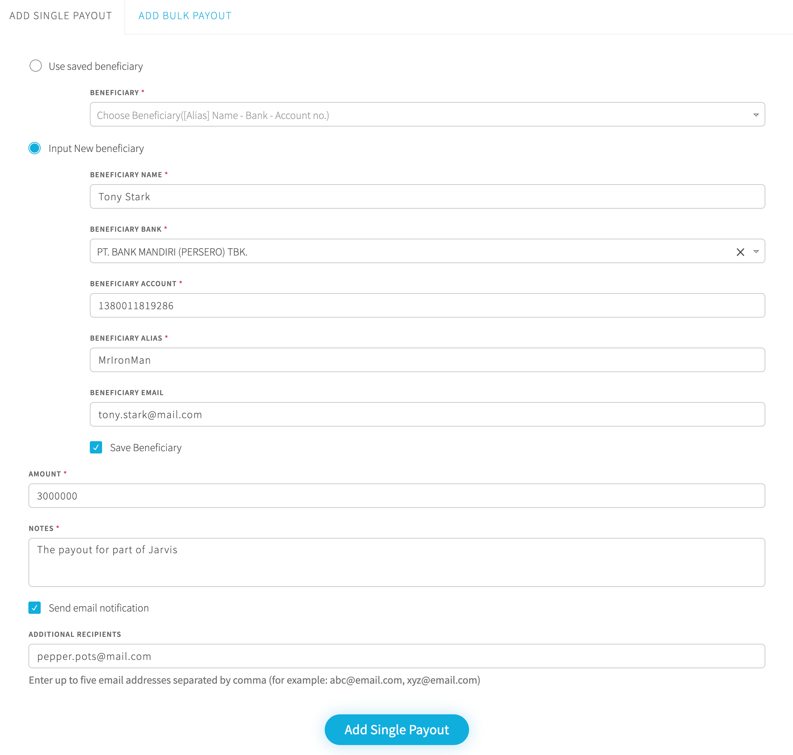

The next process is to fill out the amount and (your custom defined) notes for the Payout. You can opt to send payout notification to the beneficiary's account email and can also add additional emails to be notified.

#### Bulk Payout
Bulk payout can be useful to make bulk transfers such as employees’ salaries,  and vendor/partner payments. With the bulk payouts feature, you will be able to make bulk payments quick and easy.

To initiate a bulk payout:
1. Make sure your account balance is sufficient.
2. Provide the beneficiaries list with the required details via CSV file. You can click `Download sample` button to get sample file.
3. Upload the CSV file by draging and dropping the file to the designated Bulk Payout area, or click `Add CSV File` button.
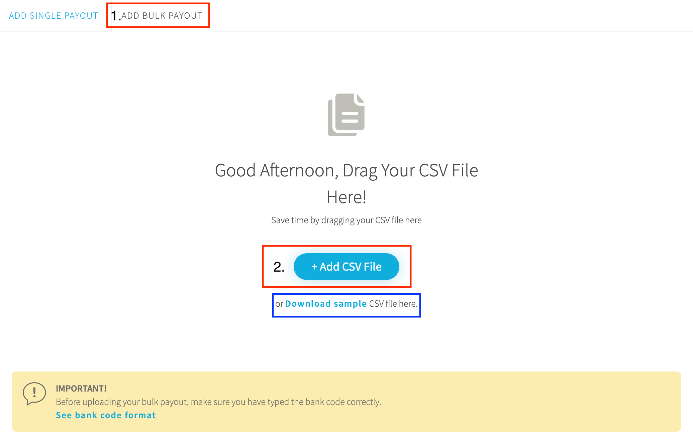
4. After the upload process is completed, The payout will be added to the list of bulk payout with status `queued` (which means, waiting for approval).
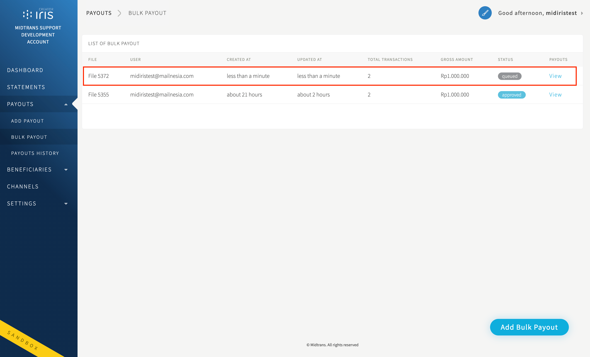

### Approving and Rejecting Payout
When you are logged in as an Approver user role. You can approve created payout requests (created by Creator user role). You can approve/reject single or bulk payout request via Iris dashboard (and Iris API). To approve via dashboard:
1. Select the payout request.
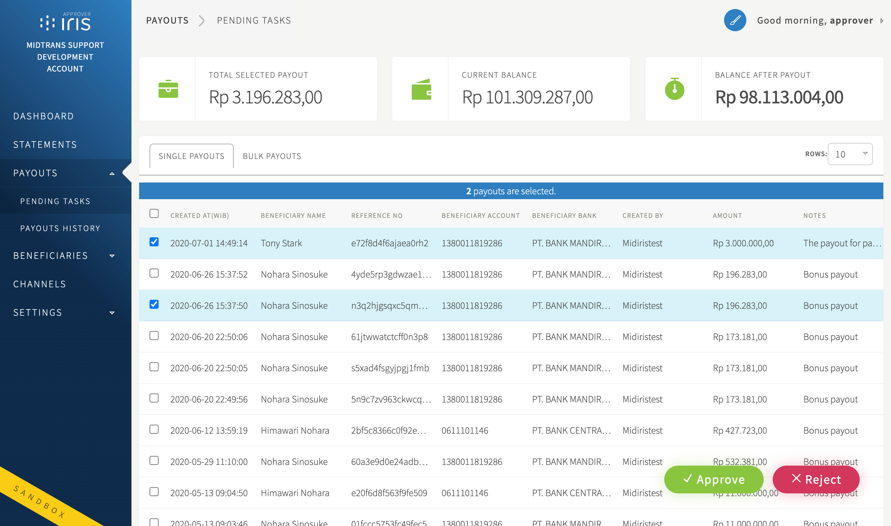

Note: You are free to define who should have Approver role, depending on your business. Which may have its own internal rules on who needs to approve outgoing payments.

#### To Approve
Click `Approve` button and then the payout status will change to `Approved`, and will be processed by Iris.
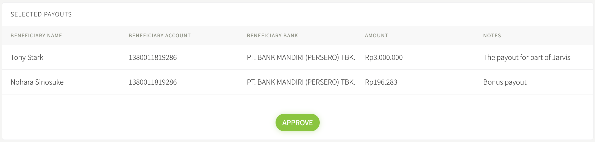

#### To Reject
You can add the rejection reasons (if you are rejecting multiple payouts, the reasons will be the same for all payouts, since there is only 1 provided field), click `Reject`. The payout status will change to `Rejected`, and will not be processed by Iris.
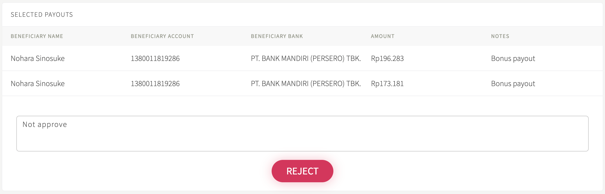

### Payouts History
The Payouts menu is an easy way for you to view your payout history from Iris dashboard. To see Payout History, head over to `Payouts menu > Payout History` menu. From this page, you’ll be able to view and download information regarding any payouts that you create (as Creator user role) with the detailed status.
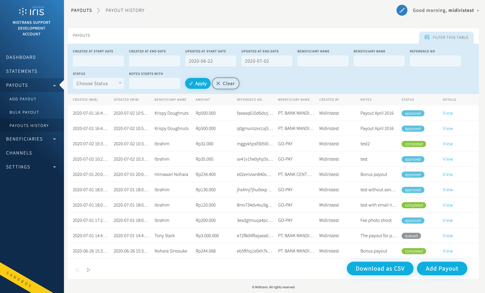

#### Payout Status Details
| Status       | Description                                     |
| ------------ | ----------------------------------------------- |
| Queued       | Payout is waiting to be approved/rejected/executed                |
| Approved     | Payout request is `approved` by approver user role   |
| Rejected     | Payout request is `rejected` by approver user role   |
| Processed    | Payout request is sent to the bank and completed|
| Completed    | Payout request is sent to the bank and received by beneficiary account |
| Failed       | Payout didn’t go through |

### Top up Account Balance (Aggregator)
With an aggregator scheme, a partner will have to top-up/deposit from time-to-time to an account balance, any payouts/transfer will deduct this balance as the source of funds. Information on how to do top-up is available within the Channels menu/page. It will show you various payment channels that you can choose to do top-up.
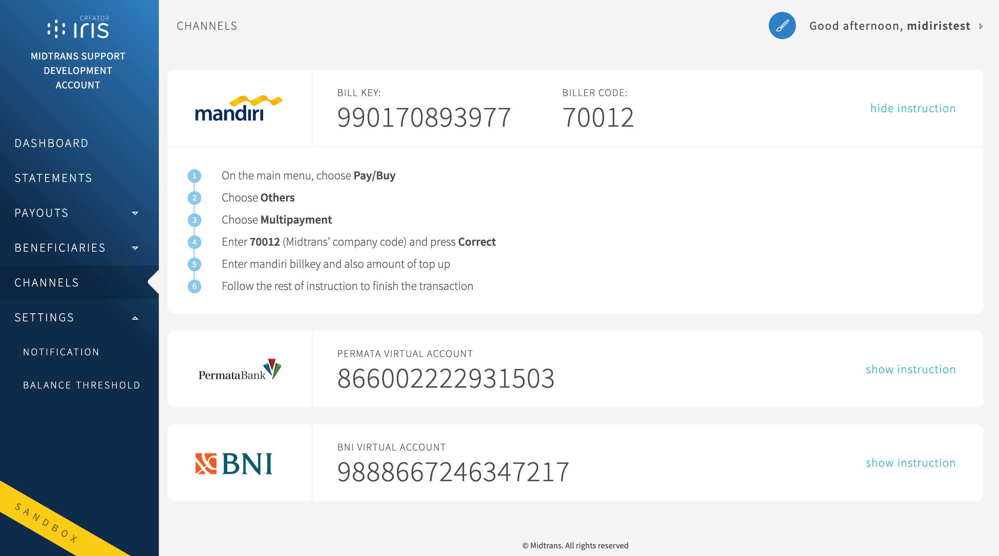

> ***Tips:*** For sandbox environment, you can visit our [Mock Payment Provider](https://simulator.sandbox.midtrans.com/permata/va/index) and go to the Permata Virtual Account payment page. Input your VA number and click `Cek Transaksi`, to initiate a sandbox balance top up.

## Dashboard Settings
### Notification Settings
Iris allows partners to receive real time HTTP(S) POST Notifications (also known as Webhook) about Iris related transactions (payout & top up, etc), by configuring an endpoint url on the Iris Portal. Notification through HTTP(S) POST / Webhook will be sent to the partner's server when the transaction changes, e.g. payout completed, etc. Partner then can utilize the HTTP(S) POST notification to update a payout status on their system.

Setup Iris HTTP(S) POST Notification by setting the Notification URL under menu `Settings > Notification`. We highly recommend using https:// to ensure security.
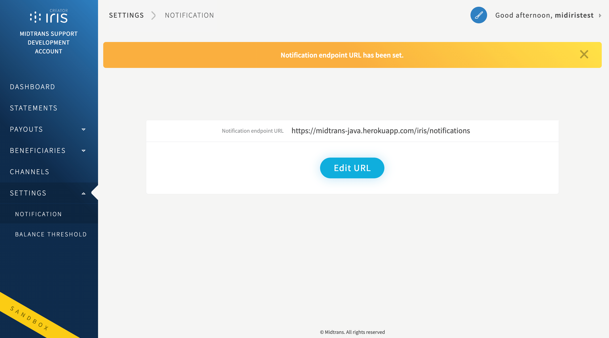

!> Make sure that the Notification URL **can be reached from Public Internet**. Midtrans **cannot send notifications to localhost**, URL protected with authorization or password, URL behind VPN, unusual destination port, and so on. You may also need to make sure the [following IP address](/en/technical-reference/ip-address#notification-ip-address) is not blocked from your infrastructure.

?> **Tips**: If you are still running/developing your notification handler on localhost, you can utilize the services (such as [Ngrok](https://ngrok.com/), [Tsocket](http://tsocket.org/), [Localhost.Run](http://localhost.run/), and so on) to expose your localhost server to public Internet. Once you have obtained the Internet accessible URL, you can add it to the *Notification endpoint URL* field on *Iris Dashboard*.

### Balance Threshold
The Balance Threshold feature is to give you email notificiation if your source of funds Account Balance is below the set threshold. e.g. The balance threshold is set to IDR 1,000,000,- if you perform payouts and the balance goes below that number, Iris will send you a notification via email, that your balance has gone below the threshold limit. It is Available under menu `Settings > Balance Threshold`.
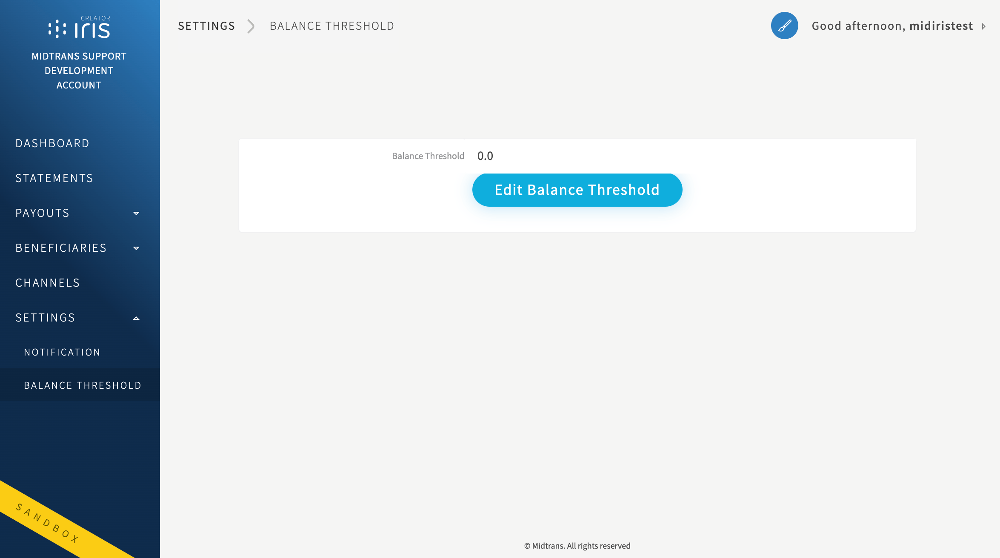
