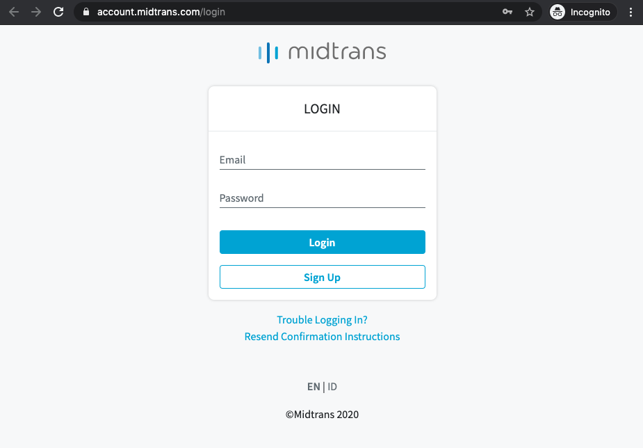

# Midtrans Account

Before integrating with Midtrans, you need to register for Account.

#### [Register Midtrans Account here](https://account.midtrans.com/register)

After completing the registration, login to Merchant Administration Portal (MAP) where you can access both Sandbox and Production environment.

## Accessing Midtrans Administration Portal

To access Midtrans Administration Portal (MAP), follow the steps given below.

1. Click **Login** on Midtrans website (www.midtrans.com).
   You are redirected to the *LOGIN* page.
2. Enter your **Email**.
3. Enter **Password**.

4. Click **Login**.

​	Upon successful login, *Dashboard* is displayed.

> **Notes:** Midtrans follows certain practices to maintain the security of your account.
>
> * If your session is inactive for more than 15 minutes, you will be logged out automatically.
> * Midtrans MAP notifies you to update your Midtrans MAP password every 90 days.

## Completing Account Information

Complete the required information from [**Settings > General Settings**](https://dashboard.sandbox.midtrans.com/settings/general_info).

> **Notes:**
>
> * Merchant Name can not contain any symbols.
> * Merchant URL should be less than 25 characters.

## Retrieving API Access Keys

To communicate with the Midtrans API, Client Key and Server Key are required.

To get access to the Client Key and Server Key, follow the steps given below.

1. Login to your MAP account.

2. On the *Dashboard*, go to **Settings > Access Keys**.

   *Access Keys* page is displayed.

> **Notes**
>
> - `Client Key`: Used as API key to be used for authorization on **frontend** API request/configuration. So it safe to put in your HTML / client code publicly.
> - `Server Key`: Used as API key to be used for authorization while calling Midtrans API from **backend**. So **keep it confidential**.

!> Access Keys are unique for every merchant. **Always keep Server Key confidential**.

## Switching Environment

Keys between **Production & Sandbox** environment are different. Please make sure to access correct dashboard environment. 

Environment can be switched from the top left **Environment** drop-down on the dashboard.

You can use the Sandbox environment during your development phase of integrating Midtrans’ payment system. You can also test dummy transactions on the Sandbox environment.

## Unlocking Locked Account

If you try to login to your account with a wrong password more than five times, your account is automatically locked. This is a safety feature to protect your account from any illegitimate access.

Once your account is locked, it will be automatically unlocked after 15 minutes. 

If you are not able to unlock your account after 15 minutes, please inform support@midtrans.com to begin the unlock process. Once the account is unlocked, please log in to Midtrans MAP account using your existing password.

## Resetting the Password

In case you forget the password, you can reset your password with a new one.

To reset your password, follow the steps given below.

1. On the Login page, click **Trouble Logging In?**.

You are redirected to *Reset Password* page.

2. Enter your registered email in the **Email** field.
3. Click **Reset Password**.

A message confirming a link will be sent via email to reset your password is displayed. Please check your *Inbox* and *Spam* folder.

4. Go to your email account and open the auto-generated email received in your inbox.

5. Click the link to reset your password.

6. You are redirected to the Midtrans **Change Password** page.

7. Enter a new password in the **New Password** field.

8. Re-enter the same password in the **Confirm New Password** field.

9. Click **Change My Password**.

   Upon successful password reset, you are redirected to Midtrans Login page.

> **Notes:**
>
> - The *Forgot password* link in the email is only valid for one hour. If the link expires, repeat the password reset process.
> - The new password can not be same as the password used in the past.

## Next Step
 

#### [Proceed with Payment Integration](/en/payments/overview.md)

