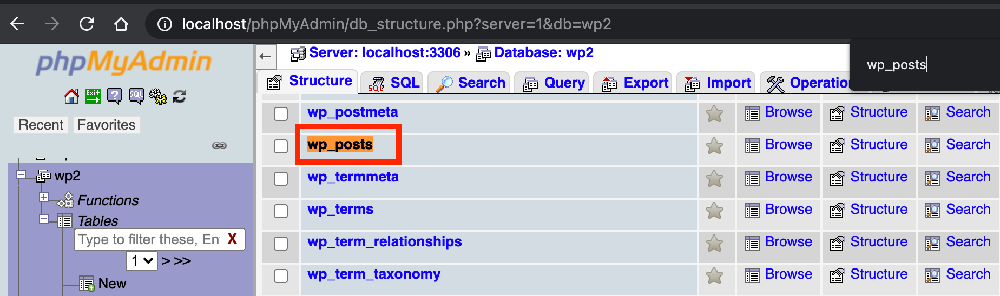
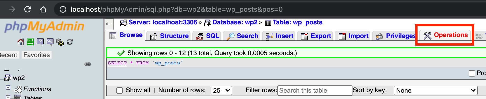
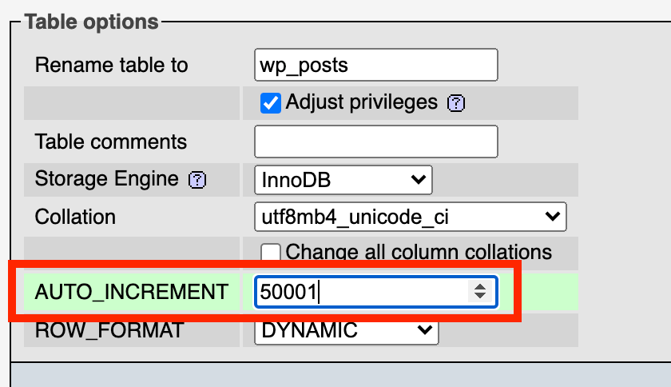
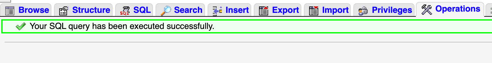

This page contains list of Midtrans Product technical FAQs
## Technical FAQ
### General & Misc
#### How to troubleshoot HTTP Notification failures?

If you are receiving Email alert with the following message:
> We are having difficulty sending notification to the endpoint that you specified. Please make sure that the endpoint is available and returns HTTP status 200 after receiving the notification.

Within the email, please check the part `Error detail`, for example it may say:
> Redirection status code 301, 302 and 303 are not supported.

It means your backend is returning/responding with invalid response, and need to be fixed. Then please follow suggestions below according to that `status code` value displayed on the email.

Make sure that your **endpoint should not return/response**: 
- `3xx` HTTP status code: it likely means your endpoint is performing a redirect, please fix your backend implementation to **remove any redirect**.
	- You can open your `notification url` on web browser, see whether the end URL is the same as the original URL or not. If you see the URL on browser address bar is different (changed) after open it, it means there is a redirect. Use the last URL displayed on browser URL bar, after you open the original URL as `notification url`.
	- For example you set `https://toko.com/webhook-handler` as notification url, after you open it via browser, the url in browser address bar becomes `https://toko.com/webhook-handler/` (there is `/` characther added). You should [set notification url](/en/http-notification.md#configuring-http-notifications-on-map) with that final url instead.
- `4xx`, `5xx` HTTP status code: it likely means your backend is throwing error/exception caused by your internal mis-implementation, please check your backend log and fix the issue on your backend side. This can means various internal error from syntax, logical, database, to validation, etc. So you need to check thoroughly.
- Make sure that your backend is available (not having down-time) during that time. Issue can be caused by temporary down time on your backend at that time period only, and may works fine at other time.

Also it is **important to double check that your infrastructure layer** such as reverse-proxy (Nginx/Apache/etc.), network layer, firewall, etc. does not perform any of the above problematic issue.

<details open>
<summary><b>Inspect & Reproduce HTTP Notification Sending Process</b></summary>
<article>

You can also reproduce on your own on how HTTP notification is sent from Midtrans to your HTTP notification URL, which should be hosted on your web server backend. Use and execute the following CURL comamnd template on your side.

<!-- tabs:start -->
##### **CURL template**
```bash
curl -vvv -X POST \
  https://your-notification-url/should-goes-here/ \
  -H 'Accept: application/json'\
  -H 'Content-Type: application/json' \
  -d 'PASTE_YOUR_NOTIFICATION_JSON_HERE'
```

- Replace `https://your-notification-url/should-goes-here/` with your notification url. 
- Replace the `PASTE_YOUR_NOTIFICATION_JSON_HERE` value with the Notification JSON value you can [retrieve via Midtrans Dashboard](/en/after-payment/http-notification.md#viewing-notification-history): 
	- Under menu `Settings > Configuration > See History` 
	- Then choose one of the table row entries that have `HTTP` value as **TYPE**, scroll right and click `Details`.
	- You will be able to see a popup, and under `Request Body` section, you will see the JSON.

##### **CURL sample**
Here is a sample of full CURL request with the notification JSON included.

```bash
curl -vvv -X POST \
  https://tokoecommerc.com/payment-notification-handler/ \
  -H 'Accept: application/json'\
  -H 'Content-Type: application/json' \
  -d '{
  "transaction_time": "2020-01-09 18:27:19",
  "transaction_status": "capture",
  "transaction_id": "57d5293c-e65f-4a29-95e4-5959c3fa335b",
  "status_message": "midtrans payment notification",
  "status_code": "200",
  "signature_key": "16d6f84b2fb0468e2a9cf99a8ac4e5d803d42180347aaa70cb2a7abb13b5c6130458ca9c71956a962c0827637cd3bc7d40b21a8ae9fab12c7c3efe351b18d00a",
  "payment_type": "credit_card",
  "order_id": "Postman-1578568851",
  "merchant_id": "M004123",
  "masked_card": "481111-1114",
  "gross_amount": "10000.00",
  "fraud_status": "accept",
  "eci": "05",
  "currency": "IDR",
  "channel_response_message": "Approved",
  "channel_response_code": "00",
  "card_type": "credit",
  "bank": "bni",
  "approval_code": "1578569243927"
}'
```
<!-- tabs:end -->

On your machine terminal/shell, you can execute the CURL command above and inspect the response of the destination URL endpoint.
</article>
</details>

Note: Unfortunately Midtrans will not be able to help you on any implementation details (beyond these suggestions), because the issue as mentioned above happen on your backend side. Since the implementation is under your scope, and is outside of Midtrans visibility & control. We don't have access to read or help you edit any of your backend implementations.

It basically can be summarized to: 
- Midtrans (as sender) has already send you a HTTP request properly, the issue is on your backend (as receiver) that reject the request. You should try to fix it in order to accept the request properly.

If you need more suggestion, please share the following details with us:
- Your Merchant ID & Order ID of the failing notification.
- Your backend log, when it (fails to) handle the HTTP notification.
- Snippet of your backend code implementation.

Please refer [here to further understand about HTTP Notification](/en/after-payment/http-notification.md#best-practice-to-handle-notification).

#### Why did I get alert message that HTTP notification is failure because of 3xx status code or redirect?

See the answer given [below](#why-does-midtrans-http-notification-received-on-merchant-backendnotification-handler-look-quotemptyquot).

#### Why does Midtrans HTTP notification received on merchant backend/notification handler look "empty"?
It can be caused by `notification url` (set by merchant on Dashboard) is ending up in HTTP redirect, when HTTP notification sent by Midtrans notification engine. If HTTP redirect happens, it can cause HTTP POST call to be redirected as HTTP GET, which means it will no longer contains HTTP body which contains the transaction data. This results in merchant notification handler getting empty request body, and might throw error. Redirect can be caused by network/reverse proxy/web framework used by the merchant.

**To resolve**:

Make sure that there is no redirect on your `notification url`. You can open your `notification url` on web browser, see whether the end URL is the same as the original URL or not. If you see the URL on browser address bar is different (changed) after open it, it means there is a redirect. Use the last URL displayed on browser URL bar, after you open the original URL as `notification url`.

#### Why my Permata VA number cannot be customized?
Permata custom VA is available only for B2B VA type. So if you are have agreement with permata as B2C VA type, the VA number cannot be customized.

#### How should I include internal fee, tax, discount in item_details API params?
For example, in a transaction the purchased items are `Apple (IDR 7000)`, & `Orange (IDR 3000)`. Then your system also add `Fee (IDR 300)`, `Tax (IDR 200)`, `Discount (IDR -100)`. Which totalled into `gross_amount: 10400` then you are sending those information as this request API parameters:

```json
{
  "transaction_details": {
    "order_id": "CustOrder-102",
    "gross_amount": 10400
  },
  "item_details": [
    {
      "name": "Apple",
      "price": 7000,
      "quantity": 1,
      "id": "SKU-01",
    },
    {
      "name": "Orange",
      "price": 3000,
      "quantity": 1,
      "id": "SKU-02",
    }
  ]
}
```

That will not work, and you will get this as API response:
```text
 "validation_messages": 
 	["transaction_details.gross_amount must be equal to token request gross_amount"]
```

That is because the sum of all item_details's price (7000+3000) is not equal to gross_amount (10400). If you have any kind of fee, tax, or discount, you must include it as item_details.

You should change the API request parameters to this to make it work:
```json
{
  "transaction_details": {
    "order_id": "CustOrder-102",
    "gross_amount": 10400
  },
  "item_details": [
    {
      "name": "Apple",
      "price": 7000,
      "quantity": 1,
      "id": "SKU-01"
    },
    {
      "name": "Orange",
      "price": 3000,
      "quantity": 1,
      "id": "SKU-02"
    },
    {
      "name": "Fee",
      "price": 300,
      "quantity": 1,
      "id": "F01"
    },
    {
      "name": "Tax",
      "price": 200,
      "quantity": 1,
      "id": "T01"
    },
    {
      "name": "Discount",
      "price": -100,
      "quantity": 1,
      "id": "D01"
    }
  ]
}
```

We added the `Fee`, `Tax`, and `Discount` as few new item_details, which now totals to 7000+3000+300+200-100 = `10400` which will be equal to `"gross_amount": 10400`. Then this API request will work just fine.

Note that the item's price can also be a negative value to accomodate discount.

Alternatively, you can also bundle together all the fee, tax, discount, etc. into 1 item_details, e.g:
```json
...
    {
      "name": "Misc Fee",
      "price": 400, // total fee,tax,discount of 300+200-100
      "quantity": 1,
      "id": "D01"
    }
...
```

Alternatively, you can also implement your system to generate `Misc Fee` item dynamically. E.g: your system already know `"gross_amount": 10400`, and total of item purchased is `10000`. Then you can generate a new item_details object to balance this value. So the `Misc Fee` price = gross_amount - sum(price of all item).

```json
  "item_details": [
  	...,
    {
      "name": "Misc Fee",
      "price": (gross_amount - total_of_all_previous_item_price)
      "quantity": 1,
      "id": "D01"
    }
  ]
```

#### I want to use payment method specific promo campaign. How should I implement this?
You have to use `enabled_payments` for payment method specific promo. The customer can pay with the specific payment method only. The customer cannot pay using other payment methods.

It is recommended to have separate payment flow (or separate payment button, check boxes, and so on) for payment method specific promo. You do not have to use different `buttons` to separate payment flow. UX-wise you can make it as check boxes for customers to select. For example, "I want to pay with < payment method >" check box.
It should give the information to the merchant backend that the customers want to pay with specific payment method. The merchant backend sends the `whitelist_bins` accordingly.

#### The customer transactions are denied because of fraud detection system. If I trust the customer, can I request whitelist?
Yes. If you trust the customer and wish to whitelist the customer, please provide the list of customer emails and send the request as email to operations.fraud@midtrans.com.

#### I don’t want to send real "customer_details" data to Midtrans. Is it possible? Are there any consequences? How can I do it?
Yes, it is possible. There are no legal or business constraints in doing so. But there can be technical consequences in terms of how Midtrans Fraud Detection System (FDS) works.
A few sample cases are listed below.

- The FDS has blacklist database of online fraudsters. If the customer is a fraudster, and your system sends a modified customer_details, the fraud attempt might not be able to be prevented.
- The FDS estimates fraud behavior based on transaction count for each email, phone number, and other unique data. If you send same static dummy email for all customer, it can get blocked after certain number of attempts. To avoid this issue, you should use dynamic masked customer details, that is unique for each user. For example, you can mask customer@email.com to MmtMPHTlqVZyE0@dummycompanyemail.com.

In most cases, you can skip sending the customer data, if the data is not mandatory. For example, Bank Transfer transaction does not require customer email or phone number.

#### While doing VA transaction, I got error 505, "Unable to create va_number for this transaction". What is the issue and what should I do?
This issue might happen because after several attempts, the bank is unable to allocate VA number for the transaction at that moment. For error code 5xx, please try to send the request again.

If the issue persists, please contact us at support@midtrans.com.

#### The customer transaction is blocked by Fraud Detection System (FDS), but I am sure that the customer is legitimate. I want to continue with the transaction. What should I do?

The reason of a denied transaction can be checked on Midtrans *Dashboard*. Go to home page, and search the specific order id. Click ⓘ on "**Transaction failure**" red indicator, to display the reason for denied transaction.

If you trust the customer, you can request to whitelist the customer by customer's email. Please provide the list of customer emails and send request email to operations.fraud@midtrans.com. Midtrans FDS team will respond promptly.

#### What is Pending, Settlement, Expire transaction status for asynchronous payment?
For asynchronous payment such as Bank Transfer, GoPay, BCA KlikPay, and so on, the payment code or payment ID created should be displayed to the customer, along with the payment instructions (if you enable customer email notification or use Snap product). Next, the customer needs to transfer the fund using the payment provider website/app/ATM and so on.

The list of available payment statuses are given below.
- `Deny`: Payment provider rejected the payment code/ID creation.
- `Pending`: Payment specific code is created for the customer. The customer needs to complete payment at the app/bank/payment provider website/app/ATM and so on.
- `Expire`: Customer failed to pay at the bank/payment provider within the specified expiry time.
- `Cancel`: Transaction is cancelled by trigger from you.
- `Settlement`: Customer payment is successfully confirmed by bank/payment provider.
- `Refund`: Transaction is refunded by trigger from you.

#### Should I refer to `status_code` API response as transaction status?
`status_code` only refers to the result of current API action. It behaves like HTTP status code. For example, the meaning of `status_code: 200`, depends on the API action context being executed.

For *Create Transaction* API action, `status_code:200` means the API is able to create transaction successfully. In case of Get Status API action, `status_code:200` means the API get status action is successful. The transaction is found, regardless of the status of the transaction. It does not refer to the transaction status or payment status.

If you want the reference of the most recent transaction status or payment status, it is recommended to check the `transaction_status` instead of `status_code`, which will have consistent value regardless of any API action.

#### What should be considered when merchant want to do SSL certificate pinning?
Most of the time you don’t need to do Certificate Pinning against Midtrans API domain’s public key SSL certificate, as most HTTP client / OS default behaviour already verifies SSL certificate at root CA level automatically (via built in CA certificate bundles).

But if you decide to do Certificate Pinning, please consider the following trade-offs and considerations:
- In the rare event of Midtrans SSL Certificate provider does some significant changes on their certificate chains (due to key rotation/update/upgrade/renewal/revoke/reissue activity) you are at risk of your HTTP client refusing to connect. Which means you should replace the pinned certificate each time this happens on each of your HTTP client implementations. It may mean you need to release a new version for your mobile app, to replace the previous app which is unable to connect.
- Due to the nature of numerous authorities/parties involved in SSL certificate chains, changes may happen without all parties informed, hence Midtrans may not be able to timely inform you about such events in advance, although we try our best.
- Note that: Digicert as one of the well-known Certificate Authority and Vendor, [does not recommend certificate pinning](https://www.digicert.com/dc/blog/certificate-pinning-what-is-certificate-pinning/). As they see there are "more risks than reward".
- Consider pinning at a higher level chain of public key, like root CA level public key instead of specific domain certificate. Because the higher level of the chain is rarely rotated.
- Consider understanding deeply about this topic and implementing failover. Here is [some resources about the topic](https://appmattus.medium.com/android-security-ssl-pinning-1db8acb6621e).

Midtrans shouldn't be held responsible for any issue caused by your decision to implement SSL certificate pinning, as you should be aware of the considerations above.

#### Why am I getting notified to update my system version?
This is to ensure the following:
- Your HTTPS or SSL client, used to communicate with Midtrans API domains are not outdated, and are in compliance to the latest security standards.

- The HTTPS client is a piece of tech component used by your system to send HTTPS request and verify SSL when communicating with Midtrans API. The exact component varies between systems. It can be OS, CURL, OpenSSL, PHP, Java, and so on, depending on the design of your system. Please make sure these components are updated with version later than 2016.

The following can possibly happen with an outdated system version.
- Security risk, with the SSL encryption being not strong enough, and might be able to be cracked by actor that has access to your HTTPS request.
- Potential compatibility issue:
  - With outdated HTTPS client, SSL certificate being used by Midtrans API might become unrecognizable, and potentially block your request to Midtrans API.
  - With outdated HTTPS client, SSL handshake can be rejected by Midtrans API, because it does not meet the security standards.

##### Updating if you are using CMS that is based on PHP web stack
If you are using PHP based CMS, check if your payment component uses Veritrans/Midtrans PHP library or official Midtrans CMS plugin/module. The most recommended way is to update it to the latest version of the official [library or plugin](https://beta-docs.midtrans.com/en/technical-reference/library-plugin).

But **if in some exceptional case, you really are unable to** simply update it (For example, due to customization), the least you should do is to search for this line of code within your payment-related codebase:
```php
CURLOPT_CAINFO => dirname(__FILE__) . "/../data/cacert.pem"
```
Then, remove that line or comment it out as shown in this [sample](https://github.com/veritrans/veritrans-php/commit/592a18d8c9b0789927029f8202abdd5b6e3b04c9).

That line makes the PHP library to use a static file `cacert.pem` for SSL verification. The file can become outdated. Outdated files might cause failure on SSL verification. After removing the line, the SSL verification is now handled by OS/CURL/OpenSSL of the OS itself. So, you must also make sure the OS/CURL/OpenSSL is at least on the version later than 2016.

If you are using Java, especially the outdated version 1.7 or older, refer to the question given [below](#my-developer-encounters-javaxnetsslsslhandshakeexception-received-fatal-alert-handshake_failure-while-trying-to-connect-to-midtrans-api-url-what-needs-to-be-done).

#### My developer encounters `javax.net.ssl.SSLHandshakeException: Received fatal alert: handshake_failure` while trying to connect to Midtrans API URL. What needs to be done?
This is usually caused by outdated Java client. Please check the Java version, web framework version, and OS version used to connect. Please make sure you are not using outdated version. Using outdated platforms make your system vulnerable to security threats, which is not a suitable environment for handling payments.

For example, if your versions are: Java version 7, Web framework version Spring 3.1 and OS version Windows 7, please update. Java version 7 is no longer officially supported by Oracle (https://java.com/en/download/faq/java_7.xml ). Spring and OS version is also outdated.

Other than that, it can also be caused by improper SSL certificate pinning/downloading on the Java client. For more details, refer to the question given [below](#does-midtrans-provide-ssl-certificate-or-root-certificate-to-download).

#### Does Midtrans provide SSL certificate or root certificate to download?
It is not a best practice and might break your future integration if our certificate is updated or upgraded. By default, HTTP client verifies SSL certificates automatically. You **should not pin/download Midtrans' SSL certificate manually** or store it locally as a file for your system to verify connection.

#### Does Midtrans provide IP address of the API domain to be whitelisted from Midtrans side (outbound request from Merchant to Midtrans)?
Midtrans API endpoint is distributed and protected with multiple layers of security, including Cloudflare, **so it will not have any specific IP address**. Instead, please whitelist Midtrans API domain names listed below.

```
api.midtrans.com
app.midtrans.com
```
> Note: Always use the domain name to contact our API — avoid using IP address, because it may changes.


Or if you really need to, you can whitelist the IP listed [here](https://www.cloudflare.com/ips/). However, you are responsible to always update the list yourself in case it got updated, else it might break your integration with Midtrans.

For inbound request from Midtrans, we provide IP address to whitelist. For more details, refer to [IP Addresses & API Domain](/en/technical-reference/ip-address.md).

#### Why am I getting `403` from Cloudflare, while using reverse-proxy to contact Midtrans API?
We always recommend requests to be sent directly to Midtrans API. Using reverse-proxy in front of Midtrans API can risk exposing the transaction data (and its log) to the proxy. Exposing payment data like credit card pose big security risk and should be avoided.

Midtrans is also using Cloudflare as security measure on top of Midtrans API. Cloudflare might block the request because it thinks the request is indicated as insecure.

Using proxy may cause failures. If the failures is on the proxy side, Midtrans is not in a position to help. Please consult your proxy admin.

If you are still getting `403` without using proxy, please ensure your HTTP request header and format are correct. For more details, refer to [API Authorization & Headers](https://beta-docs.midtrans.com/en/technical-reference/api-header).

\#cloudflare \#security \#proxy

#### When I try to send request to Midtrans API, it always gets blocked by CORS Policy on the browser. What is the issue?
For now, it is expected to get CORS issue when calling `/transactions` endpoint from frontend (until our *Snap* API team decides to allow CORS). Please send the API request securely from backend.

For security reasons, **do not call an API which requires Server Key authorization from the Frontend**. You are at a risk of exposing your *Server Key* to the public. *Server Key* should be kept secret. *Server Keys* on frontend code are easily accessible from client side. *Server Key* should be used from the backend (server) only. You can send the frontend HTTP request to merchant backend first. Merchant backend should securely add the Authorization header, then send the request to the API.

#### Customer complains the refund is not yet received, but on Midtrans Dashboard the status has already changed to `refund`, can you check?
Unfortunately, access to fund status checking is not granted to Midtrans Technical Support Team. They can only check the status technically. The actual fund checking will be inquired to Business Operations Team (which may reconcile with GoPay team as needed). To ensure you have the correct point of contact and faster response regarding fund status, please follow the steps given below.

Here are some things that can be done if there is any mismatch in the transaction using the GoPay payment method:

1. If the customer complains that there is no refund after 3 working days from a refund submission to Midtrans, merchant needs to provide information to Midtrans Business Team and the Business Operations Team (bizops@midtrans.com) with the detailed information given below.
	- Order ID
	- Transaction date
	- Gross amount
	- Refund amount
	- Screenshot of customer GO-PAY payment history, if any.

2. If there is any mismatch found in the transaction on the customer’s payment proof and transaction data at MAP, then you can contact the Business Team and the Business Operations Team (bizops@midtrans.com) by providing the following information.
	- Order ID
	- Transaction Time
	- Transaction Amount

#### I used Midtrans provided CMS plugin/module, but found that it does not exactly suit my specific needs. Can Midtrans help change the plugin/module?
Midtrans provides easy-to-install popular CMS plugin/module to cover general merchant use-cases and some advanced features. We will try our best to cover use-cases that are generally needed by most merchants.

However, please note that any of the CMS module is developed as-is and without any warranty (MIT licensed, see the License file). As every use-case may be unique and different for each merchant, there is no warranty to cover every merchant-specific needs. There is no one-fits-all solution unfortunately.

Midtrans publishes open-source code of the modules. Your development team should be able to further develop or use it depending on your customization needs. Fulfilling your specific use cases should fall in to their scope.

Midtrans however is fully responsible for payment API service (not the CMS plugin/module, but the API). You can let us know if there is any feedback for us related to the API. We will also consider implementing feedback for CMS plugin/module if the feedback is beneficial to general use-cases.

#### I am using Midtrans provided CMS plugin/module. But I encounter an issue. Can Midtrans help?
Since the plugin/module and the CMS is hosted on the merchant's infrastructure, Midtrans may not be able to check it directly.

Please provide all the details listed below which are necessary for technical assistance.
- Error log of the CMS/PHP/Server that have relevant Midtrans related error message.
- Order ID of the transaction.
- Screenshot or video of the issue.

Midtrans can only guide/assist the troubleshooting process, as Midtrans may not have direct control/access of the infrastructure. You are fully in control/responsible of this process.

Please note that many things can cause interference or issues that are outside of Midtrans control, for example:
- Server/infrastructure/network related issue.
	- Which must be ensured to be working properly first, else any function (not just payment) of the server can cause issues
- Installing conflicting non-standard plugins/module or themes.
	- Try to uninstall all other plugins/modules/themes first and see if it works
	- Try to install and test on freshly installed CMS, without installing any third-party plugin/module/themes and modifications
	- If it works, then most likely one of your modifications caused the issue
- Non-standard modification of the CMS.
- Outdated, or no longer supported CMS version.
	- Please update to the latest recommended compatible version
- Malware on the infrastructure.
	- Please make sure your infrastructure is clean, or freshly re-install the CMS

Midtrans may not be able to guarantee anything, due to the numerous external factors that are not under control.

Also, please refer to [previous question](#i-used-midtrans-provided-cms-pluginmodule-but-found-that-it-does-not-exactly-suit-my-specific-needs-can-midtrans-help-change-the-pluginmodule).

#### How does Midtrans ensure that the customer card data is securely transmitted to Midtrans and not compromised by third-party?
All the data transmitted from the customer device to Midtrans should be encrypted over the network layer via SSL/HTTPS. That means data transmission is end-to-end encrypted (customer-to-Midtrans), and secure from any third-party. Only the customer and Midtrans can see the real values of data being transmitted, unless a third-party has direct control over the customer's device (which means already compromised anyway) or is able to decrypt SSL/HTTPS.

In order to ensure the customer-to-Midtrans encryption is properly implemented, you are required to use JavaScript library provided by Midtrans for card transaction (midtrans.min.js, snap.js, or Mobile SDK) and you are strictly prohibited to record card credentials to your own system, unless PCI DSS certified.
If you have proof of how a third-party can possibly break this security, feel free to contact us at support@midtrans.com, we will connect you to our Infosec team.

Some auditors may see credentials transmitted in plain text. This is because the audit happens on the customer device itself. So, the data is expected to be visible from customer device. Auditor should try to check from non-customer device, for example from network layer as third-party between Midtrans and customer. Auditor will see the data is encrypted from third-party.

Additionally, HTTPS GET method encrypts any GET query or request credentials (via TLS/HTTPS). It may expose the destination web domain to proxy, but **will not** expose any parameter.

#### There are some missing field or property on the JSON response or notification. It seems the JSON is not consistent. Is this expected?
Yes, it is expected to have few missing JSON fields or properties. It means the value is `null` for that field or property. Please adjust your implementation accordingly to accommodate this behavior.

At Midtrans, we follow [Google JSON Style Guide](https://google.github.io/styleguide/jsoncstyleguide.xml). According to this style guide, it is recommended that a property without any value (`null`), should be removed. Reference: https://google.github.io/styleguide/jsoncstyleguide.xml#Empty/Null_Property_Values.

#### There are new fields or properties added on the JSON response or notification. It breaks merchant implementation. Is this expected?
Yes, it is expected.

As JSON based API common practice, please allow new fields or properties to be added on JSON based API communication, to ensure "forward compatibility". Thus include API response and HTTP notification. Ensure that the merchant backend is able to ignore and does not break when encountering new fields or properties. It depends on JSON parser library you are using. The parser having `JsonIgnoreProperties` flag or similar can be utilized.

Please adjust your implementation accordingly to accommodate this behavior.

#### Can Midtrans show or deduct MDR directly to the customer during payment?
Business and regulation wise, Merchant Discount Rate (MDR) as the name suggests, is merchant's responsibility to the payment provider (bank or card network principal). MDR should be charged to the merchant, not the customer. So, it should not be directly charged to customer.

However merchant may manage this by charging a fee to the customer. Merchant may define additional service fee or include it to the final item price to customer.

For example, merchant can add fee as additional `item_details` when requesting payment to the Midtrans API. An example is shown below.
```json
...
"item_details": [
  {
    "id": "ITEM1",
    "price": 7000,
    "quantity": 2,
    "name": "Apple Fruit"
  },
  {
    "id": "miscfee",
    "price": 250,
    "quantity": 1,
    "name": "Service Fee"
  }
]
...
```

#### For a failure card transaction, there is `reversal transaction` entry in *Dashboard*. What does that mean?
You need not be alarmed when you see this `reversal transaction` entry in *Dashboard*. When a card transaction is failed because of acquiring bank timeout (no response after a while), Midtrans will make sure that the customer fund does not get deducted, by sending reversal command to the bank. If the customer fund is deducted during the timeout, the reversal will make sure the fund will be reverted to customer. If fund is not deducted, then the reversal will not do anything.

<!-- No longer relevant -->
<!-- ### I am using Midtrans Shopify integration. Sometimes item stock quantity becomes negative (item oversell). Why does this happen?
This behavior can happen in some specific cases if the item stock is low, and there are multiple customers trying to checkout the same item. This usually happens during promo or flash sale period. If the order is not yet paid, the stock quantity is not yet reserved for that customer. When multiple customers pay their orders within a short time period, all of the orders can be accepted on Shopify side, causing negative stock quantity. This happens due to the limitation of Shopify platform integration model with external payment gateway.

For now, there is no work around of this behavior, and Shopify team confirms it as expected behavior.

The explanation from Shopify Technical Merchant Support Team can be referred below:

> This is actually expected behavior for an offsite gateway. Because of the way these gateways interact with Shopify, we're currently unable to apply our Cart Hold Policy.
This stock discrepancy occurs because once the request to move to the gateway is triggered in the checkout we check for available stock. If stock is available, then we permit the customer to proceed to the transaction externally to the Shopify checkout.
However if it’s the case where multiple orders come in at once, they all have the ability of making it to the external gateway provided there is still at least 1 stock available when they click Complete Payment, this is because we can't decrement inventory levels until the initial customer has returned from the gateway with a successful transaction.
Then because other customers were permitted to proceed to the gateway, any successful transactions they place will also decrement inventory even if it's already at zero due to the fact there was still at least one in stock when they began payment and the order was permitted to proceed.

> It is a factor that our support developers are working on and they're constantly testing for a new method of offsite gateways integrating with our inventory services, but as it currently stands this is something that can happen with use of an external payment gateway which is not directly connected to an online checkout. -->

#### Can I customize the data printed on the customers Indomaret payment receipt?
Yes, you can configure the data as follows:
- `Biller/Merchant` from value of `Merchant Name` configured on *Dashboard*, under menu `Settings > General Settings`.
- `Name` from value: `first_name.customer_details` and `last_name.customer_details` of the transaction request.
- `Description` from value: `quantity.item_details` and `name.item_details` of the transaction request.

#### Does Midtrans show the trail history of transaction or payment cycle?
Yes. The transaction status record details can be retrieved from your [*Dashboard*](https://dashboard.midtrans.com). On the **transaction menu** page, you can click one of the *Order ID*, then scroll down to see **Transaction History**. It displays payment status changes such as `pending` to `settlement` to `refund` status.

HTTP notification history can be viewed under menu `Settings > Configuration > See History`.

The most recommended method is to build your own audit trail of transaction events. For example, in the event of transaction being created and the customer initiating payment is triggered on your system, you can record that event. Also, for each transaction status change on Midtrans side, HTTP notification is sent to your **Notification URL** (configured on *Dashboard*). You may record each of those events to know the transaction history from end to end.

#### Transaction has been paid by the customer, but the status is not updated on my system. What is the issue?
In some cases, you may find that transaction status change is not reflected on merchant's system. In such cases, please check from Midtrans Dashboard.
- Log in to Midtrans *Dashboard*.
- On the **Transaction** menu, search by the *Order ID* to see the payment status.

If the status is updated on Midtrans but not on merchant's system, please check the HTTP Notification sent from Midtrans to the merchant's System.

Most likely the issue is caused by mis-implementation of **Notification URL** handler on merchant backend. For more details, refer to [View notification history](https://docs.midtrans.com/en/after-payment/http-notification?id=viewing-notification-history).

<!-- END OF Category --><hr>
### Snap

#### How to check if Snap token is still valid or not?
Please refer to this [explanation of Snap token default expiry time](https://docs.midtrans.com/en/snap/advanced-feature?id=snap-token-expiry-time).

#### Why Snap pop-up doesn't work on merchant's mobile app?
- If your mobile app is using WebView to display Snap pop-up, then make sure that the app follows the points given below.
    *  Enable JavaScript capability for the WebView.
    *  Allow WebView to open bank web domain.
	  A lot of payment methods within Snap, redirect the customer to the bank's website. Your mobile developer needs to ensure that the app allows WebView to open the bank's website domains. All domains needs to be whitelisted, as the customers can use any issuing bank credit card with any website domain.
- For testing or on Sandbox environment, allow WebView to open Midtrans simulator domain: https://simulator.midtrans.com.
Those configs may be found on app config/manifest. Or specific code when calling WebView.

**Reason:**

Since a lot of payment methods within Snap will redirect customer to bank website, merchant mobile developer needs to make sure that the app allows WebView to open bank website domains. This means whitelisting any domain to be opened. In case of credit card, customers can use any issuing bank credit card, for which the web domain can be anything.

#### Why the Snap payment button is obscured/covered by Android's on-screen navigation bar, when rendered via merchant's app WebView?
When you decide to render *Snap* within WebView of your app, please ensure to configure/implement WebView properly. WebView can sometimes behave unexpectedly on some devices/OS. It may not fully render the web page properly. Some elements like pay button can be obscured.

You can follow the configurations given below to avoid this situation.

On your `AndroidManifest.xml`, configure:

```text
android:fitsSystemWindows="true"
```
If the problem persists, make sure to do the same with your views, WebViews, and so on.

If the issue is not resolved, refer to the following links:
- https://stackoverflow.com/questions/7026854/textbox-hidden-below-keyboard-in-android-webview
- https://stackoverflow.com/questions/35679445/content-going-behind-navigation-bar
- https://medium.com/androiddevelopers/why-would-i-want-to-fitssystemwindows-4e26d9ce1eec

#### Can I revoke or cancel an active *Snap* Token to prevent the customer from proceeding with the transaction?
 There is no official revoke or cancel API method for *Snap* token. However, there is some workaround.
- If you know how long you will need Snap token to be active, set the duration using `expiry` JSON parameter. Make sure to set `start_time`. Or
- Do another `createTransaction()` with **same order ID** to obtain another token. This will revoke the old token and only the latest token is activated.

If you just need to close payment pop-up on customer browser, using frontend JavaScript you can call `snap.hide()` function to close the payment pop-up.

#### My developers are using React/Vue/Angular (or any frontend specific framework). Does Midtrans have any compatible library?
Please note that those frameworks are frontend JS frameworks.

Midtrans Core API product requires backend integration only. You are free to use anything you want on the frontend, as long as it able to display the data returned by Core API on the backend.

Midtrans Snap product requires backend and frontend integration. On the backend, those frameworks do not matter. You still can use [our library](https://beta-docs.midtrans.com/en/technical-reference/library-plugin), based on your backend technology stack. While on the frontend refer to the question [below](#my-developer-uses-react-js-frontend-framework-and-is-unable-to-use-midtransminjssnapjs-what-should-i-do).

#### My developer uses React JS frontend framework, and is unable to use midtrans.min.js/snap.js. What should I do?
Please note that React (or other frontend framework) does play nicely with regular `<script>` tag based JS library. Both are same frontend-based JS anyway, so they can still access each other. So, include the midtrans.min.js/snap.js as `<script>`. `Veritrans` object, still available as global `window.Veritrans` object inside React. `snap` object is still available as global `window.snap` object inside React. 

Since there are various way to achieve that (and it also changes quickly), please refer to the official documentation or the community resource of ReactJS. Such as discussed here: https://github.com/facebook/create-react-app/issues/3007#issuecomment-357863643.

Here is one example implementation using one of the solution [recommended here](https://stackoverflow.com/a/34425083), which is [useEffect](https://reactjs.org/docs/hooks-effect.html) ReactJS hook:
```javascript
useEffect(() => {
  //change this to the script source you want to load, for example this is snap.js sandbox env
  const midtransScriptUrl = 'https://app.sandbox.midtrans.com/snap/snap.js'; 
  //change this according to your client-key
  const myMidtransClientKey = 'your-client-key-goes-here'; 

  let scriptTag = document.createElement('script');
  scriptTag.src = midtransScriptUrl;
  // optional if you want to set script attribute
  // for example snap.js have data-client-key attribute
  scriptTag.setAttribute('data-client-key', myMidtransClientKey);

  document.body.appendChild(scriptTag);
  return () => {
    document.body.removeChild(scriptTag);
  }
}, []);

// Then somewhere else on your React component, `window.snap` object is imported & available to use
```

This hook will be triggered when the React component load, then it will add the specfied JS script library tag to the HTML page's body. Then you can use the object/function provided by the JS script library from within your React component code.

#### We have noticed that the transaction amount on the Snap pop-up can be tampered/modified/changed from the customer side, is it safe?
Amount that may be tampered/modified on Snap is strictly on the front-end side. Back-end wise you can check on the Midtrans Dashboard that the amount remains as the original value, and amount being charged to the customer by bank is also the original value.

Tampering on the front-end side is common and can possibly be done via Browser Dev Tools like inspect-element tool. It only affects the front-end of that specific customer. It does not possess any potential risk and it is outside of Midtrans or Merchant control.

If you have proof of how this can possibly cause significant risk, feel free to contact us at support@midtrans.com, we will connect you to our Infosec team.

#### Why does Google Analytics within *Snap* payment page differ from the one configured from the *Snap* Preference menu?
When you are using `Snap.js`, *Snap* payment page is loaded within iframe inside merchant's website. The custom Google Analytics UA ID configured on `Snap Preference` menu on Midtrans *Dashboard* are loaded dynamically within the iframe. You might not immediately find it on the HTML, because it is dynamically loaded via Ajax.

To check if the Google Analytics code is successfully used, open `Chrome Dev Tools` before merchant's payment page is loaded. Continue checkout until *Snap* page or iframe is opened. Go to `network` tab. On the filter or search field, enter the UA ID. For example, `UA-xxxxxxx-x`. Analytics request sent to Google Analytics server with custom UA ID will be displayed. This means that the merchant UA ID is being used correctly.

Midtrans also has another built-in Midtrans UA ID within the iframe HTML. It tracks *Snap* page views count globally, across any merchant using *Snap*, for analytics and debugging purposes.

For any questions or concerns, contact us at support@midtrans.com.

\#snap \#google-analytics

<!-- END OF Category --><hr>
### Core API
#### While switching system configuration from Midtrans *Sandbox* environment to Midtrans *Production* environment (or switching between different MID/Account), credit card transactions encounter error message "Credit card token is no longer available". What should I do?
This issue happens because of the *Server Key* and *Client Key* mismatch. Please ensure the following:

* *Server Key* and *Client Key* used are from the same MID or the same account.
* *Server Key* and *Client Key* used are for the same environment (Sandbox/Production) of the specific MID/account.

#### How should I implement offline installment card payment?
You have to use `whitelist_bins` to implement offline installment payment. The customer can pay with the whitelisted card only. The customer cannot use other cards or banks that are not in `whitelist-bins`.

It is recommended to have separate payment flow (or separate payment button, check boxes, and so on) for offline installment. You do not have to use different `buttons` to separate payment flow. UX-wise you can make it as check boxes for customers to select. For example, "I want to pay with {Offline-Installment-bank-name} Installment" check box. It should give the information to the merchant backend that the customers want to pay with offline installment. The merchant backend sends the `whitelist_bins` accordingly.

#### Is it possible to identify card issuer or brand based on the card number?
Yes, it is possible. The first 6-digit of the card is called: Bank Identification Number (BIN). This can help to identify the card issuer or the bank. For example, `410505` belongs to BNI Visa card, `477377` belongs to BCA Visa card, and so on.

If you need to identify card issuer/brand for promo purposes, it is advisable to request the list of BIN from the bank that wants to do promos with you. The banks will provide the list of BINs when they offer to do joint promotion. They will have the most accurate list of BIN for the cards they issued.

The card's network can be identified using the first digit of the card.
- Visa begins with 4
- Mastercard begins with 5
- Amex begins with 34 or 37
- JCB begins with 2131, 1800 or 35

Further references:
- https://stackoverflow.com/a/72801
- https://www.creditcardinsider.com/learn/anatomy-of-a-credit-card/

On the other hand, if you have no choice but to do it yourself, Midtrans offers BIN API:
https://api-docs.midtrans.com/#bin-api
This is based on BINs provided by Midtrans partner banks. It might not be 100% accurate for every card. So, please proceed with caution.

For more reference on card transaction, refer to [Introduction to Card Payment processing](https://support.midtrans.com/hc/en-us/articles/115004900593-Introduction-to-Card-Payment-processing).

#### I want to use card BIN specific promo campaign. How should I implement this?
You have to use `whitelist_bins` for BIN-specific promo. The customer can pay with the whitelisted card only. The customer cannot use other cards or banks that are not in `whitelist-bins`.

It is recommended to have separate payment flow (or separate payment button, check boxes, and so on) for BIN specific promo. You do not have to use different `buttons` to separate payment flow. UX-wise you can make it as check boxes for customers to select. For example, "I want to pay with {the promo name}" check box.
It should give the information to the merchant backend that the customers want to pay with BIN specific promo. The merchant backend sends the `whitelist_bins` accordingly.


<!-- ### I want to use Bin API ( /v1/bins/bin_number), but I am getting "Invalid authentication credentials"?
In order to use Bin API, request the Turbo team to whitelist the specific merchant. Provide Merchant ID and the environment.

> Note: On #pilar Slack channel, search for "Please consult with gaia team regarding the inquiry". -->

<!-- END OF Category --><hr>
### Mobile SDK
#### While submitting to Apple App Store using Midtrans iOS Mobile SDK, I got warning about deprecated `UIWebView`. What should I do?
> Note: Only applicable if you are using Midtrans iOS SDK, specifically under version v1.16.0.

Apple introduced a new App Submission warning, stating that they are formally deprecating `UIWebView` in favor of `WKWebView`. We want to let you know that Midtrans iOS SDK has been updated to use `WKWebView` on our latest version of Midtrans iOS SDK `v1.16.0` to meet the new Apple App Submission requirement. Please update to this latest version next time you plan to submit your app to the App Store.

#### I used Mobile SDK but I am unable to get *Snap* Token. How can I resolve it?
Typically the Mobile SDK transaction flow is as given below.
1. Midtrans Android/iOS SDK is configured and setup within Merchant's app, especially the environment, Client Key and the merchantServerURL.
2. Given correct implementation, SDK will send API request to merchantServerURL to retrieve *Snap* transaction token.
3. Backend implementation of the merchant server will forward the API request to Midtrans *Snap* API endpoint, adding HTTP auth header from the *Server Key*.
4. *Snap* API will respond with token. The merchant server needs to print/output the API response as-is.
5. SDK will auto parse the API response. Once the token is retrieved, payment page will be displayed

Things to check:
- Make sure that you configure the correct environment, merchant ServerURL and *Client Key* in step 1 given earlier.
- In the app codebase, the [SDK implementation should follows the docs](https://mobile-docs.midtrans.com/).
- Implement merchant server/backend.
- In the backend codebase: Configure the correct *Server Key* and API endpoint, according to to the correct environment.
- If the issue persists, please share any error messages recorded on log, either from the Mobile or backend.
- Check the backend log to see if it is able to get API response from *Snap* API. Sometimes API can reject invalid request.

To check the issue with our API log, provide us with the log or the *Order ID* of the transaction.


#### How can I disable debug log on Android Mobile SDK?
You can disable it by setting the value of `enableLog` to `false`. A sample code is given below.
```java
SdkUIFlowBuilder.init()
        .setClientKey(CLIENT_KEY)
        .setContext(CONTEXT)
        .setTransactionFinishedCallback(new TransactionFinishedCallback() {
                    @Override
                   public void onTransactionFinished(TransactionResult result) {
                   }
                })
        .setMerchantBaseUrl(BASE_URL)
        .enableLog(false) // this is to disable logging
        .buildSDK();
```
\#mobile


#### Can I configure enabled payments list on Android SDK?
Yes. It is recommended to define `enabled_payments` JSON field on merchant server (backend), during API request to Midtrans *Snap* API.

Alternatively, merchant can define enablePayment object as List
```
List<String> enabledPaymentList = new ArrayList<>();
```
and set to transactionRequest object with method `setEnablePayments(enabledPaymentList)`.
Sample code is given below.

```java
List<String> enabledPaymentList = new ArrayList<>();
enabledPaymentList.add("gopay");
enabledPaymentList.add("credit_card");

final UUID idRand = UUID.randomUUID();
TransactionRequest transactionRequest = new TransactionRequest(idRand.toString(), 200000);
transactionRequest.setEnabledPayments(enabledPaymentList);

midtransSDK.setTransactionRequest(transactionRequest);
midtransSDK.startPaymentUiFlow(CONTEXT);
```

#### How to display specific payment channel via mobile SDK client code?
It is recommended to specify payment channel from merchant backend/server. Before forwarding request to *Snap* API, you can modify the JSON payload to add `enabled_payments` parameter. For example, add the following to the JSON.

```text
...
"enabled_payments": ["credit_card", "mandiri_clickpay", "cimb_clicks",
    "bca_klikbca", "bca_klikpay", "bri_epay", "echannel", "permata_va",
    "bca_va", "bni_va", "other_va", "gopay", "indomaret",
    "danamon_online", "akulaku"]
...
```

If you really need it on client/front end side, try adding the configuration given below.

Android Java
```java
List<String> enablePayment = new ArrayList<>();
enablePayment.add("gopay");
enablePayment.add("credit_card");

final UUID idRand = UUID.randomUUID();
TransactionRequest transactionRequest = new TransactionRequest(idRand.toString(), 200000);
transactionRequest.setEnabledPayments(enablePayment);


midtransSDK.setTransactionRequest(transactionRequest);
midtransSDK.startPaymentUiFlow(CONTEXT);
```

iOS Objective C
```c
MidtransConfig.shared.customPaymentChannels = @[@"credit_card",@"gopay",@"bank_transfer"];
```

iOS Swift
```swift
MidtransConfig.shared().customPaymentChannels = ["alfamart"]
```

#### I am using Android SDK, but the transaction is failing because 3DS is not enabled. What is wrong?
If you are creating *Snap* transaction token via merchant backend and if you are trying to start payment screen with Android SDK, Android SDK may override the transaction as non-3DS.

As a workaround, try to implement the following code before `startPaymentUiFlow`.
```java
// create CreditCard config object and set as 3DS enabled
CreditCard creditCard = new CreditCard();
creditCard.setAuthentication(Authentication.AUTH_3DS);

// create dummy transaction request to attach CreditCard config
TransactionRequest transactionRequest = new TransactionRequest("",0);
transactionRequest.setCreditCard(creditCard);
// apply the config to SDK
midtransSDK.setTransactionRequest(transactionRequest);
// start the payment UI
midtransSDK.startPaymentUiFlow(this, YOUR_TRANSACTION_TOKEN_FROM_BACKEND);
```

Another issue is that you may encounter successful card payment in *Sandbox* environment but it fails in *Production* environment. This is because the transaction is non-3DS. By default, *Sandbox* allows 3DS and non-3DS transactions, but in *Production* environment, the bank may allow only 3DS transaction for their account.

#### Does Midtrans support Flutter, React Native, or other hybrid/non-native mobile framework?
Midtrans does not directly provide official SDK for hybrid mobile framework, because currently we focus on supporting native Android and iOS experience via our [Mobile SDK](https://mobile-docs.midtrans.com).

Rest assured, our payment products are compatible to be used on Flutter, React Native, or other hybrid mobile framework platforms. Some of our merchants have been able to do so successfully.

The simplest and easiest method is to utilize **WebView** (or similar method to display HTML page). Developer can display (via WebView) the HTML page of *Snap* payment (HTML which utilize snap.js).

Please proceed with [Snap integration](/en/snap/overview?id=various-ways-to-integrate-with-snap) on your web based backend, then you can use WebView to display the payment page from your mobile app.

Alternatively developer can also utilize [Core API](/en/core-api/overview), which is JSON-based REST API, that should be able to integrate with any framework/platform with custom UI that you can build on your mobile app.

#### I updated iOS SDK from v1.14.7 and earlier versions. But the implementation did not work after the update. How can I to resolve it?
- Earlier SDK required configuration of `CC_CONFIG.secure3DEnabled = ...`. Newer SDK no longer requires it. Please remove that configuration. Then add `CC_CONFIG.authenticationType = MTAuthenticationType3DS` configuration.
- Please make sure that merchant backend or merchant server will also accept those changes. Older SDK will generate request that have JSON keys `"secure" : true`. Newer SDK will have `"authentication" : "3ds"`. Ensure that there are no type checking or similar that may be rejecting the JSON.

#### How can I make sure that the card transaction is 3DS on iOS?
Make sure to use the following configuration on the client code.

```
 CC_CONFIG.secure3DEnabled = YES;
 CC_CONFIG.authenticationType = MTAuthenticationType3DS;
```

If you do not need to specify any bank, remove `CC_CONFIG.acquiringBank`.

#### On iOS device why GoPay deeplink redirects the customer to different app other than Gojek?
Some apps might interfere with `gojek://` app deeplink URL and redirects the customer to their app. This behavior is caused by the app. If this keeps happening please report to us about the interfering app and the Gojek team will raise the issue to the iOS app store for further investigation. As a temporary measure, please request the customer to uninstall the app that causes the interference.

\#gopay

#### Why am I unable to do other VA transaction on *Snap*/Mobile SDK?
During *Snap* token creation, if you are sending `enabled_payments` parameter as shown below, it may not work.
```
"enabled_payments": ["other_va"]
```
Behind the scene `other_va` will need to utilize BNI or Permata VA for the transaction.

To fix the problem, please change the parameter as shown below.

```
"enabled_payments": ["other_va","bni_va"]
```
or
```
"enabled_payments": ["other_va","permata_va"]
```

#### How can I debug network or API call on Midtrans iOS SDK to check for any API validation error?
Please enable network logging using the following:
```[[MidtransNetworkLogger shared] startLogging];```
For any issues, please contact us at support@midtrans.com with the network log result.

<!-- END OF Category --><hr>
### E-money
#### My developer tested failure scenario within GoPay simulator. Nothing happened and the transaction status is still pending. What happened?
This is expected. In production mode, a failure of payment within Gojek App will be contained only within the app, and will allow customer to retry payment. So, failure is not notified to you or Midtrans. Transaction status will remain as pending, to allow retry attempt from the customer. If the customer fails to do successful payment within the expiry-time (default expiry is 15 minutes) the transaction status will change to `EXPIRE` and cannot be paid.

#### Customer fails to be redirected to gojek:// deeplink on mobile app. What should I do?
Sometimes, customer may also encounter error message `net:ERR_UNKNOWN_URL_SCHEME`.

This may happen if the customer don't have the Gojek app installed, please make sure the **latest Gojek app version is installed on the customer's device**. If this doesn't solve the issue, please continue below.

The issue usually happen if the customer is transacting (with Gopay payment method) within your mobile app, which the app implementation is using WebView, and the WebView implementation by default may not allow opening deeplink URL to Gojek app (or other external app).

You will need to make sure that your app's WebView configuration allows opening `gojek://` deeplink protocol (or any other app required by payment provider). This section below will give you basic idea on how to configure your app implementation to allow opening other app deeplink (`gojek://` and `shopeeid://` will be used as example). 

Please follow according to the app platform your app is being implemented in:

##### Android
If your app is native Android app, You need to override `shouldOverrideUrlLoading` functions of your WebView object as follows.

```java
@SuppressWarnings("deprecation")
@Override
public boolean shouldOverrideUrlLoading(WebView view, String url) {
    final Uri uri = Uri.parse(url);
    return handleWebviewCustomUri(uri);
}
// Include above override only if you need backward-compatibility with Android API level <24
// If you only build for Android API level >=24, start from line below

@TargetApi(Build.VERSION_CODES.N)
@Override
public boolean shouldOverrideUrlLoading(WebView view, WebResourceRequest request) {
    final Uri uri = request.getUrl();
    return handleWebviewCustomUri(uri);
}

private boolean handleWebviewCustomUri(final Uri uri) {
    final String url = uri.toString();
    
    // detect these specified deeplinks to be handled by OS
    if (url.contains("gojek://") 
    	|| url.contains("shopeeid://") 
    	|| url.contains("//wsa.wallet.airpay.co.id/")) 
    {
        final Intent intent = new Intent(Intent.ACTION_VIEW, uri);
        startActivity(intent);
        // `true` means for the specified url, will be handled by OS by starting Intent
        return true;
    } else {
        // `false` means any other url will be loaded normally by the WebView
        return false;
    }
}
```
Based on [this community resource](https://stackoverflow.com/a/32714613).

<details>
<summary>Alternative Code</summary>
<article>
Alternative (old) sample codes, use this if you are targeting Android API level <24
that may trigger deprecation warning if used target API level >=24

```java
@Override
public boolean shouldOverrideUrlLoading(WebView view, String url) {
    LogUtils.info(TAG, "shouldOverrideUrlLoading: " + url);
    Intent intent;
    // detect these deeplink to be handled by OS
    if (url.contains("gojek://") 
    	|| url.contains("shopeeid://") 
    	|| url.contains("https://wsa.wallet.airpay.co.id/")) 
    {
        intent = new Intent(Intent.ACTION_VIEW);
        intent.setData(Uri.parse(url));
        startActivity(intent);

        return true;
    } else {
        // `false` means any other url will be loaded normally by the WebView
        return false;
    }
}
```
</article>
</details>

##### iOS
If your app is native iOS app, you will need to add `LSApplicationQueriesSchemes` key to your app's `Info.plist`

```xml
<key>LSApplicationQueriesSchemes</key>
<array>
<string>gojek</string>
<string>shopeeid</string>
</array>
```

##### iOS Webview Specific
If you are implementing ShopeePay method and presenting it within Webview on iOS and encounter issue. Configure/override your WebView like below:

```obj-c

- (void)webView:(WKWebView *)webView decidePolicyForNavigationAction:(WKNavigationAction *)navigationAction decisionHandler:(void (^)(WKNavigationActionPolicy))decisionHandler {
 NSURL *url = navigationAction.request.URL;
 NSString *urlString = (url) ? url.absoluteString : @"";
 
 // detect these ShopeePay links to be handled by OS
 if ([urlString containsString:@"//wsa.wallet.airpay.co.id/"]
 	|| [urlString containsString:@"shopeeid://"]) 
 {
  // will be opened by the OS level
  [[UIApplication sharedApplication] openURL:url];
  // prevent webview from opening it
  decisionHandler(WKNavigationActionPolicyCancel);
  return;
 }
 
 // detect protocol/URL-Scheme that is not http(s)
 else if (url.scheme && ![url.scheme hasPrefix:@"http"]) {
  [[UIApplication sharedApplication] openURL:url];
  decisionHandler(WKNavigationActionPolicyCancel);
  return;
 }
 decisionHandler(WKNavigationActionPolicyAllow);
}
```
Based [on this resource](https://laptrinhx.com/ios-wkwebview-cannot-handle-url-scheme-and-app-store-links-1368412119/).

##### Web Browser or Progressive Web App (PWA)
If the customer is transacting through Mobile Web Browser or PWA, and the Gojek App fails to open, please make sure that you are not trying to open `gojek://` deeplink via JavaScript. Some web browsers **may block** link opening or redirection through JavaScript, because browsers consider it as malicious pop-up.

**Avoid doing** this, via JavaScript:
```javascript

window.open("gojek://gopay/merchanttransfer?tref=RHHM5IIFEIZCAUEWYDFITLBW", '_blank');
```

Instead, please **do this**, allow customer to click the deeplink URL themselves, for example via HTML link element (`a` tag):
```html

<a href="gojek://gopay/merchanttransfer?tref=RHHM5IIFEIZCAUEWYDFITLBW" rel="noopener" target="_blank">Click to Pay with Gopay</a>
```
Browser will allow opening the deeplink URL, because it recognizes it as valid user click.

##### React Native
If your app is React Native app, try whitelisting the deeplink via the `originWhitelist`. For example:

```html
<WebView
    {...this.props}
    bounces={false}
    originWhitelist={["https://*", "http://*", "gojek://*", "shopeeid://*"]}
    allowFileAccess={true}
    domStorageEnabled={true}
    javaScriptEnabled={true}
    geolocationEnabled={true}
    saveFormDataDisabled={true}
    allowFileAccessFromFileURLS={true}
    allowUniversalAccessFromFileURLs={true}
  />
```
If it doesn't work, try `onShouldStartLoadWithRequest`, as shown in the example given below.

```
<WebView
    ...
    onShouldStartLoadWithRequest={this.openExternalLink}
    ...
  />
```

Then, implement function to handle `gojek://`, as shown in the example shown below.

```javascript
import { WebView, Linking } from 'react-native';

openExternalLink= (req) => {
  const isHTTPS = req.url.search('https://') !== -1;

  if (isHTTPS) {
    return true;
  } else {
    if (req.url.startsWith("gojek://") || req.url.startsWith("shopeeid://")) {
      return Linking.openURL(req.url);
    }
    return false;
  }
}
```
For more reference, please visit:
- https://facebook.github.io/react-native/docs/linking#opening-external-links
- https://stackoverflow.com/questions/54248411/react-native-deep-link-from-within-webview
- https://stackoverflow.com/questions/56800122/err-unknown-url-scheme-on-react-native-webview
- https://stackoverflow.com/questions/35531679/react-native-open-links-in-browser

##### Flutter
If your app is Flutter based app, if you are using WebView, referring to [this community resource](https://stackoverflow.com/a/60515494), you will need to implement this listener of the WebView in order to override Deeplink URL to be opened by the device's OS:
```javascript
_subscription = webViewPlugin.onUrlChanged.listen((String url) async {
      print("navigating to deeplink...$url");
      if (url.startsWith("gojek") || url.startsWith("shopeeid"))
      {
        await webViewPlugin.stopLoading();
        await webViewPlugin.goBack();
        if (await canLaunch(url))
        {
           await launch(url);
           return;
        }
        print("couldn't launch deeplink $url");
      }
    });
```

For more reference, please visit:
- https://github.com/fluttercommunity/flutter_webview_plugin/issues/43

##### If None Works
The main goal is that to configure your WebView to allow opening the deeplink/universal link of the destination payment app. This usually require you to override/config your WebView to listen for specific URL prefixes, then invoke the URL to be opened on the OS level (e.g: via Android's `intent` or iOS `openURL`). 

If none of the sample code above works for you, please follow this same goal but you will need to figure out how to implement it on the framework/platform that you are using. You may need to consult with the documentation, or the community resources for that particular framework/platform.

If it still fails, you should consider integrating with native Midtrans Mobile SDK. 

If you are using Snap, you can try presenting the Snap payment page **via the Web Browser not via embedded Webview**. The browser should take care of the redirection properly on OS level.

##### Limitation and Risk
Please not that as consequences of implementing custom URLs listener/whitelist/handler like above sample codes may means:
- You may need to update your implementation to add more URLs to handle, e.g: when adding new payment methods.
- The URLs from the payment provider may changes without prior notice, so you may need to update your implementation when that happens.

These limitation and risk unfortunately are due to the nature of how WebView, deeplink, and universal link works on each mobile platforms. Midtrans, payment provider, or merchant have no direct control over how they behave. We only follow the rule of the platforms.

#### Failure to redirect the customer to Gojek GoPay, Shopee Pay, and other e-Money payment provider app. What should I do?
Refer to the section [above](#customer-fails-to-be-redirected-to-gojek-deeplink-on-mobile-app-what-should-i-do).

It applies to other E-Money payment providers too. For example, if the issue happens to `shopeeid://` app deeplink, then proceed with the suggestion above to allow deeplink whitelist, and add `shopeeid://` to the configuration.

Also please refer to [this section if none of them works](#if-none-works).

#### I am using GoPay `callback_url` but the customer is not redirected to expected URL/deeplink. What is wrong?
For GoPay transaction, you can specify the `callback_url`. After attempting GoPay payment within Gojek app, the customer will be redirected to `callback_url` whether the result is failure or success. If the customer did not get redirected properly, please check the points given below.
- **If the customer is making payment on Gojek app via QR Code**
Making payment by scanning QR will not result in redirect. Only `gojek://` deeplink method will result in redirect.
- **If You are using `http/https` protocol as the URL**
Make sure to add trailing slash `/` at the end of the URL. For example, `https://myshop/finish_payment/`. GoPay will automatically append `?<some-query>` at the end of the URL. Web framework is unable to handle `?`, appended to your URL like `https://myshop/finish_payment?order_id=123`. So, you have to ensure to add `/`.
- **If merchant app use deeplink protocol as the URL**
Make sure the merchant app handles deeplink URL, for example `slack://finis_payment/`. Make sure the `slack` app can handle `/finish_payment` as deeplink.
- **If the callback_url triggers any redirect**
Sometimes callback_url triggers redirect to another URL, or you have internal redirect rule within your network/device. Please check that URL.

\#gopay \#mobile \#snap

#### After creating a GoPay transaction or after the transaction status is pending, how long is it available for payment?
The default expiry for GoPay transaction is 15 minutes. However this can be customized by sending additional JSON parameter `custom_expiry` ([Core API](https://api-docs.midtrans.com/#charge-features)) or `expiry` ([Snap API](https://snap-docs.midtrans.com/#json-objects)) during transaction creation.

It is **not recommended to set expiry less than 15 minutes**. Expiry time is subjected to some delay because of batch processing of periodic expire transactions. Midtrans expiry scheduler may only reliably expires the transaction within 15 minutes or more. If you want the transaction to expire in real time or less than 15 minutes, utilize API [cancel](https://api-docs.midtrans.com/#cancel-transaction) or [expire](https://api-docs.midtrans.com/#expire-transaction) which you can trigger anytime on a `pending` transaction.

\#gopay

#### Can merchant store or retrieve GoPay deeplink URL if using Snap or Mobile SDK?
For *Snap* payment product, payment UI is managed by Midtrans.

- If you are using Snap.js or `redirect_url` to display transaction, the GoPay deeplink/QR URL is currently not retrievable from merchant side.
- If you are using Midtrans Mobile SDK (native Android/iOS), deeplink are retrievable using the SDK.

For *Core* API payment product, integration is API based. So, you can directly retrieve deeplink/QR URL as API response and store it however you like.

\#gopay \#mobile

#### Can merchant force *Snap* to always show deeplink or QR for GoPay transaction?
Yes, *Snap* can be configured to specifically display QR, deeplink, or automatically guess the device type.

To configure *Snap* to always display QR, you can use the option `options.gopayMode` on `snap.js`. For example,

* If using `snap.js` pop-up mode, add `gopayMode` on second parameter when calling `window.snap.pay`:

```javascript
window.snap.pay('<SNAP_TRANSACTION_TOKEN>', {
  gopayMode: "qr"
  // possible value gopayMode: `qr`, `deeplink`, `auto`
})
```

* If using Snap's `redirect_url`, append `?gopayMode=deeplink` after the URL:

```text

https://app.midtrans.com/snap/v2/vtweb/c9e25cd7-1b89-4fc9-8cb8-ab0342eac21f?GoPayMode=qr
```

\#gopay \#snap

#### Is GoPay QR or QRIS provided by Midtrans API a dynamic QR or static QR?

All QR for GoPay QR and QRIS are a dynamic QR. This means there is a unique QR for each transaction. This ensures that payments cannot be done more than once. Once a payment is created, the transaction amount is fixed. This is unlike static QR for mostly offline merchants, which can be re-used, but don't have fixed transaction amount.

\#qris \#gopay \#snap

#### Why is the customer's fund deducted for a GoPay transaction, even when the transaction is recorded as failure or expired on Midtrans Dashboard?
In very rare cases, the GoPay system deducts customer’s funds but experiences issues that may result in failure to notify you and Midtrans about the transaction status. GoPay system will auto-sync the transaction status on their end by refunding the payment. This mechanism is intended to sync up transaction status between Merchant-Midtrans-GoPay to failure state. You can always refer to status on Midtrans, as the most accurate and final status. You may advise customer to re-check their GoPay balance periodically to ensure that their balance is refunded. The refund can be instant or might take a while depending on GoPay internal process. If the customer still does not receive any refund, you can send an email to bizops@midtrans.com with the *Order ID, Transaction date*, and *Gross amount*.

If the customer wishes to proceed with the transaction, please create a new transaction.

> Note: **Do not** deliver good/service to customer, if the transaction status on Midtrans is not `settlement`/success.

\#gopay

#### When can I refund GoPay transaction?
You can instantly refund a transaction, within 45 days after the transaction status changes to `settlement`.

There are fund related limitations. You can only refund if your Midtrans account has sufficient payable amount on it. Usually a transaction becomes payable within five days or less depending on business agreement. This prevents refund exceeding the total amount received.

For example, if you received a transaction worth IDR 100K, and IDR 0 payable today, you cannot refund immediately. Then after five days, let's say your payable amount already increased to IDR 100K, you can refund any number of transactions as long as it does not exceed the payable amount.

\#gopay \#refund

#### My team/my customer tried failure payment scenario on E-Money transaction. But transaction status does not update to failure?
If you are declining payment, through API `/cancel` the transaction status will become failure. But if the customer is trying to pay, then it fails within the E-Money app. They have chance to top-up their E-Money and retry the payment. It is expected that the status will remain as `pending` until it eventually becomes `settlement` or `expire` because of time limit.

So, E-Money may contain the failure within their own app and does not reflect failures to merchant/Midtrans, in order to give customer chance for retries. From business perspective it also increases your payment success rate and may increase revenue.

\#gopay \#refund

#### Getting `deny` status on API response while attemtping to create Gopay transaction, what happened?

Please check the API response, it usually contains more reason of why transaction fails, for example:

```text
...
"status_message":"GO-PAY transaction is rejected"
"transaction_status":"deny"
"channel_response_code":"900"
...
```

Sometimes `status_message` may already explains the reason, then you can further check `channel_response_code` response code definition explained here:
https://api-docs.midtrans.com/#go-pay-response-codes

In this example it means GoPay side is returning `900` response code, which means intermittent service error. For the most cases, it is retriable. There might be temporary issue from GoPay at that time, please retry sometimes later.

\#gopay

#### Refund has been requested for QRIS transaction. But the customer has not received the refund yet. What is the issue?
When the customer made payment using QRIS (Quick Response Indonesian Standards) protocol, it is nationally interconnected between Indonesian e-money providers. This is facilitated by national-switching-company assigned by Bank Indonesia, as official regulatory. The funds are routed from their source-wallet (For example, Wallet ABC), to national payment-switching-company, and then to the acquiring-wallet (GoPay) for the merchant.

When refund happens, the fund travels in the opposite route. In this case the merchant may have requested GoPay, so the refund must be completed by GoPay. Both merchant and GoPay have completed their responsibility for refund process. However the fund may now be between national-switching-company and source-wallet (For example, Wallet ABC), and is subject to their refund policy, which may take up to several days.

It is advised for customer to ask the source-wallet for the fund status.

If the transaction was GoPay to GoPay, the refund policy will be much faster (instantly, in most cases) since the refund is not subject to external party policy.

<!-- END OF Category --><hr>
### Card Payment
#### How can I check the reasons for the denial of a customer's card transaction?
The reason of a denied credit card transaction can be checked on merchant Dashboard. Go to home page, and search order id. Click ⓘ on "**Transaction failure**" red indicator, to display the reason for denied transaction.

#### What should I do if the customer card is denied by the bank or is blocked on OTP page?
If the card is blocked within the OTP/3DS page of the card issuer/bank, the customer should contact the card issuer/bank call center. The customer should provide the card issuer/bank the screenshot or message of the issue on the 3DS page. Please note that some card issuer/bank might mistakenly check only if the card has any offline payment issue. They might not check from online/3DS perspective whether it is able to transact online or not. The customer should mention specifically, that they are unable to pay on 3DS enabled online merchant.

Unfortunately, Midtrans as the Payment Gateways have no direct control over the issue, because the block happened on the card issuer (and their network) side. The customer should explain the issue to the card issuer.

#### The customer stuck on 3DS/OTP screen. What is happening?
3DS/OTP page is directly served by card issuer/bank's website. The issue is very likely caused by downtime or maintenance on the website.

The customer should contact the card issuer/bank call center. The customer should provide the card issuer/bank the screenshot or message of the issue on the 3DS page. Please note that some card issuer/bank might mistakenly check only if the card has any offline payment issue. They might not check from online/3DS perspective whether it is able to transact online or not. The customer should mention specifically that, they are unable to pay on 3DS enabled online merchant.

Unfortunately, Midtrans as the Payment Gateways have no direct control over the issue, because the block happened on Card Issuer (and their network) side. The customer should explain the issue to the card issuer.

#### The customer does not receive 3DS/OTP, so he can’t proceed with payment or the customer can proceed with the payment but the transaction becomes non 3DS. What is the issue? What should I do?
In case of OTP could not be received by customer, the issue is between card issuer’s (bank’s) 3DS (OTP) page and the customer's phone. This can be caused because of any of the following reasons.
- The card issuer 3DS page is currently down or under maintenance.
- The card is blocked by card issuer because fraud attempt or incorrect OTP is submitted too many times.
- The customer's phone is unreachable by the SMS service or the customer's phone does not have enough credit to receive SMS, and so on.
- The card issuer is having issues and is downgrading the transaction to non 3DS.

You should inform the customer to contact their card issuer support center. They should explain in detail that they are unable to do online transaction and did not receive 3DS/OTP. They should also provide the error message displayed on the page, if any. Make sure that they explain the issue is for online transaction. That is to avoid some case where the card issuer support center might mistakenly check the card issue for offline transaction only, and may tell customer that the card is fine and able to transact. The card issuer support center should check for issues on online transaction.

#### During card transaction, the customer entered invalid expiry date and CVV, but the transaction still get proceeded to 3DS, is this expected?
The card's expiry date and CVV validation is a part of card issuer's validation process. The card issuer holds the card data and is responsible to validate it. Midtrans, as a payment gateway, only proceeds based on the card issuer validation process returned.

In this case the Card Issuer still allows to proceed to 3DS even though some of the card data input is invalid. The card issuer is responsible and have the rights to implement card validation process. They may validate expiry date only or both Expiry date AND CVV input, or sometime they prioritize 3DS validation over expiry date and CVV input. They may decide that 3DS/OTP validation is stronger than those other inputs, and the final result of 3DS/OTP will decide the final result of transactions, regardless of invalid expiry date and CVV inputs. Or sometime they may decide to deny a transaction caused by wrong inputs after 3DS.

#### The customer receives notification of successful transaction, from the card issuer or payment provider but the transaction is a failure according to Midtrans. What is the issue?

In some rare cases, when the customer fund is deducted but the acquiring bank is having issues such as network timeout or Acquiring Bank failure to respond to a *Charge* request, the transaction is considered failure. By default, the customer funds will not be deducted. If the fund is deducted, it will be automatically refunded.

Most card issuers or payment providers notify the customer (through SMS, email, push notifications, and so on) only when a fund deduction happens. Sometimes the customer is not notified when a transaction is refunded or reversed. This may confuse the customer. Unfortunately, this is directly under the card issuer or the payment provider's control, which neither you nor Midtrans is able to control.

The customer should check their card's real-time billing statement or contact their card issuer to ensure that no fund has been deducted. You can also check the transaction details within Midtrans *Dashboard*. Such transactions will have `reversal` event for card transaction.

If further fund status check is required, merchant can send email to bizops@midtrans.com with at least following information: Order ID, Transaction date, Gross amount.

#### For MIGS acquiring (and facilitator agreement type), if my customer says their card is deducted but Midtrans says the transaction is failure, what to do next?
In case of payment status mismatch between Midtrans MAP and MIGS based acquiring bank (which usually only happens when the MIGS encounters a timeout), please check the payment status from the MIGS portal using the account given by the bank. Then check whether the *Transaction ID* was successful using search feature. On the MIGS portal, you can search by `transaction_id` from Midtrans API response or MAP. If the transaction is shown as successful on the MIGS portal, to ensure Midtrans & MIGS transaction status is in sync, then please decide which one you prefer to proceed with:

* Cancel/refund the transaction: Please proceed with cancel/refund on MIGS portal side, so that it matches with status on Midtrans side. Or,

* Accept the transaction: If you want to leave it as accepted/successful transaction, please inform Midtrans so that Midtrans can update the transaction status to success, to match the status on MIGS portal.

#### Our customer or team tried to pay using a debit card, but we are getting responses that the transaction is denied. What is the issue?
Please note that not all debit cards (especially in Indonesia) are activated for online payment by the card issuer (bank). That can vary depending on card issuer (bank) regulation. By default, most major Indonesian banks still do not activate debit card for online transaction because of security reasons. In this case, before attempting to make online transactions, the customer (card holder) should confirm with the card issuer (bank) that their debit card is activated for online transaction.

Additionally, some customer services of card issuer (especially in Indonesia) also don’t really understand the difference between online and offline transactions, they would often mistakenly inform customer that the debit card is available for transactions. Customer should explain the issue in detail providing which website they try to transact, and evidence (screenshot, web URL), if available. So, the card issuer can better understand and handle the case.

#### How to use Core API `/register card` endpoint from frontend?
Please refer to [this demo](https://gist.githack.com/rizdaprasetya/cecce986cb3c71ca0ec1a404d3063105/raw/4fadc5e425b4ddc770a005e33383fd1a8e481134/index.html ':include :type=iframe width=100% height=400px').

#### During 3DS card transaction frontend callback what does `"status_message": "Failed to generate 3D Secure token"` means?
This means that the 3DS process is not properly completed by customer. This can be due to any of the following reasons.
- The customer enters wrong OTP/3DS. The customer can retry again.
- The customer does not have access to the OTP/3DS device.
- Card issuer decided the transaction is unauthorized. For example, a fraud, stolen card, and so on.
- Card issuer 3DS verification system is having issue, maintenance, or downtime. The customer can communicate with the card issuer contact center.

Since the issue is between customer and card issuer, you and Midtrans cannot do much.

#### Using 3DS Card transaction flow v1 Core API, how can I ensure that the transaction is 3DS end to end?
To ensure that the transaction is 3DS, check the following parameters.
1. Get Token Process (endpoint `/v2/token`)
       Make sure `redirect_url` is present on the response as shown in the sample given below.


```javascript
{
  status_code: "200",
  status_message: "Credit card token is created as Token ID.",
  token_id: "481111-1114-dc7d77d5-237b-4a7f-a26c-75c4a7aa4e91",
  bank: "bni",
  redirect_url: "https://api.sandbox.veritrans.co.id/v2/token/redirect/481111-1114-dc7d77d5-237b-4a7f-a26c-75c4a7aa4e91",
  hash: "481111-1114-xxx"
}
```
2. Callback from 3DS iframe
  Response object should have `status_message: "Success, 3D Secure token generated"` and `eci` field, as a proof that the OTP/3DS page has been successfully completed by customer and verified by card issuer. A sample is shown below.

```javascript
{
  token_id: "481111-1114-592cfc60-9056-4c6d-bb4d-323fb0ebd97e",
  status_code: "200",
  status_message: "Success, 3D Secure token generated",
  eci: "05"
}
```
ECI for **non-3DS** transaction is `07` or `00` (bad value). For more details, refer to [What is ECI on 3DS Protocol](https://support.midtrans.com/hc/en-us/articles/204161150-What-is-ECI-on-3DS-protocol-).

3. Charge process (endpoint `/v2/charge`)
  There will be `eci` value as well.
  ECI for **non-3DS** transaction is `07` or `00 `(bad value).

#### Can you explain the implementation details of Credit Card 3DS transaction?
Please refer to this [Core API Card Transaction Documentation](https://docs.midtrans.com/en/core-api/credit-card).

For sample implementation, please refer to the links given below.
- https://github.com/Midtrans/midtrans-nodejs-client/blob/master/examples/expressApp/views/core_api_credit_card_frontend_sample.ejs
- https://github.com/Midtrans/midtrans-python-client/blob/master/examples/flask_app/templates/core_api_credit_card_frontend_sample.html

For more source code, please refer to the link given below.
- https://gist.github.com/rizdaprasetya/9d16893578d600a03075939ef74c5c1f

<!-- INTERNAL -->
#### Merchant's MID is 3DS. The card is 3DS, this is first transaction on that MID, and it fails with no OTP/3DS displayed. What should I do?
Search PAPI graylog by `"<the transaction_id>"`, find for keyword `error` or `exception`. For example, you may find
```
done executing verify to netcetera with response={"session_id":"00259985-2a42-4196-bdf4-50c872c4ef71","error":{"message":"The input value for the element 'merchant.url' is missing.","code":"INP-MISS","element":"merchant.url"}}
```
It means Merchant URL is required but empty, ask merchant to complete their *Dashboard* configuration.

#### Which of the Credit Card acquiring banks need BCA MIGS Pilot testing?
BCA, Maybank, and BRI banks need BCA MIGS Pilot testing for full payment and installment payments.

#### I got `Terminal or MID not found` message from log and all card transactions fail. What should I do?
This might be because MID-TID is not properly onboarded yet (not yet sync). Please ask onboarding team to sync or to properly onboard.

#### If I have Recurring MID, can it be used for non-3DS transactions?
Recurring MID is intended to be used for transactions with “saved card token id”. 
- It can be used to do non-3DS transactions **if the card has been saved on Midtrans, and you already have the `saved_token_id`**. This is to charge the card in a “recurring” manner, after the first transaction (that is used to save the card) happens.
- It is **not intended to be used for regular one time or first time transactions** where the card is yet to be saved.

If you are goal is to do recurring card transaction flow, It is recommended for first time transactions to be using 3DS MID. Like explained on these section for:
- [Snap Recurring Flow](/en/snap/advanced-feature?id=recurring-subscription-card-transaction)
- [Core API Recurring Flow](/en/core-api/advanced-features?id=recurringone-click-transaction)

Alternatively, only if needed, you can also: 
- Opt to use [Register Card API](/en/core-api/advanced-features?id=recurring-transaction-with-register-card-api) to save the card on Midtrans first, before attempting to perform recurring.
- If you really want to perform non-3DS transactions, you can also opt to have an agreement with the acquiring bank to grant you a non-3DS MID. Please contact Midtrans Activation Team to learn more.

<!-- END OF Category --><hr>
### CMS Plugins
#### WooCommerce: unable to pay getting error message transaction_details.order_id sudah digunakan

When you are using Midtrans WooCommerce payment plugin, then if your customer encounter error messages that says `transaction_details.order_id sudah digunakan`, or you are getting validation error email notification with that same message, follow suggestion below.

This is most of the time is because your WooCommerce website is re-using previous Order ID that has been paid previously. The Order ID is auto generated by WooCommerce system, and is usually sequential number (e.g. 1,2,3,4 ... 99,100, etc.), this **Order ID sequence can get reset back to 1 (or any beginning number) if somehow you re-installed your Wordrpess/WooCommerce website, restored from a outdated backup database, or misconfigured it**. Midtrans API does not allow duplicated Order ID, to prevent reconciliation confusion.

So the solution is you will have to configure your WooCommerce website Order ID sequence to use Order ID sequence number that have not been used previously.

This can be done by modifying the Wordpress SQL database. You can do so by using GUI tools like PhpMyAdmin (or other). Follow these steps with PhpMyAdmin:

> Note: Please be careful when modifying database, do this at your own risk, you may want to backup first although this is relatively simple operation. 

1. On PhpMyAdmin login to the SQL database, with your SQL username & password.
2. Find and select/click your wordpress database.
3. Find and select/click table named `wp_posts`.

4. Click `Operations` on the top menu of PhpMyAdmin.

5. You will see `Table Options` form, select the `AUTO_INCREMENT` field, and change the value to some big number, e.g: `50001` (that will be the sequential Order ID begin number. Make sure the number is have not been used as Order ID).

6. Press `enter` on your keyboard to execute.
7. You will see success message when you do it correctly.


Alternative steps without GUI (PhpMyAdmin): 
- If you are familiar with SQL query, instead of step above you can navigate to the `wp_posts` table with SQL query, and execute the following sample query:

```sql

ALTER TABLE `wp_posts` auto_increment = 50001;
```

After executing above steps, the Order ID that will be generated by WooCommerce will now start from the number you input above. This will solve the issue you are facing.

#### WooCommerce: getting issue on payment page within the WooCommerce website
If on some rare case you encounter frontend issue on the Midtrans payment page within your WooCommerce website (e.g: webpage constantly getting refreshed, unusable UI, etc. This usually caused by conflicting WP plugins, or WP misconfiguration), follow suggestion below.

Configure payment page to be redirection-mode:
- On your Wordpress/WooCommerce admin panel, navigate to Midtrans payment plugin configuration (under menu **WooCommerce > Settings > Payments > Midtrans**).
- Activate the checkbox labeled `Enable payment page redirection`, 
- Scroll to bottom, click `Save changes` to save the configuration page.
- Now customer will be redirected to Midtrans hosted payment webpage, instead of payment popup within your website.

This is also applicable if you don't prefer the payment page to be a popup within your website, and prefer for customer to be redirected to Midtrans hosted payment web page, you can use the configuration above.
<!-- END OF Category --><hr>

<br><br><br><br><br><br><br><br><br><br><br><br><br><br><br><br><br><br><br><br><br><br><br><br><br><br><br>

.
<!-- @TODO: convert this KlikPay landing page FAQ https://support.midtrans.com/hc/en-us/articles/115004580573-BCA-KlikPay-Landing-Page-Development-Guideline into tech faq? -->
