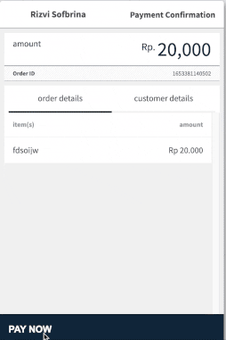

# Payment Link via API

## Overview
This section will explain about **Payment Link API** BETA. Merchant can create & manage **Payment Link** using the API. **Payment Link** is a web-based link (URL) which can be shared to Customer to receive payments from them – like an **invoice**. The link will redirect them to Midtrans hosted payment web page.

?> Payment Link API is still in BETA phase. But is currently usable on Midtrans Production & Sandbox environment. Feel free [to contact our Support Team](https://midtrans.com/contact-us) (or your Midtrans' Sales Account Manager) to share your feedback or question.

## Key Benefit
 

<!-- @NOTE: SVG icons generated from: https://tablericons.com/ size: 40, color: 597e8d
Because of limited time. Should properly ask MKT team for icons?
-->

  

  <svg xmlns="http://www.w3.org/2000/svg" class="icon icon-tabler icon-tabler-exchange" width="40" height="40" viewBox="0 0 24 24" stroke-width="1.5" stroke="#597e8d" fill="none" stroke-linecap="round" stroke-linejoin="round">
  <path stroke="none" d="M0 0h24v24H0z" fill="none"/>
  <circle cx="5" cy="18" r="2" />
  <circle cx="19" cy="6" r="2" />
  <path d="M19 8v5a5 5 0 0 1 -5 5h-3l3 -3m0 6l-3 -3" />
  <path d="M5 16v-5a5 5 0 0 1 5 -5h3l-3 -3m0 6l3 -3" />
</svg>

 

<h4 class="my-card-title">Create with simple API call</h4>

No need to login to Midtrans dashboard to manually create one-by-one. Easily create Payment Link via API integration.

  

  

  <svg xmlns="http://www.w3.org/2000/svg" class="icon icon-tabler icon-tabler-refresh" width="40" height="40" viewBox="0 0 24 24" stroke-width="1.5" stroke="#597e8d" fill="none" stroke-linecap="round" stroke-linejoin="round">
  <path stroke="none" d="M0 0h24v24H0z" fill="none"/>
  <path d="M20 11a8.1 8.1 0 0 0 -15.5 -2m-.5 -4v4h4" />
  <path d="M4 13a8.1 8.1 0 0 0 15.5 2m.5 4v-4h-4" />
</svg>

 

<h4 class="my-card-title">Connect with Your Web/App</h4>

Connect your web/app/system, receive real time notification, & manage your transaction in a two-way communication flow via API.

  

  

  <svg xmlns="http://www.w3.org/2000/svg" class="icon icon-tabler icon-tabler-lock-access" width="40" height="40" viewBox="0 0 24 24" stroke-width="1.5" stroke="#597e8d" fill="none" stroke-linecap="round" stroke-linejoin="round">
  <path stroke="none" d="M0 0h24v24H0z" fill="none"/>
  <path d="M4 8v-2a2 2 0 0 1 2 -2h2" />
  <path d="M4 16v2a2 2 0 0 0 2 2h2" />
  <path d="M16 4h2a2 2 0 0 1 2 2v2" />
  <path d="M16 20h2a2 2 0 0 0 2 -2v-2" />
  <rect x="8" y="11" width="8" height="5" rx="1" />
  <path d="M10 11v-2a2 2 0 1 1 4 0v2" />
</svg>

 

<h4 class="my-card-title">Accessible & Secure</h4>

Manage who can access the feature from your system, without providing access to your whole Midtrans dashboard. Also a secure & simple payment flow for the Customer.

  

  

  <svg xmlns="http://www.w3.org/2000/svg" class="icon icon-tabler icon-tabler-calendar-time" width="40" height="40" viewBox="0 0 24 24" stroke-width="1.5" stroke="#597e8d" fill="none" stroke-linecap="round" stroke-linejoin="round">
  <path stroke="none" d="M0 0h24v24H0z" fill="none"/>
  <path d="M11.795 21h-6.795a2 2 0 0 1 -2 -2v-12a2 2 0 0 1 2 -2h12a2 2 0 0 1 2 2v4" />
  <circle cx="18" cy="18" r="4" />
  <path d="M15 3v4" />
  <path d="M7 3v4" />
  <path d="M3 11h16" />
  <path d="M18 16.496v1.504l1 1" />
</svg>

 

<h4 class="my-card-title">Customizable Limit</h4>

Customize how long and how many usage(s) the link will be valid for.

  

  

  <svg xmlns="http://www.w3.org/2000/svg" class="icon icon-tabler icon-tabler-forms" width="40" height="40" viewBox="0 0 24 24" stroke-width="1.5" stroke="#597e8d" fill="none" stroke-linecap="round" stroke-linejoin="round">
  <path stroke="none" d="M0 0h24v24H0z" fill="none"/>
  <path d="M12 3a3 3 0 0 0 -3 3v12a3 3 0 0 0 3 3" />
  <path d="M6 3a3 3 0 0 1 3 3v12a3 3 0 0 1 -3 3" />
  <path d="M13 7h7a1 1 0 0 1 1 1v8a1 1 0 0 1 -1 1h-7" />
  <path d="M5 7h-1a1 1 0 0 0 -1 1v8a1 1 0 0 0 1 1h1" />
  <path d="M17 12h.01" />
  <path d="M13 12h.01" />
</svg>

 

<h4 class="my-card-title">Customizable URL</h4>

Customize some part of the URL, to make it more accessible for Customer.

  

  

  <svg xmlns="http://www.w3.org/2000/svg" class="icon icon-tabler icon-tabler-send" width="40" height="40" viewBox="0 0 24 24" stroke-width="1.5" stroke="#597e8d" fill="none" stroke-linecap="round" stroke-linejoin="round">
  <path stroke="none" d="M0 0h24v24H0z" fill="none"/>
  <line x1="10" y1="14" x2="21" y2="3" />
  <path d="M21 3l-6.5 18a0.55 .55 0 0 1 -1 0l-3.5 -7l-7 -3.5a0.55 .55 0 0 1 0 -1l18 -6.5" />
</svg>

 

<h4 class="my-card-title">Email Notification</h4>

Payment instructions can automatically be sent to Customer, after each successful creation.

  

  

## Business Usecase Example
Here are some business use case ideas that Merchant can achieves with Payment Link:
- **Invoice based payment system** use case. As the payment link expiry can be set to weeks or months. Can also be set to be paid by 1 specific customer, or mass generic invoice for a big number of customers.
  - Whether for B2B business type where Merchant wants to create goods & services payment invoice to be paid by partner/vendor/customer.
  - Or even for regular B2C business type that sells various goods & services.
- **Ticketing payment** use case, due to the same reason as above. For example tickets for transportations, entertainment, courses, digital products, conferences, webinars, online/offline event, concert, shows, meet and greet, parking, hotel, traffic/other violation sanction, & hospitality, etc.

## Customer Journey
Example of how Customer journey can be:
1. Merchant **shares the Payment Link to Customer** via messaging app (Whatsapp, SMS, Email, etc. Midtrans can also automatically send via Email to Customer).
  
2. Customer click the Payment Link, open the **payment page in web browser, and then the payment** as instructed.
  

## Merchant Journey

Example of how Merchant journey can be:

1. **Customer create an order/purchase** to Merchant (via web/app/system, or manual order).
2. Merchant's **sales person prepares/initates payment invoice via Merchant's system**.
3. Merchant's **system/backend [initiate API request to Create Payment Link](/en/technical-reference/payment-link-api.md#create-payment-link-api)** to Midtrans API to retrieve payment URL. Display the result to the sales person (or via system).
4. Merchant's sales person (or system) **share the Payment Link to Customer** via messaging app (Whatsapp, SMS, Email, etc. Midtrans can also automatically send via Email to Customer). [Customer proceed to pay](#customer-journey).
5. Later after payment has been completed, [merchant system's will be notified](/en/technical-reference/payment-link-api.md#handling-notifications). There are also other [alternatives actions for after-payment](#other-api-actions-amp-payment-handling).

?> Note: you can check **[Business Usecase Example](#business-usecase-example)** for more idea & variations.

Check out sequence diagram below for more details & visual.

## Sequence Diagram
<small>Click below to expand:</small>

<b>Sequence Diagram</b>

<article>

</article>

## Next Step
Follow the linked section below to learn further about the technical aspect of Payment Link API & its integration.

#### [Payment Link API Reference](/en/technical-reference/payment-link-api.md)

