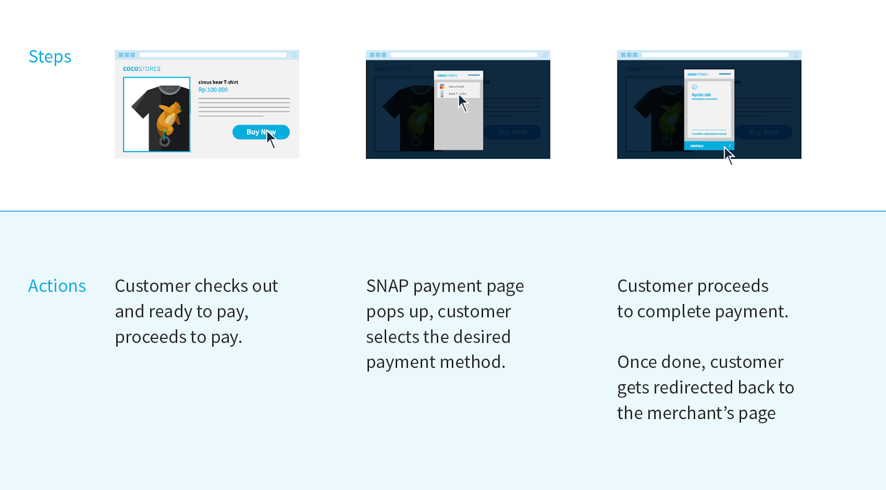

# Snap Overview

<i>Snap</i> is a payment service that allows Midtrans partners to use Midtrans payment systems. This allows Midtrans payment page to pop-up on your web page after checkout. Configuring <i>Snap</i> is easy and there is no monthly fees. The simple and quick integration process is suitable for small size business or corporate size businesses.

 With single integration, Snap user interface allows you to accept payments with any of the [Midtrans payment methods](https://midtrans.com/payments).

  <button onclick="
  event.target.innerText = `Processing...`;
  fetch(`https://cors-anywhere.herokuapp.com/https://midtrans.com/api/request_snap_token`)
    .then(res=>res.json())
    .then(res=>{
      let snapToken = res.token;
      snap.pay(snapToken,{
        onSuccess: function(res){ console.log('Snap result:',res) },
        onPending: function(res){ console.log('Snap result:',res) },
        onError: function(res){ console.log('Snap result:',res) },
      });
    })
    .catch( e=>{ console.error(e); window.open('https://demo.midtrans.com', '_blank'); } )
    .finally( e=>{ event.target.innerText = `Pay with Snap &#9099;` })
  " class="my-btn">Try Snap Demo &#9099;</button>

## Various Ways to Integrate with Snap {docsify-ignore}
Choose the best suitable method to integrate with Snap from the list given below.<!--Anuja, Please see if this is OK-->

#### [A. Integration Guide](/en/snap/integration-guide.md)
Use the simple step-by-step basic integration guide which includes examples for various programming languages.

#### [B. Interactive Demo](/en/snap/interactive-demo.md)
Quickly understand how the integration works, by looking at an interactive code example with real-time output. You can quickly replicate the code and learn to integrate.

#### [C. Install Snap as CMS Plugin](/en/snap/with-plugins.md)
Simply install these ready to use plugins to start integration with E-commerce CMS like: WordPress WooCommerce, Magento, PrestaShop, OpenCart, WHMCS, and so on.

#### [D. Using Ecommerce Platform](/en/snap/platform/overview.md)
Use third-party E-commerce platform solutions such as Shopify, Sirclo, Jejualan and so on, to quickly integrate with Midtrans.

#### [E. Sample Code Repo](/en/technical-reference/library-plugin.md#sample-integration-code)
Use the collections of integration code examples for various programming languages, available as public GitHub repositories to integrate with Midtrans.

## Advanced Usage {docsify-ignore}

#### [Snap Advanced Feature](/en/snap/advanced-feature.md)
Learn the various useful features provided by Snap API.

