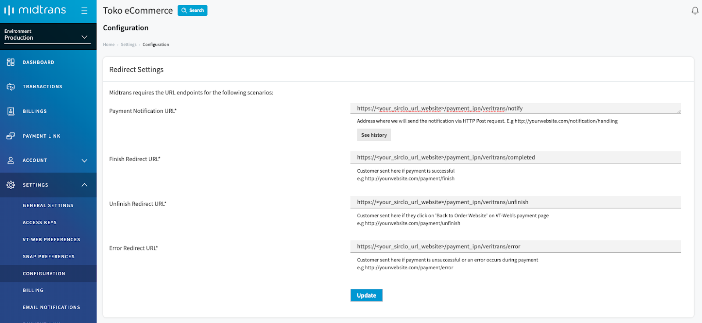

# Integrated Platform

If you are using 3rd party E-commerce platform or SaaS like Shopify, Sirclo, and Jejualan. 

We have partnered with various platfroms to make integration process as easy as possible. This page contains a list of platforms that have partnered with Midtrans, if you are using 3rd party platform and would like for us to integrate with it, please contact [support@midtrans.com](mailto:support@midtrans.com "email support")

Step by step guide to integrate Snap to your platform of choice, will be explained below.
#### Choose from any platform of your choice:
 

#### [Shopify](#shopify)

#### [Sirclo](#sirclo)

#### [Jejualan](#jejualan)

  

## Shopify

Please complete the following steps in advance:

1. Create an online store with Shopify (You must be in an active paid Shopify-plan in order to allow your customer to do checkout).
2. Register to Midtrans account [here](https://account.midtrans.com/register).
3. Complete the account registration form, or get help by contacting [Midtrans activation team](mailto:activation@midtrans.com) with __SHOPIFY - URL Name__ as a subject header and mention your registered _Midtrans Merchant ID_.

### Integrate Midtrans to Shopify Platform by following the steps below:

1. Login to Midtrans [Merchant Administration Portal](https://account.midtrans.com/login)

	You will find your online shop name with Sandbox/Production environment. Please make sure that you are in __Production environment__.

	

2. Choose __Settings - Configuration__.

	

	Fill __Payment Notification URL__ with: `http://vt-pixels.herokuapp.com/veritrans/callback_url`. 
	Fill __Finish Redirect URL__ with: `<your_website>`. 
	Fill __Unfinish Redirect URL__ with: `<your_website>`. 
	Fill __Error Redirect URL__ with: `<your_website>`.

3. Choose __Settings - Access Keys__.

	Copy Midtrans __Merchant ID__ dan __Server Key__ (Will be used for the next step).

	

4. Login to your [Shopify Store](https://www.shopify.com/login) 

5. In your Shopify Store admin page go to menu __Settings - Payment providers__ 
	
	
	

6. Under __Third-party providers__ menu, click __Choose third-party provider__.
	

7. Search __Midtrans__ and click it.
	

8. Complete the configuration by filling in your __Merchant ID__ & __server key__. Then click __Activate__. 

	__Note:__

	- Leave __Enable test mode__ checkbox unchecked to allow real transaction.
	- Check the __Enable test mode__ checkbox if you want to test transaction without actual payment (using test credentials provided by Midtrans).

	Please note that __server key__ for sandbox/testing is different from production. You may obtain your Merchant ID & server key from Midtrans MAP (after logging in) from the following links:
	
	- For sandbox/testing: [here](https://dashboard.sandbox.midtrans.com/settings/config_info)
	- For production/real transaction: [here](https://dashboard.midtrans.com/settings/config_info)

	

9. Done! Now your Shopify online shop is ready to use Midtrans as payment gateway. Your customer will see Online Payment as payment method on the checkout page.

	

10. Midtrans Snap payment page will be displayed to the customer. Payment methods that are available for this integration is all payment methods that are available on Snap product, which is explained on [this page](https://midtrans.com/payments).

	

  

### Available Payment Methods
Payment methods that are available for this integration is all payment methods that are available on Snap product, which is explained on [this page](https://midtrans.com/payments).

### Matching Order ID Between Shopify & Midtrans
Order ID created on Midtrans Dashboard for each transaction is based from reference auto generated by Shopify platform, to ensure uniqueness per transaction. It can be different with order id shown on Shopify platform.

To find order on Shopify platform based on Order ID from Midtrans, first find the transaction Order ID from Midtrans Dashboard on Transactions Menu.

#### Via Order menu
1. On your Shopify admin area, go to __Orders > All Orders__ menu.
2. Use the __search__ feature, search by inputting order id from Midtrans.
3. Click on the shown order.

#### Via General Search
1. On your Shopify admin area, there is general __search__ bar on top of the page.
2. Search by inputting order id from Midtrans.
3. Click on the shown order.

#### Order detail
Inside the order found by the search result, you can see the reference number.

#### Via Exported Order
You can also find the reference number on the exported CSV file using Shopify export feature: __All Orders > Export > Export Orders.__ Then search within the CSV file.

  

## Sirclo

Please complete the following steps in advance:

1. Create an online store with Sirclo.
2. Register to Midtrans account [here](https://account.midtrans.com/register).
3. Complete the account registration form, or get help by contacting [Midtrans activation team](mailto:activation@midtrans.com) with __SIRCLO - URL Name__ as a subject header and mention your registered _Midtrans Merchant ID_.

### Integrate Midtrans to Sirclo Platform by following the steps below:

1. Login to Midtrans [Merchant Administration Portal](https://account.midtrans.com/login)

	You will find your online shop name with Sandbox/Production environment. Please make sure that you are in __Production environment__.

	

2. Choose __Settings - Configuration__.

	Fill __Payment Notification URL__ with : `<your_website>/payment_ipn/veritrans/notify`. 
	E.g: If your website is www.abc.com, so your Payment Notification URL should be filled with “http://www.abc.com/payment_ipn/veritrans/notify”.

	Fill __Finish Redirect URL__ with: `<your_website>/payment_ipn/veritrans/completed`. 
	Fill __Unfinish Redirect URL__ with: `<your_website>/payment_ipn/veritrans/unfinish`. 
	Fill __Error Redirect URL__ with: `<your_website>/payment_ipn/veritrans/error`.

	

3. Choose __Settings - Access Keys__

	Copy Midtrans __Merchant ID__ dan __Server Key__ (Will be used for the next step).

	

4. Login to Sirclo Admin Panel of your Sirclo store.

	

5. Choose __Settings - Payment Settings__.

	

	Find Midtrans field, then input Midtrans Production _Merchant ID_ and _Server Key_.

	

6. Enable payment methods via Midtrans by checking / unchecking the desired payment method

> **Info:**
> You can enable all registered payment methods at Midtrans by unchecking all payment methods.

7. You can choose installment payment method by filling installment period in _Veritrans Installment period for [Bank Name]_. 

> **Info:**
> For installment:
> - You need to be approved and negotiate with the Bank regarding to interest rate and installment period
> - Please contact us at [activation@midtrans.com](mailto:activation@midtrans.com) for further inquiry.

8. Click **Save** or **Update**

  

## Jejualan

Please complete the following steps in advance:

1. Create an online store account with [Jejualan](https://jejualan.com/daftar), and choose Beta, Gamma, or Delta in order to use Midtrans service.
2. Register to Midtrans account [here](https://account.midtrans.com/register).
3. Complete the account registration form, or get help by contacting [Midtrans activation team](mailto:activation@midtrans.com) with __Jejualan – URL Name__ as subject header.

### Integrate Midtrans to Jejualan platform by following the steps below:

1. Login to Midtrans [Merchant Administration Portal](https://account.midtrans.com/login)

	You will find your online shop name with Sandbox/Production environment. Please make sure that you are in __Production environment__.

	

2. Choose __Settings - Configuration__.

	

	Fill __Payment Notification URL__ with: `<your_website>`. __E.g__ : if your website is http://abc.jejualan.com, so your Payment Notification URL should be filled with “http://abc.jejualan.com”. 

	Fill __Finish Redirect URL__ with: `<your_website>/store/payment/veritrans/success`. 
	Fill __Unfinish Redirect URL__ with: `<your_website>/store/payment/`. 
	Fill __Error Redirect URL__ with: `<your_website>/store/payment/veritrans/failed`.

3. Choose __Settings - Access Keys__.

	Copy Midtrans __Merchant ID__ dan __Server Key__ (Will be used for the next step).

	

4. Login to Jejualan Admin Panel of your store 

	

5. Choose __Konfigurasi - Pembayaran__.

	

	Click Midtrans field, then change mode from `Tidak Aktif` to `Aktif`. Ensure that the button is now colored in blue.

6. Input Midtrans __Production Server Key__. Then enable payment methods via Midtrans by checking / unchecking the desired payment method.

	

> You can enable only registered payment methods. For Credit Card, 3D Secure mode is recommended.

7. Click **Simpan**.