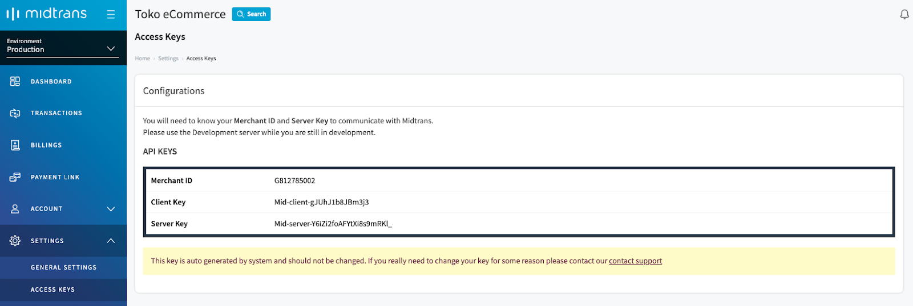
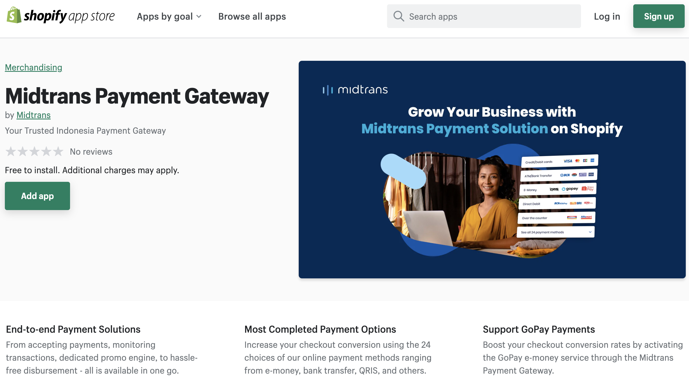
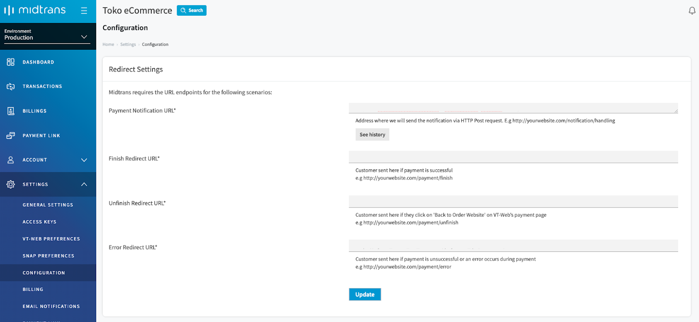

# Integrate Midtrans Snap to 3rd Party Ecommerce Platform
<hr>
 
Midtrans Snap can be integrated with third party E-commerce platform or SaaS like Shopify, Sirclo, and Jejualan. 

Midtrans is partnered with various platforms to make integration process as easy as possible. This page contains a list of platforms that have partnered with Midtrans. If you are using third party platforms that are not listed here, and would like for Midtrans to integrate with it, please [contact us](https://midtrans.com/contact-us/).

Step by step guide to integrate Snap to the platform of your choice, is explained below. 
#### Choose from any platform of your choice:
<br>

<div class="my-card">

#### [ Shopify](#shopify)
</div>
<div class="my-card">

#### [ Sirclo](#sirclo)
</div>
<div class="my-card">

#### [ Jejualan](#jejualan)
</div>

<hr><br><br>

## Shopify

Please complete the pre-requisite below:

1. Create an online store with [Shopify](https://shopify.com) if you haven't.
2. Register for [Midtrans account](https://dashboard.midtrans.com/register).
3. Complete the account registration form. For any help, you can contact [Midtrans contact center](https://midtrans.com/contact-us/registration-and-service-information/cara-mendaftar-akun-midtrans).

Note: 

- You can try with Shopify Trial plan to test payment integration in *Sandbox mode*. 
- You may be required by Shopify to have an active paid-plan in order to allow your customer to do checkout on *Production mode*.

### Integrating Midtrans to Shopify Platform

Depending on each situation, please **follow one which best fits your situation**:
- If you are a New/Existing Merchant who wants to integrate to Midtrans for the first time, please click & follow: [First Time Integration guide.](#first-time-integration)
- If you are an Existing Merchant and previously using Old Midtrans Payment App, please click & follow: [Migrating from Previous Payment App Version](#migrating-from-previous-payment-app-version)

### First Time Integration

1. Login to Midtrans [Merchant Administration Portal](https://dashboard.midtrans.com/login).

	You will find your online shop name with *Sandbox/Production environment*. Please make sure that you are in __Production environment__.

	<br>

2. Select __Settings -> Access Keys__.

	Copy Midtrans __Merchant ID__ and __Server Key__ (Will be used for the next step).

	you also need Midtrans Merchant ID and Server Key from sandbox environment, please change the environment mode to sandbox, and access the same menu to get Midtrans Merchant ID and Server Key

	<br>

3. Login to your [Shopify Store](https://www.shopify.com/login).

4. Follow this link to find [Payments via Midtrans App on Shopify App Store.](https://apps.shopify.com/midtrans-payment-gateway-new)

	<br>

5. Click __Add app__ button to install.

6. You will be redirected to installation page, you can review the displayed information, then click __Install app__
	<br>

7. You will be redirected to the Onboarding page, please fill in your Midtrans __Merchant ID__ and __Server Key__ (from step 2) for each production and sandbox. Then click __Register__.
	<br>

8. You will be redirected back to Shopify, and the page will indicates that your Shopify store is connected to Payments via Midtrans.
	<br>

9. To activate, click __Activate Payments via Midtrans__. You can also tick/untick desired payment method icons that will be shown in the payment button on your checkout page.

10. Done! Now your Shopify online shop is ready to start accepting payments with Midtrans as payment gateway. Your customer will see __Payments via Midtrans__ as payment method on the checkout page.
	<br>

<br>

With this integration, your customer will be redirected to Snap Redirect payment page if they choose Payments via Midtrans on your store. Customer payment data is safely managed by Midtrans hosted payment web page, outside of your Shopify store web domain.

All supported [Payment methods that are available on Snap product, are explained here](https://midtrans.com/payments).

### Migrating from Previous Payment App Version
?> As [announced by Shopify](https://shopify.dev/apps/payments/hosted-payment-sdk), Shopify planned to deprecate the previous payment integration platform (Hosted Payment SDK) by July 31st, 2022. Shopify has urged Midtrans (and other payment gateways) to migrate to their new [Payment Platform integration](https://shopify.dev/beta/payments-apps/). In compliance with it, Midtrans has migrated to the new platform. As a result, __you__ as a __Midtrans’ merchants will need to migrate by installing "Payments via Midtrans App" for Shopify__. The app will have improved performance, reliability, & security.<br><br>
__If by July 31st, 2022 you have not done so__, Midtrans payment integration (installed using the previous platform) __may no longer work for your Shopify store__.<br><br>
Due to the changes introduced by Shopify’s new payment platform, there are some changes and limitations (compared to previous integration version) that should be expected. Visit [Known Limitations](#known-limitations) under Advanced section to see the details.

There will be two parts:
1. [Install New Midtrans Payment App](#install-new-midtrans-payment-app)
2. [Uninstall Old Midtrans Payment App](#uninstall-old-midtrans-payment-app)

- Additionally, if you were using Card Installment feature previously, you [can follow card installment settings guide](#card-installment-settings).

#### Install New Midtrans Payment App

During the transition period, move from Old Midtrans App to New Midtrans App, you can install New Midtrans App before uninstalling the Old Midtrans App. Both apps can work on your Shopify store. You can install and test the New Midtrans App to ensure that it will work.

1. Login to Midtrans [Merchant Administration Portal](https://dashboard.midtrans.com/login).

	You will find your online shop name with *Sandbox/Production environment*. Please make sure that you are in __Production environment__.

	<br>

2. Select __Settings -> Access Keys__.

	Copy Midtrans __Merchant ID__ and __Server Key__ (Will be used for the next step).

	you also need Midtrans Merchant ID and Server Key from sandbox environment, please change the environment mode to sandbox, and access the same menu to get Midtrans Merchant ID and Server Key

	<br>

3. Login to your [Shopify Store](https://www.shopify.com/login).

4. Follow this link to find [Payments via Midtrans App on Shopify App Store.](https://apps.shopify.com/midtrans-payment-gateway-new)

	<br>

5. Click __Add app__ button to install.

6. You will be redirected to installation page, you can review the displayed information, then click __Install app__
	<br>

7. You will be redirected to the Onboarding page, please fill in your Midtrans __Merchant ID__ and __Server Key__ (from step 2) for each production and sandbox. Then click __Register__.
	<br>

8. You will be redirected back to Shopify, and the page will indicates that your Shopify store is connected to Payments via Midtrans.
	<br>

9. To activate, click __Activate Payments via Midtrans__. You can also tick/untick desired payment method icons that will be shown in the payment button on your checkout page.

10. Done! Now your Shopify online shop is ready to start accepting payments with Midtrans as payment gateway. Your customer will see __Payments via Midtrans__ as payment method on the checkout page.
	<br>


#### Uninstall Old Midtrans Payment App
!> If you **choose to uninstall the old one, you will not be able to re-install the old one again**.
\
\
 **Uninstalling the old Payment App is not a must**. <!-- It will be just fine to leave it enabled (and let Shopify platform auto-disable them when the time comes).--> You can have both old and new app enabled for customer to choose. With an advantage if anything goes wrong during transition period, you can still use the old one and temporary disable the new one.

If you choose to uninstall the Old Midtrans Payment App(s), you can proceed to follow steps below.

<!-- To avoid confusion from customer side & inconsistent payment status update behavior, we recommend to uninstall the Old Midtrans Payment App on your store, so that only the new Midtrans Payment App is available for your customer to choose from. -->

Before uninstalling, it is recommended to:
- Please ensure that you have successfully installed the New Midtrans App and it works on your Shopify store.
- Plan to uninstall around the time that has low payment traffic, e.g: 2 AM. To prevent failure, if there are any customer in the middle of checkout/payment session.
<!-- - Wait for all the order/payment that was created using Old Midtrans App to no longer `pending` status and already have `success/settlement` or `failure` status in Midtrans Dashboard. 
	- If a payment was initiated (still `pending`) using the old payment app, then you disable it, payment status for that payment may no-longer be updated on your shopify store when later payment become success. You should refer to Midtrans Dashboard for the actual & updated payment status. -->

Uninstall steps:
1. Login to your Shopify admin page. Go to menu **Settings > Payments**.
2. Click **Manage** button on payment app that you want to uninstall. Hint:
	- You **should uninstall** the old ones named `Midtrans` & `Midtrans - ...`. 
	- But **don't uninstall** `Provider Payments via Midtrans` the new one.
3. Then click **Deactivate** button in the payment app detail view.
4. You will be redirected back to Payment Menu, and the app will be removed from Payment List and also removed from your list of available payment methods on checkout page.
5. If you have installed multiple of Midtrans old payment apps, you can repeat the step from no.2.

<!-- Although, it will be OK to not to uninstall any of the old Payment App (and let Shopify platform auto-disable them when the time comes), it is more recommended to perform the uninstall as we instructed. -->
<hr>

### Test Transaction with Sandbox Mode

**Sandbox/Test Mode** can be used to create "testing" transactions. All transaction made within this mode is not "real", and does not require "real payment/fund", you can do a test transaction with New Midtrans App, please follow the steps given below.

1. On your store admin page, navigate to **Settings > Payment**.
2. Click Manage button on payment app that you want to enable test mode.
	<br>
3. In the payment app detail page, enable the test mode by ticking the option **Enable Test Mode**.
	<br>
4. Click **Save** button.
5. Create a transaction as a customer, complete the checkout process, and choose Payments via Midtrans as payment options, until redirected to Midtrans payment page.
6. You will see Midtrans payment page with a mark "TEST" around top right of the screen.
	<br>
7. Select payment method and proceed to **Pay**.
8. Use [Sandbox payment credentials here](/en/technical-reference/sandbox-test.md), based on payment method that you selected.
9. Follow the guide to complete the payment.
10. After payment is completed, on your Shopify admin page, visit the order detail page. You will find the timeline history on the order detail page will show `Test = True`.
	<br>
11. That indicates the transaction was made on sandbox/test mode.
12. After the test is finished and you are ready for real transactions (live on Production mode), please disable the test mode by unticking the option on step 3.

<hr>

### Payment App Account Settings
**Optionally**, you can further manage/edit your Payments via Midtrans App account settings. Although **for most-usecase, you are not required** to do this.

1. On your store admin page, navigate to **Settings > Payment**, then on the listed payment with Midtrans as the provider, click **Manage**.
2. In the displayed Payments via Midtrans page, click __Manage__.
<br>

3. You will be redirected to the Midtrans account settings, you can update Midtrans Merchant ID, enable specific payment methods, and activate online offline installment.


#### General Settings
On this section, you can update Midtrans Merchant ID and enable specific payment methods
<br>

1. Sample if you only enable credit card payment method
<br>
<br>

2. Sample if you enable credit card, gopay, and bank transfer payment methods
<br>
<br>

#### Card Installment Settings
On this section, you can activate Online or Offline Installment for card payment method, to activate the installment feature, you are required to have an agreement with the bank. Please contact Midtrans for details.
<br>

Previously on Old Midtrans Payment App, when you install/activate Midtrans Card Installment, it will automatically configured by default. But on the New Midtrans Payment App, you will need to Enable Online Card Installment by ticking the option and clicking the **Submit** button to save the settings.
<br>

When customer choose to checkout using Payments via Midtrans, they will see the installment options on the card payment page.

__Offline Installment__, [this feature](/en/snap/advanced-feature.md#offline-installment) previously was not supported on Old Midtrans Payment App, to activate the installment feature, you are required to have an agreement with the bank. Please contact Midtrans for details.

You can Enable Offline Card Installment by ticking the option and clicking the **Submit** button to save the settings.
<br>

<hr>

### Advanced

<br>

<details>
<summary>Matching Order ID Between Shopify and Midtrans</summary>
<article>

Order ID created on Midtrans Dashboard for each payment transaction is based from Payment ID auto generated by Shopify platform. It can be different with the Order ID shown on Shopify platform.

?> **Note:** The Shopify Payment ID is auto generated by Shopify's platform, it **does not seems to be possible to customize the ID** or the format. Hence, the Order ID created on Midtrans side will also follow this limitation. This is a limitation on Shopify side, you can consult with them should you have any feedback.

To find order on Shopify platform, based on Order ID from Midtrans, first find the transaction Order ID from Midtrans *Dashboard* on **Transactions**.


##### From Order menu
1. On your Shopify admin area (administration page), go to __Orders__. 
2. In the search bar, search using the custom term **receipt.payment_id:** and the **order ID** value from Midtrans. For example: **receipt.payment_id:order_id_from_midtrans**
3. Click on the shown order.


##### Order detail

From the order details' `Timeline` you can also review the order status history. You can also click one of them to expand to see more details. You will see the Midtrans order ID under `Information from the gateway => Payment`.


##### From Exported Order
You can also find the order ID on the exported CSV file using Shopify export feature: __Export Orders.__ Then search **Payment ID column** within the CSV file


</article>
</details>


<details>
<summary>Customize Shopify Order Confirmation Email Template</summary>
<article>

When customer is proceeding to check out from your Shopify store into Midtrans Snap payment page, order is "confirmed" on Shopify side, and they will send "order confirmation" email notification to customer.

But you may find the wording of the email is confusing for customer, for example: 
> Hi John, we're getting your order ready to be shipped. We will notify you when it has been sent.

You may notice that email is being sent **before customer completes the payment**, so it may not be true that the order is ready for shipping, **the order needs to be paid first**. Unfortunately that's how the default Shopify "order confirmation notification" behavior works. We can try to customize the message to be less confusing. 

Shopify explained how to customize notification [on their documentation here](https://help.shopify.com/en/manual/sell-online/notifications/edit-template). We try to summarize it for you.

1. Login to your Shopify admin page.
2. Go to `Settings > Notifications`.
3. Click `Order Confirmation`.
4. Search for `` text.
5. Input or copy this sentence just below/after that text:
```
If you have completed your payment, then you are done. If you have not completed your payment, please complete it soon to avoid auto-cancelation.<br><br>
```
You can customize the message to your own preference. Or even modify it as "payment reminder".

6. Click `Save`. You can also `Preview` the email.
7. Done.


</article>
</details>

<details>
<summary>Additional Notes</summary>
<article>

##### Cancel and Refund via Shopify admin panel
Within Shopify admin panel's order details view, there are actions of `cancel` and `refund`. When triggering `cancel` or `refund`, Midtrans order status will try to sync with the Shopify status, if it met the criteria for payment cancel or refund.

For example:
- Refunding `paid` order on Shopify, will also make Midtrans order status to be marked as `refund`/`cancel`.

Limitations:
- Not all payment methods support online `refund` on Midtrans side, capability is mostly limited to Card & e-money/QRIS transaction.
- Will only works if your Midtrans account is allowed to trigger online refund.
- Shopify's refund UI/UX can be a little bit confusing, after clicking refund it may not tell you whether the refund is successful or not. It only shows `refund processing` which **should not be confused as an indication of success**. You can follow the refund status from the Shopify Order’s timeline. If it is marked as `pending` or failure, the refund is not successful.
- It is more recommended to manage payment refund & cancellation from Midtrans Dashboard instead. As it will have a better indication of refund success and failure.
- `cancel` or `refund` action triggered on Midtrans dashboard/API, may or may not be synced to Shopify due to some limitation.

?> The more accurate payment status is the one shown on Midtrans dashboard. You should refer to it in case there are discrepancies on Shopify's side. Because in some rare case payment status syncing to Shopify's system may fail, and Shopify's order details UI can be confusing to read.

##### Note on Canceling Order
Canceling a paid order will auto trigger attempt to refund/cancel payment on Payment Gateway (Midtrans) side. That is the flow of Shopify that Merchant and Payment Gateway follows. Please avoid canceling a paid order when you mean to edit/customize the item or size.

As per Shopify docs, `cancel order` are not supposed to be used to change item/size:
https://help.shopify.com/en/manual/orders/refund-cancel-order#cancel-an-order

Merchants supposed to `edit order` if they need to change the item/size:
https://help.shopify.com/en/manual/orders/edit-orders

Or archive the order, if they really need to remove it from order list:
https://help.shopify.com/en/manual/orders/manage-orders#archive-a-fulfilled-order

##### Email Notification of SNAP Validation Error
In the scenario of:
- Your customer proceeds to payment by selecting card payment method (on Snap payment page), and the **card payment ends up as rejected or abandoned**.

Then after some times (usually 2 hours):
- You (Merchant) may **receive a few emails from Midtrans** with subject __"Snap - Validation Error"__ and message: __"Transaction can't be canceled after being paid"__. 

Currently, it is **safe to ignore/disregard these emails**. This email is unintentionally triggered as part of Midtrans' internal integration with Shopify. It will not cause any issue for you and Customer, which should be safe to ignore.

We do understand that this can become an inconvenience, and our team is working to find a solution.

##### Retry Payment Email on an Order with Expired Payment
In the scenario of:
- Your customer proceeds to pay for an order to the point that they are redirected to Midtrans' Snap payment page, but then **they don't complete the payment**.
- Then after some time, the payment will be **considered as unpaid on Midtrans side**. On the Shopify admin panel's order details timeline you can also see it marked with `Unable to process a payment for Rp ... IDR on Payments via Midtrans`.

Then:
- By Shopify's default behaviour, your customer **will receives an email** that informs `Your payment couldn’t be processed for order #... You have not been charged. Click below to try paying for the order again.`. Which will **allow your customer to attempt another payment** by clicking the provided `Pay now` link.

When your customer does that, the payment status for that order will be re-started to `pending` state again. Which your customer has another chance to proceed with payment.

This is a default Shopify behavior (as of the time of this writing) and is outside of Midtrans control. If you want to know whether this is configurable, please consult Shopify's documentation or contact center.

##### Multiple Payment IDs for One Shopify Order
It is possible for **1 order (on Shopify admin panel) to have more than 1 payment IDs**. This is due to Shopify platform's behavior that **allows customers to retry their payments** for each order they create. For example, customer is able to [retry payment via an email received from Shopify](#retry-payment-email-on-an-order-with-expired-payment). 

The **detailed history will be displayed on Shopify admin panel's order details timeline**. Each one of those payment IDs (payment attempts) will **produces a separate Order ID on Midtrans side** aswell.

Here is an example of 1 order that has 1 earlier payment id which is unpaid, and then 1 other payment id which is successfully paid, as observed from Shopify admin panel's order details timeline.


##### Item Stock & Status
Few points to understand about order status & item stock management that is managed automatically with this integration:
- Item stock will be reduced whenever order status become `pending` on Shopify side.
- Item stock will be reduced immediately after the customer reaches Snap payment page, regardless of whether he/she will proceed to actual payment or not. This is to prevent "oversell" issue, by reserving the item stock for the duration of this payment. 
  - Example of "oversell" issue prevented by this mechanism: This happens when item stock is 1 left, but there are 2 (or more) customers racing to complete the payment, if both complete the payments, and both are accepted by Shopify, then the item stock will be negative. Which will cause issues on its own. So to prevent this, item stock is reserved (and marked as pending on Shopify side) as early as the customer is redirected to the payment page.
- Card transaction with `deny` status will be updated as failed on Shopify by Midtrans after two hours if left without any success attempt. If success pay attempt is found, it will be updated as success on Shopify.
- Abandoned Snap payment page (customer left without proceeding with any payment method) will be updated as expired on Shopify after two hours. Order may not show up in Midtrans Dashboard.
- When customer reaches Snap payment page (status `pending` and stock reduced). Shopify may send email to customer which says "order ready to be shipped", although from Shopify side it is still waiting for payment. Refer to section above about this behavior.
- It is recommended to **avoid manual order status changes (manual intervention)** from Shopify Admin Panel at least between period of the order first created as `pending` and it finally become `paid/canceled` (about 0-26 hours), in order for payment integration with Midtrans to perform smoothly. Which the order status and item stock will be managed automatically based on the flow explained on this page.
  - Manual order status changes may cause unexpected behaviour in terms of order status & item stock management, such as order status stuck at certain state. Do this at your own risk. Midtrans may not be in position to explain/help-with the consequences.

##### Basic Status Mapping
Condition | Midtrans Status | Shopify Payment Status
--- | --- | ---
Customer redirected to Snap payment page. | \- | Payment Pending
Customer proceeds with asynchronous payment <br>For example: Bank Transfer, Gopay. | Pending | Payment Pending
Customer proceeds with asynchronous payment <br>but does not pay until expiry time reached.<sup>[1]</sup> | Expire | Expired
Customer successfully makes payment. | Settlement/Capture | Paid
Customer abandoned Snap payment page <br>without proceeding with payment. | \- | Expired
Customer abandoned or denied card transaction. | Deny | Expired
Merchant cancels/refunds order via Shopify. | Cancel/Refund | Canceled/Refunded

<br>

<sup>[1]</sup> The expiry time calculation starts at the moment when the customer proceeds with the payment method (not necessarily from when redirected to Snap payment page). The payment expiry will then follow what is defined on Snap Preference for each payment method, you can [customize the Snap Preference](/en/after-payment/dashboard-usage.md#configuring-custom-payment-expiry-settings-on-snap) to your needs. When the payment expiry time is reached and the customer does not complete the payment, the transaction will be updated to `Expired` on Shopify side & `Expire` on Midtrans side. 

</article>
</details>

<hr>

#### Known Limitations
Due to the changes introduced by Shopify’s new payment platform, here are some changes (compared to previous integration version) and limitations that should be expected:

#### Is auto restock items upon abandoned payment still supported?

For context: In previous integration, if a customer left the Snap payment page without proceeding with any payment method, order will be updated as canceled on Shopify after two hours, and will be restocked. 

On this Shopify's new platform (at the time of this writing), unfortunately "auto restock items upon abandoned payment" may not be available. Due to **Shopify (or Shopify's new payment platform) default behavior does not seem to re-stock unpaid/payment-canceled order**. This is was a design-decision from Shopify, which is **outside of Midtrans control**.

As alternative, **you can cancel the order manually from Shopify admin**, to release the stock that previously was allocated for customers.

Further details:

When we reached out to Shopify, they answered:
- "This is an expected behaviour. Once the order is created, even if the payment is pending (as an example), we will hold the inventory for the merchant. Even if they reject the pending payment, the order still exists and the merchant can decide to get paid with another payment method. So as long as the merchant does not explicitly decide to release the inventory or cancel the order, the inventory is held. ... As some context, with the new system once a pending payment is rejected/expired, the customer is sent an email indicating that their original payment was not processed and provides the option to once again try payment. At the current time, we do not have plans to modify this flow. All this being said, I will be sure to pass on your feedback to our development team for potential future API updates." -- Shopify Team.

Which in short: Shopify allows customer to retry payment to the unpaid order, so the item stock will not be auto re-stocked unless Merchant explicitly do so.

There was another option, but seems to be **no longer working due to same reason** above:
- There is also 3rd party apps/extensions that may able to automate such task. For example, [Mechanic App](https://apps.shopify.com/mechanic) seems to be able to do that using [this automation task](https://tasks.mechanic.dev/cancel-and-close-unpaid-orders-after-two-days). Note: Informational only, Midtrans is not promoting the use of & not responsible for any external-party products.

#### Is it possible to have each payment method displayed as a separate payment button on my store’s checkout page?
As Midtrans have to follow Shopify's new payment platform guidelines, unfortunately Shopify discourages this approach. Additionally it will cause some technical complications. So Midtrans no longer able to continue providing this approach.

The above also applies to "card installment payment method as a separate payment button".

#### Is it possible to add more payment method icons to be displayed on the checkout page?
Shopify's platform seems to have limitation on the number of payment icons displayed for 1 payment button. We are trying to communicate with Shopify about this concern.

For now, you can choose which payment icons should be displayed for "Payments via Midtrans" button from:
- Shopify admin page, go to menu **Settings > Payments**, click **Manage**.

#### Is it possible to change the text-label of the payment button instead of the generic Payment via Midtrans text?
In Shopify's new payment platform, this doesn’t seem to be possible.

#### Is there anything Midtrans plan to do about the missing features compared to previous integration?
We do understand your concern that you want to bring the best customer experience to your store, Midtrans indeed also share a similar vision. So we are trying to figure out if we can bring back those or similar features. However please note that Midtrans integration is strictly bound to the limitations & behaviors of Shopify's new payment platform, so most of the time we’ll also need to communicate with Shopify and need their support to improve on the limitations. We’ll update our docs when we have any improvements ready.

#### Is it possible to have card online installment & offline installment feature activated at the same time?
It is not currently possible to have both features activated, as activating both features may result in unexpected behavior regarding the installment acquirer result. Please choose only one of either feature activated. Please note that you should not enable Offline Installment if you are not exactly sure, as it may result in Customer not being able to pay with their card.

#### As a Shopify store owner who already integrated with Midtrans using the previous integration method, what am I required to do?
According to Shopify’s mandate, you will be required to integrate using the current/new integration method, please follow the steps given in [Migrating from Previous Payment App Version](#migrating-from-previous-payment-app-version) section.

<!-- 
#### What will happen during the transition period where both integration methods can be installed? Anything else the store owner is required to do?
It is recommended to follow the [steps provided in the migration section](#migrating-from-previous-payment-app-version).

Although you can install New Midtrans Payment App along with Old Midtrans Payment App, both apps will work on your Shopify store. But it is less recommended.
 -->

#### What will happen during the end of the transition period where the old integration method is deactivated? Anything else the store owner is required to do?
The old one will be automatically deactivated from Shopify's platform side. We are further clarifying with the Shopify team, we’ll update the docs once we have further details.

#### How can I integrate my store with the Midtrans Sandbox Environment?
To integrate your store with the Midtrans Sandbox environment, you need to [enable test mode on Payments via Midtrans App, you can follow the step here](#test-transaction-with-sandbox-mode) to enable it.
<hr>

#### Deactivating Payments via Midtrans
If you decide to not use Payments via Midtrans, then you can deactivate it. When you deactivate the app, it's removed from your list of available payment methods, but it's still available if you need it for cases such as order returns.

1. In the Supported payment methods section, find the provider in the list.
2. Click Manage.
3. Click Deactivate to disable the provider.
4. Click Deactivate Payments App.

<!-- @TODO: explain if payment page closed, it may lost forever -->
<!-- @TODO: explain shopify void & refund feature -->
<!-- @TODO: explain item stock deduction / restock scenarios -->


<hr><br><br>

## Sirclo

Please complete the following steps:

1. Create an online store with Sirclo.
2. Register to [Midtrans account](https://account.midtrans.com/register).
3. Complete the account registration form. For any help, you can contact [Midtrans contact center](https://midtrans.com/contact-us/registration-and-service-information/cara-mendaftar-akun-midtrans).

### Integrating Midtrans to Sirclo Platform:

To integrate Midtrans to Sirclo platform, follow the steps given below.

1. Login to Midtrans [Merchant Administration Portal](https://account.midtrans.com/login).

	You will find your online shop name with *Sandbox/Production* *environment*. Please make sure that you are in __Production environment__.

	

2. Select __Settings->Configuration__.

	

| URL Role | Redirect URL|
|----------|-------------|
| Payment Notification URL | [your-site-url]/payment_ipn/veritrans/notify |
| Finish Redirect URL | [your-site-url]/payment_ipn/veritrans/completed |
| Error Redirect URL | [your-site-url]/payment_ipn/veritrans/error |
| Unfinish Redirect URL | [your-site-url]/payment_ipn/veritrans/unfinish |

> **Note:**
>
> Please make sure to input **http://** or **https://** when filling Notification URL and Redirect URL, according to your web-server configuration. 
>
> If you are not sure, try opening your web URL in a browser, and check the URL is **http** or **https** on the address bar.


3. Select __Settings->Access Keys__.

	Copy Midtrans __Merchant ID__ and __Server Key__ (Will be used for the next step).

	

4. Login to Sirclo Admin Panel of your Sirclo store.

	

5. Select __Settings->Payment Settings__.

	

	Find Midtrans field, then enter Midtrans Production _Merchant ID_ and _Server Key_.

	

6. Select the checkbox, corresponding to payment method, to enable it. 

> **Note:** 
>
> You can enable all registered payment methods at Midtrans by clearing all payment methods.

7. You can select installment payment method by filling installment period in _Veritrans Installment period for [Bank Name]_. 

> **Note for installment:**
> 
>- You need to agree and negotiate with the Bank regarding interest rate and installment period.
> - Please contact Midtrans for details.

8. Click **Save** or **Update**.
<hr><br><br>

## Jejualan

Please complete the following steps:

1. Create an online store account with [Jejualan](https://jejualan.com/daftar), and choose Beta, Gamma, or Delta in order to use Midtrans service.
2. Register to [Midtrans account](https://account.midtrans.com/register).
3. Complete the account registration form. For any help, you can contact [Midtrans contact center](https://midtrans.com/contact-us/registration-and-service-information/cara-mendaftar-akun-midtrans).

### Integrating Midtrans to Jejualan Platform:

To integrate Midtrans to Jejualan platform, follow the steps given below.

1. Login to Midtrans [Merchant Administration Portal](https://account.midtrans.com/login).

	You will find your online shop name with *Sandbox/Production* environment. Please make sure that you are in __Production environment__.

	

2. Select __Settings->Configuration__.

	

| URL Role | Redirect URL|
|----------|-------------|
| Payment Notification URL | [your-site-url] |
| Finish Redirect URL | [your-site-url]/store/payment/veritrans/success |
| Error Redirect URL | [your-site-url]/store/payment/veritrans/failed |
| Unfinish Redirect URL | [your-site-url]/store/payment/ |

> **Note:** 
>
> Please make sure to input **http://** or **https://** when filling Notification URL and Redirect URL, according to your web-server configuration. 
>
> If you are not sure, try opening your web URL in a browser, and check the URL is **http** or **https** on the address bar.

3. Select __Settings->Access Keys__.

	Copy Midtrans __Merchant ID__ dan __Server Key__ (Will be used for the next step).

	

4. Login to Jejualan Admin Panel of your store 

	

5. Select __Konfigurasi->Pembayaran__.

	

	Click Midtrans field, then change mode from `Tidak Aktif` to `Aktif`. Ensure that the button is now colored in blue.

6. Enter Midtrans __Production Server Key__. Then select the desired payment method. 

	

> You can enable only registered payment methods. For Credit Card, 3D Secure mode is recommended.
>

7. Click **Simpan**.

