# Integrating Midtrans Snap to E-commerce Content Management System (CMS)

Content Management System (CMS) allows you to easily have a website or web store without building from scratch. CMS does not require programming knowledge. You just need to install the CMS and customize according to your requirement. Then you can focus on managing the content, without much technical work. In the context of Ecommerce CMS, it means you can easily manage your ecommerce website. Some of the examples of CMS are WordPress, Magento 2, PrestaShop, WHMCS, and so on.

Midtrans provides easy to use & install plugins for popular Ecommerce CMS, which will enable your website to accept payments from your customers. All [payment methods](https://midtrans.com/payments) available on [Snap](/en/snap/overview.md) that are activated on your Midtrans Account will become available for your website’s customers.

?> Want to **try Midtrans CMS payment plugins, without/before installing?** We have some demo web-stores that you can use to try the payment journey directly, [follow this section.](#midtrans-payment-plugin-live-demonstration)

## Preparation
 

#### [Sign Up for Midtrans Account](/en/midtrans-account/overview.md)
Sign up for a Midtrans Merchant Administration Portal (MAP) account, to get your API Keys for *Sandbox* environment and to test integration.

#### [Retrieve API Keys](/en/midtrans-account/overview.md#retrieving-api-access-keys)
Retrieve API Keys for *Sandbox* environment that will be used for this guide.

?>**Note**: Follow the [preparation section](#preparation) to retrieve *Client Key* and *Server Key*, before proceeding to the section given below.

## CMS Plugins and Extensions Supported by Midtrans

This is a list of Content Management System (CMS) supported by Official Midtrans plugins and extensions. Step-by-step guide to install Snap integration plugin to your CMS of choice will also be explained.

Note: (un-official) 3rd party plugins from outside developer may exists out there and may support more CMSes than those being listed here. Feel free to use/try them, as most of them is useful and genuine, but Midtrans will not be able to offer support, or held responsible for the implementation of them.

 

<!-- NOTE: "Space" is intentionally added as prefix, to avoid header ID conflict-->
#### [ WordPress - WooCommerce](#wordpress-woocommerce)

#### [ Magento](#magento)

#### [ PrestaShop](#prestashop)

#### [ OpenCart](#opencart)

#### [ WHMCS](#whmcs)

#### [ Drupal](#drupal)

#### [ WordPress - Easy Digital Download](#wordpress-easy-digital-download)

<!-- @TODO: explain what is notification URL for non dev user. Why it is important, and what's the benefit of using notification url -->

  

<!-- @TODO: add section where to send feedback and feature request here -->

### WordPress - WooCommerce
Midtrans ❤️ WooCommerce! This plugin allows secure online payment on your WooCommerce store, without ever needing your customer to leave your WooCommerce store! It has a beautiful built-in responsive payment interface. Midtrans strives to make payments simple for you and your customers. It supports various online payment channels. Midtrans supports WooCommerce v2 and v3.

Midtrans-WooCommerce plugin is also available on [WordPress plugins store](https://wordpress.org/plugins/midtrans-woocommerce/). If you cannot find it listed there, you can always download and install it manually. For more details, refer to Manual Installation.

Note: Wordpress is generally known as a generic CMS used for blogging, news, etc. But it also can easily become Ecommerce by installing WooCommerce plugin on top of it. Please ensure to install WooCommerce plugin first on your Wordpress site, so that payment feature is enabled.

#### Requirements
Some of the requirements to continue with the integration process, are listed below.
* WordPress v3.9 or later **|** Tested up to v5.x
* WooCommerce v2 or later **|** Tested up to v3.5.2
* PHP version v5.4 or later
* MySQL version v5.0 or later
* PHP CURL enabled server/host
* Download Midtrans plugin for WooCommerce: [Zip file](https://github.com/veritrans/SNAP-Woocommerce/archive/master.zip) (Open source on [GitHub](https://github.com/veritrans/SNAP-Woocommerce))

#### WooCommerce Plugin Installation
Select **any one** of the installation options given below.

#### A. Simple Installation

To install Midtrans-WooCommerce plugin, follow the steps given below.
  1. Login to your WordPress administration panel.
  2. Go to **Plugins** menu.
  3. Click **add new**.
  4. Search for **Midtrans-WooCommerce plugin**.
  5. Click **Install Now** and follow on-screen instructions.
 The plugin is installed successfully. Proceed to [WooCommerce Plugin Configuration](#wooCommerce-plugin-configuration).

If you are unable to install, proceed to Manual Installation.

#### B. Manual Installation

If you are unable to install using simpler method above, to install Midtrans-WooCommerce plugin manually, follow the steps given below.
   1. Download the plugin file from the link given above.
   2. Extract the plugin, then rename the modules folder as **midtrans-woocommerce**.
   3. Upload the unzipped plugin folder to your WordPress installation's `./wp-content/plugins/` directory.
   4. On WordPress administration panel, click **Install and activate** the plugin from plugins menu.
 The plugin is installed successfully. Proceed to [WooCommerce Plugin Configuration](#wooCommerce-plugin-configuration).

#### WooCommerce Plugin Configuration
To configure Midtrans-WooCommerce plugin, go to **WooCommerce > Settings > Payments > Midtrans** menu and follow the steps given below.
  * Enter **Merchant ID**.
  * In the **Environment** list, click the appropriate environment. `Sandbox` for testing transaction and `Production` for real transaction.
  * Enter **Client Key**.
  * Enter **Server key**.
  * For more details, refer to [Preparation](/en/snap/preparation.md).

Optionally configure **Button Title**. This text appears on the WooCommerce payment button displayed to the customer. Also you can configure **Button Description** too, if you wish.

> **Note**: Other fields are optional. You may leave it as default.

 The plugin is configured successfully.

#### WooCommerce Plugin Notification Configuration
To configure the Midtrans-WooCommerce plugin notification URL, follow the steps given below.
1. Login to [Midtrans Dashboard portal](https://account.midtrans.com/).
2. In the **Environment** list, click the appropriate environment.
3. On the Home page, go to **SETTINGS > CONFIGURATION**.
   *Configuration* page is displayed. Follow the steps given below.
    *  Enter **Payment Notification URL**.
    *  Enter **Finish Redirect URL**.
    *  Enter **Error Redirect URL**.
    *  Enter **Unfinish Redirect URL**.
8. Click **Update**.
A confirmation message is displayed.
 The plugin notification URL is configured successfully.

The table given below shows the fields and the URL.

| Field | URL |
|-------------|-------------|
| Payment Notification URL | [your-site-url]/?wc-api=WC_Gateway_Midtrans |
| Finish Redirect URL | [your-site-url]/?wc-api=WC_Gateway_Midtrans |
| Unfinish Redirect URL | [your-site-url]/?wc-api=WC_Gateway_Midtrans |
| Error Redirect URL | [your-site-url]/?wc-api=WC_Gateway_Midtrans |

> **Note**:
>
> WordPress is installed in `your-site-url`. It can be the domain root directory such as `https://myshop.com` or `https://shop.myshop.com`or within a sub directory such as `https://myshop.com/wordpress/`.
>
> Please make sure to input **http://** or **https://** when filling Notification URL and Redirect URL, according to your web-server configuration.
>
> If you are not sure, try opening your web URL in a browser, and check the URL is **http** or **https** on the address bar.
>
> You can also test the validity of the URL by opening it (`[your-site-url]/?wc-api=WC_Gateway_Midtrans`) on your web browser, if you see the following message, then the URL is correct and valid. You can copy this current URL on your browser address bar.
> 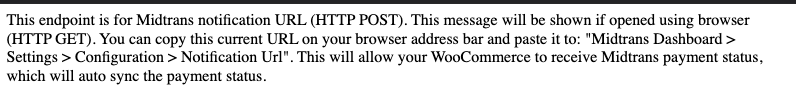

#### Transaction Test

<article>

1. Perform successful transaction on your online store by entering the card details given below. For more details, refer to [Testing Payment on Sandbox](/en/technical-reference/sandbox-test.md).
  * **Card Number**: 4811 1111 1111 1114
  * **CVV**: 123
  * **Exp. Month**: 01
  * **Exp. Year**: 2025
2. To ensure the proper installation and performance of the plugin, examine few points given below.

| Check Point | Error | Troubleshooting |
| --- | --- | --- |
| Order status in CMS backend| Order status not recorded in the backend. | Check endpoint or the *Payment Notification URL* setting on MAP.  Check if your CMS or notification URL is publicly accessible. |
| Merchant email notification| Notification not received. | Check *Email Notifications* settings on MAP. For more details, refer to [Configuring Email Notifications](/en/after-payment/dashboard-usage.md#configuring-email-notifications). |
| Customer email notification| Notification not received. | Check *Email Notifications* settings on MAP. For more details, refer to [Configuring Email Notifications](/en/after-payment/dashboard-usage.md#configuring-email-notifications). |

#### Payment Example
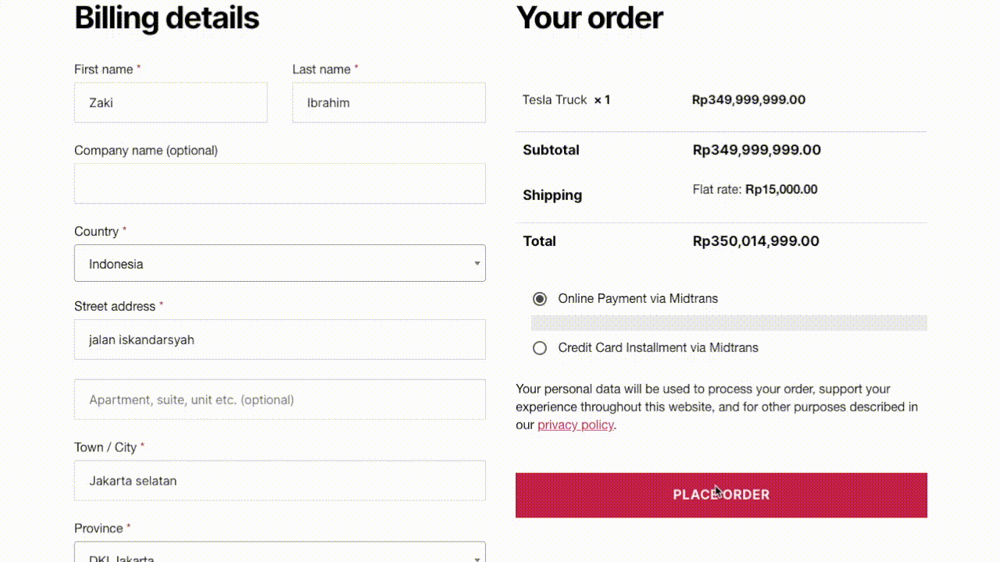

</article>

For more details and configurations, refer to [Midtrans WooCommerce wiki documentation](https://github.com/veritrans/SNAP-Woocommerce/wiki).

#### Advanced: Specific Payment Buttons
[Optional] Follow these steps **if you prefer to have each payment method displayed individually in your WooCommerce checkout page**. See example below :

1. Go to **WooCommerce > Settings > Payments**, you will see **Midtrans Specific: \[Payment Method Name\]**.
2. You can choose which payment methods you want to show to your customers by toggling the on-off switch. The toggle will only work for payment methods that you have activated in Midtrans. See below:

3. [Optional] Click each payment method's **Manage** button to configure the payment method's appearance, such as the displayed Payment Method Name & Description text.
4. Once you've finished configuring the settings, you're all set. Each of the specific buttons will use the same configurations as "Midtrans – All Supported Payment"'s [configuration](#woocommerce-plugin-configuration).
5. If you choose to display each payment method individually, it is advised to toggle off the main "Midtrans – All Supported Payment" button.

Note: This feature is only available in plugin version v2.30.0 or above - please ensure you have updated your plugin to the latest version.

#### Advanced: Customize WooCommerce Order Status upon Payment Paid
[Optional] You can configure the status that WooCommerce Order should become when an order is successfully paid. This can be useful if you want, for example, order status to become `completed` once paid (instead of `processing` as default behaviour).

Configure it from **WooCommerce > Settings > Payment > Midtrans > Manage** under configuration field **WC Order Status on Payment Paid**. Select your preferred value from the drop down.

#### WooCommerce Midtrans Plugin Advanced features
If you have Woocommerce Subscription feature, and want to integrate it with Midtrans, please [follow this guide](https://github.com/veritrans/SNAP-Woocommerce/wiki/02---Credit-card-online-and-offline-installment).

For installment feature (when you have completed the business agreeement), you can [follow this guide to configure installment](https://github.com/veritrans/SNAP-Woocommerce/wiki#payment-methods-featured).

Further resources:
- https://github.com/veritrans/SNAP-Woocommerce/wiki
- https://github.com/veritrans/SNAP-Woocommerce#readme

#### WooCommerce Midtrans Plugin FAQ
Available [on this page](/en/other/faq/technical.md#cms-plugins).

  

### Magento
Midtrans ❤️ Magento! Midtrans takes customer experience (UX) seriously and tries to make payments simple for you and the customers. With this plugin you can make your Magento store using Midtrans payment. This extension is also available on [Magento Marketplace](https://marketplace.magento.com/midtrans-snap.html).

?> **Note**: This section explains the installation and the configuration for Magento 2. For Magento 1, please refer to [Snap Plugin for E-commerce CMS](/en/technical-reference/library-plugin.md#snap-plugin-for-e-commerce-cms).

#### Requirements
Some of the requirements to continue with the integration process, are listed below.
* An online store with Magento infrastructure
* Magento 2 version 2.1.0, 2.2.0, 2.3.4 and later **|** Tested up to v2.3.4
* PHP v5.6 or later
* MySQL v5.7 or later
* Download Midtrans plugin for Magento (Please choose accordingly):
    * For Magento v2.x: [Zip file](https://github.com/Midtrans/Midtrans-Magento2/archive/master.zip) (Open source on [GitHub](https://github.com/Midtrans/Midtrans-Magento2))
    * For Magento v1.9: [Zip file](https://github.com/veritrans/SNAP-Magento/archive/master.zip) (Open source on [GitHub](https://github.com/veritrans/SNAP-Magento))

#### Midtrans Snap Plugins Installation

To install Magento Snap plugin, select **any one** of the installation options given below.

#### A. Installation through Magento Marketplace

You can install Midtrans Snap plugin through Magento Marketplace. Please visit Midtrans on [Magento Marketplace](https://marketplace.magento.com/midtrans-snap.html) and follow step-by-step installation instructions from the [Official Magento extension docs](https://docs.magento.com/user-guide/system/web-setup-extension-manager.html). Proceed to [Magento 2 Plugin Configuration](#magento-2-plugin-configuration) section.

#### B. Installation through Composer

Install Composer and create Magento Marketplace account before installing Midtrans Snap plugin through Composer.

On your terminal, go to the Magento folder and run the commands given below.
1. Install the plugins: `composer require midtrans/snap`.
2. Enable the plugin: `bin/magento module:enable Midtrans_Snap`.
3. Execute upgrade script : `bin/magento setup:upgrade`.
4. Flush cache storage : `bin/magento cache:flush`.
5. Login to your Magento administration Panel.
 The plugin is installed successfully. Proceed to [Magento 2 Plugin Configuration](#magento-2-plugin-configuration) section.

#### C. Installation from GitHub project

To customize Midtrans Magento plugin to handle your business model, follow the steps given below.
1. Download the plugin file from the link given above.
2. Extract the plugin and rename the folder as Snap.
3. Make a directory structure as shown below.
    
4. Locate the root Magento directory of your shop via FTP connection.
5. Copy the app folders into the Magento root folder.
6. Run the following commands on terminal.
    * `bin/magento module:enable Midtrans_Snap`
    * `bin/magento setup:upgrade`
    * `bin/magento cache:flush`
7. Login to your Magento administration panel.
 The plugin is installed successfully. Proceed to [Magento 2 Plugin Configuration](#magento-2-plugin-configuration) section.

#### Magento 2 Plugin Configuration
Before you begin, install and enable Midtrans Snap plugin.
To configure the Midtrans-Magento 2 plugin in your Magento administration panel, follow the steps given below.
1. Login to your Magento administration panel.
2. Go to **Stores(1)** > **Configuration(2)**.
3. Go to **Sales(3)** > **Payment Methods(4)**.
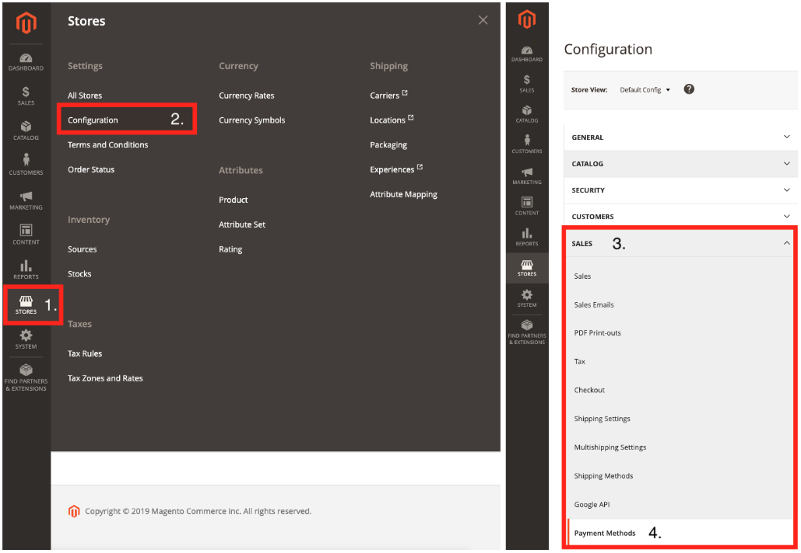
4. In the **Midtrans - Accept Online Payment** section, click **Basic Settings** and fill out the fields given below.

| Field                   | Description                                                  |
| :---------------------- | :----------------------------------------------------------- |
| Is Production           | Select whether you want to use a *Sandbox* or *Production* environment. |
| Merchant ID             | Unique id of your Midtrans account for which the payments will be processed. |
| Sandbox \- ClientKey    | Used as an API key to be used for authorization *Sandbox* environment on frontend API request/configuration\. So, it is safe to put in your HTML / client code publicly. |
| Sandbox \- ServerKey    | Used as an API key to be used for authorization *Sandbox* environment while calling Midtrans API from the backend. So, keep it stored confidentially. |
| Production \- ClientKey | Used as an API key to be used for authorization *Production* environment on frontend API request/configuration. So, it is safe to put in your HTML / client code publicly. |
| Production \- ServerKey | Used as an API key to be used for authorization *Production* environments while calling Midtrans API from the backend. So, keep it stored confidentially. |
| Enable Snap redirect    | Change to Snap redirect mode, the default value is **No**. |

> **Note**: *Access Key* and *Server Key* are unique for every merchant. Always keep *Server Key* confidential.

#### Storing Log Files
The plugin will store log files in directory `/var/log/midtrans`. By default, the log files are enabled for request, notification and error log. *Enable Throw Exception* is disabled by default.
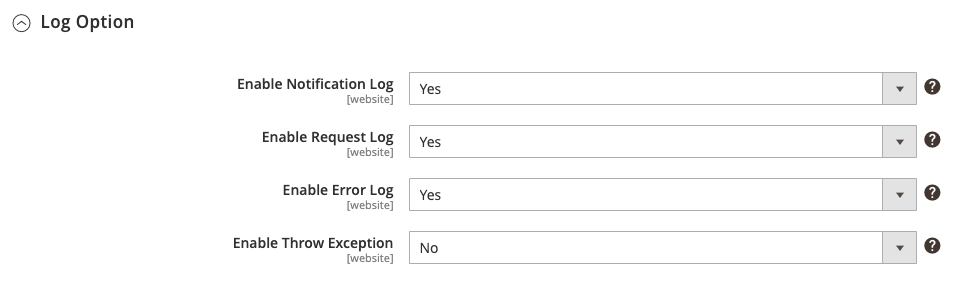

#### Payment Integration Configuration
The options to use Snap payment method, for Midtrans-Magento plugins are given below.

**Snap payment integration**
This is the default option for Midtrans Magento plugin. Snap payment is enabled automatically when Midtrans plugin is installed. Midtrans shows the available payment method on the Snap payment screen.

**Specific payment integration | Optional**
Enabling this option displays additional payment options to the customer. For specific payment that is specified in the **Allowed Payment Method** field, Midtrans Snap will show only the listed payment method on the Snap screen.

**Online Installment payment integration | Optional**
Enabling this option displays additional payment options to the customer, for *Online Installment* payment where the *Card Issuer* and *Acquiring Bank* is the same entity. For example, if a customer makes an installment payment using BNI Card and the *Acquiring Bank* is also BNI.

**Offline Installment payment integration | Optional**
Enabling this option displays additional payment options to customer, for *Offline Installment* where the *Card Issuer* and *Acquiring Bank* don't have to be same entity. For example, if a customer makes an installment payment using BNI Card and the *Acquiring Bank* is Mandiri.

> **Note**:
>
> You can use different Midtrans Account for every Snap model payment method. To do so, configure the *Access Key* in Optional section `“Use different Midtrans account”`.
>
> If the optional *Access Key* is empty, the plugin will automatically use *Access Key* on Basic Settings.
>
> Currently, the built-in BCA KlikPay landing page only use *Server Key* from basic settings of Snap payment integration.

#### Customizing Configuration

The table given below describes the fields to customize configurations.
<article>

| Field                  | Description  |
|-----------------------|--------------------------------------------------------------------------|
| Enable                 | Payment snap section enable.  |
| Title                  | The title for the payment method in the checkout page. |
| Custom Expiry          | This field will allow you to set a custom duration on how long the transaction is available to be paid\. |
| Allowed Payment Method | Customize allowed payment method, separate payment method code with a comma\. For example, bank\_transfer, credit\_card\. Leave it as default if you are not sure\.  |
| Acquiring Bank         | You can specify which Acquiring Bank they prefer to use for a specific transaction\. The transaction fund will be routed to that specific acquiring bank\. Leave it blank if you are not sure.     |
| BIN Number             | It is a feature that allows the merchant to accept only Credit Cards within a specific set of BIN numbers\. Separate BIN number with comma. For example, `4,5,4811,bni,mandiri`\. Leave it blank if you are not sure. ***Note***: Please ensure that there is no empty space separating the BIN numbers. |
| Installment Terms      | An arrangement for payment by installments\.     |
| 3D Secure              | You must enable 3D Secure for secure card transactions\. Please contact us if you wish to disable this feature in the *Production* environment\.   |
| Save Card              | This will allow your customer to save their card on the payment popup, for faster payment flow on future transactions. |

</article>

#### Magento 2 Plugin Notification Configuration
To configure the Magento 2 plugin notification URL, follow the steps given below.
1. Login to [Midtrans Dashboard portal](https://account.midtrans.com/).
2. In the **Environment** list, click the appropriate environment.
3. On the Home page, go to **SETTINGS > CONFIGURATION**.
   *Configuration* page is displayed. Follow the steps given below.
   * Enter **Payment Notification URL**.
   * Enter **Finish Redirect URL**.
   * Enter **Error Redirect URL**.
   * Enter **Unfinish Redirect URL**.
   * Click **Update**.
4. On the Home page, go to **SETTINGS > SNAP PREFERENCES > System settings**. Follow the steps given below.
   * Enter **Finish Redirect URL**.
   * Enter **Error Redirect URL**.
   * Enter **Unfinish Redirect URL**.
   * Click **Save**. A confirmation message is displayed.
 The plugin notification URL is configured successfully.

The table given below shows the fields and the URL.

| Field                    | URL                                       |
| ------------------------ | ----------------------------------------- |
| Payment Notification URL | [your-site-url]/snap/payment/notification |
| Finish Redirect URL      | [your-site-url]/snap/index/finish         |
| Error Redirect URL       | [your-site-url]/snap/index/finish         |
| Unfinish Redirect URL    | [your-site-url]/snap/index/finish         |

> **Note**:
>
> Please make sure to input **http://** or **https://** when filling Notification URL and Redirect URL, according to your web-server configuration.
>
> If you are not sure, try opening your web URL in a browser, and check the URL is **http** or **https** on the address bar.

#### Refunding Transactions Online

<article>
You can request refunds either from the Midtrans Dashboard or from the Magento administration. After a refund is issued, it cannot be cancelled or undone. So, before you trigger a refund request, make sure to check the refund amount and any other details. The online refund feature is available for GoPay and credit card payment methods.

If you make refund from the Midtrans *Dashboard*, refund notification is sent to Magento, transaction state is set to *CLOSED* and credit memo is not created.

#### Requesting Refund from Magento Administration
To request a refund for a transaction from Magento administration, follow the steps given below.
1. Log in to your Magento administration panel.
2. In the menu, go to **Sales** > **Orders**. The order overview page is displayed.
3. Click the specific **order** you want to refund.
4. Click **Invoices** tab on **Order list View** navigation sidebar.
5. Go to **Invoice List Page** > **Order**, click **View** on invoice you need to request online refund.
6. Click **Credit Memo** on the top-right corner of the page.
7. In the **New Memo for Invoice** page, scroll down to the **Refund Totals** section.
8. In this section, you can request for refund online or offline.
    *  **Refund:** This option is used to request refund online to Midtrans. Midtrans automatically sends refund notification and changes the order status to **Closed**.
    *  **Refund Offline**: An offline refund does not trigger request refund to Midtrans. It is only refund in Magento side. You need to take action and carry out the refund manually from Midtrans dashboard. After a refund operation, the order status changes to **Closed**. This order status change is controlled by the Magento system. The status change may not mean that the refund has carried out successfully on Midtrans side. When the refund is processed successfully, the transaction status in Midtrans dashboard changes to REFUND.

</article>

#### Transaction Test

<article>

1. Perform successful transaction on your online store by entering the card details given below. For more details, refer to [Testing Payment on Sandbox](/en/technical-reference/sandbox-test.md).
  * **Card Number**: 4811 1111 1111 1114
  * **CVV**: 123
  * **Exp. Month**: 01
  * **Exp. Year**: 2025
2. To ensure the proper installation and performance of the plugin, examine few points given below.

| Check Point                 | Error                                     | Troubleshooting                                              |
| --------------------------- | ----------------------------------------- | ------------------------------------------------------------ |
| Order status in CMS backend | Order status not recorded in the backend. | Check endpoint or the *Payment Notification URL* setting on MAP.  Check if your CMS or the *Notification URL* is publicly accessible. |
| Merchant email notification | Notification not received.                | Check *Email Notifications* settings on MAP. For more details, refer to [Configuring Email Notifications](/en/after-payment/dashboard-usage.md#configuring-email-notifications). |
| Customer email notification | Notification not received.                | Check *Email Notifications* settings on MAP. For more details, refer to [Configuring Email Notifications](/en/after-payment/dashboard-usage.md#configuring-email-notifications). |

#### Payment Example

</article>

  

### PrestaShop
Midtrans ❤️ PrestaShop! Integrate your PrestaShop store with Midtrans Snap payment gateway. Midtrans strives to make payments simple for you and the customers. This plugin will allow online payment on your PrestaShop store using various online payment channels.

#### Requirements
Some of the requirements to continue with the integration process, are listed below.
* PrestaShop 1.6 and 1.7 or later **|** Tested up to v1.7
* PHP version 5.4 or later
* MySQL version 5.0 or later
* Download Midtrans plugin for PrestaShop: [Zip file](https://github.com/veritrans/SNAP-Prestashop/archive/master.zip) (Open source on [GitHub](https://github.com/veritrans/SNAP-Prestashop))

#### PrestaShop Plugin Installation and Configuration
To install and configure the Midtrans-PrestaShop plugin, follow the steps given below.
1. Download the plugin file from the link given above.
2. Extract the plugin and rename the folder as **midtranspay**. Then Zip the folder back into **midtranspay.zip**.
3. Go to **IMPROVE > Modules > Modules Manager** on PrestaShop administration page.
4. Click **Upload a module**.
5. Locate the **midtranspay.zip** file, click **Open**.
 The plugin is installed successfully. A message to confirm the action is displayed.
6. Click **Configure**.
7. Find the **Midtrans Pay** module in the module manager and click **Configure**. Configure *Midtrans Pay* page is displayed. Follow the steps given below.
    * Enter **Payment Option Display Text**. This text appears on the button displayed to the customer.
    * In the **Environment** list, click the appropriate environment. *Development* for testing transaction, *Production* for real transaction.
    * Enter **Merchant ID**.
    * Enter **Client key.**
    * Enter **Server key**.
    * Select desired order status for successful payments, from **Map payment SUCCESS status to** list.
    * Select desired order status for payment failure, from **Map payment FAILURE status to** list.
    * Select desired order status for challenge payment, from **Map payment PENDING/CHALLENGE status to** list.
     > **Note**: Other fields are optional. You may leave it as is.

 The plugin is installed and configured successfully.

#### PrestaShop Plugin Notification Configuration
To configure Midtrans-PrestaShop plugin notification URL, follow the steps given below.
1. Login to [Midtrans Dashboard portal](https://account.midtrans.com/).
2. In the **Environment** list, click the appropriate environment.
3. On the Home page, go to **SETTINGS > CONFIGURATION**.
   *Configuration* page is displayed. Follow the steps given below.
   * Enter **Payment Notification URL**.
   * Enter **Finish Redirect URL**.
   * Enter **Error Redirect URL**.
   * Enter **Unfinish Redirect URL**.
4. Click **Update**.
   A confirmation message is displayed.
 The plugin notification URL is configured successfully.

The table given below shows the fields and the URL.

| Field                    | URL                                                          |
| ------------------------ | ------------------------------------------------------------ |
| Payment Notification URL | [your-site-url]/index.php?fc=module&module=midtranspay&controller=notification |
| Finish Redirect URL      | [your-site-url]/index.php?fc=module&module=midtranspay&controller=success |
| Error Redirect URL       | [your-site-url]/index.php?fc=module&module=midtranspay&controller=failure |
| Unfinish Redirect URL    | [your-site-url]/index.php?fc=module&module=midtranspay&controller=success |

> **Note**:
>
> Please make sure to input **http://** or **https://** when filling Notification URL and Redirect URL, according to your web-server configuration.
>
> If you are not sure, try opening your web URL in a browser, and check the URL is **http** or **https** on the address bar.

#### Transaction Test

<article>

1. Perform successful transaction on your online store by entering the card details given below. For more details, refer to [Testing Payment on Sandbox](/en/technical-reference/sandbox-test.md).
  * **Card Number**: 4811 1111 1111 1114
  * **CVV**: 123
  * **Exp. Month**: 01
  * **Exp. Year**: 2025
2. To ensure the proper installation and performance of the plugin, examine few points given below.

| Check Point                 | Error                                     | Troubleshooting                                              |
| --------------------------- | ----------------------------------------- | ------------------------------------------------------------ |
| Order status in CMS backend | Order status not recorded in the backend. | Check endpoint or the *Payment Notification URL* setting on MAP. Check if your CMS or the *Notification URL* is publicly accessible. |
| Merchant email notification | Notification not received.                | Check *Email Notifications* settings on MAP. For more details, refer to [Configuring Email Notifications](/en/after-payment/dashboard-usage.md#configuring-email-notifications). |
| Customer email notification | Notification not received.                | Check *Email Notifications* settings on MAP. For more details, refer to [Configuring Email Notifications](/en/after-payment/dashboard-usage.md#configuring-email-notifications). |

#### Payment Example
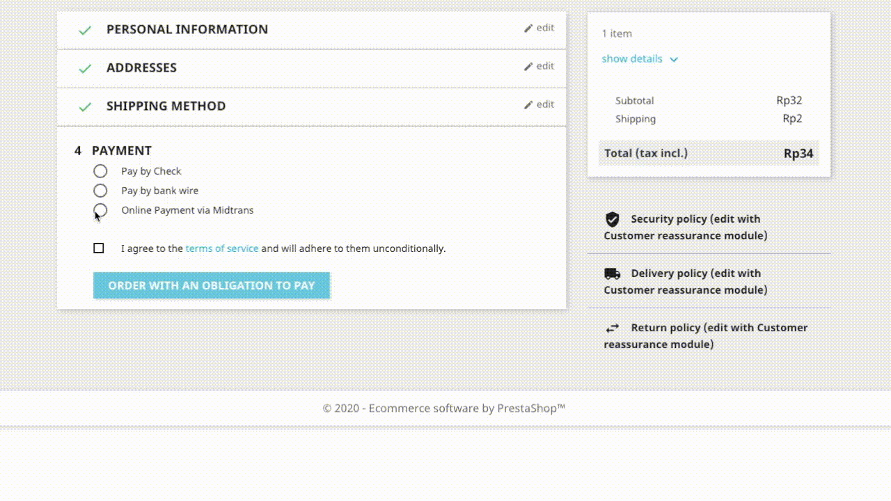

</article>

  

### OpenCart
Midtrans ❤️ OpenCart! This is official Midtrans extension for the OpenCart E-commerce platform.

#### Requirements
Some of the requirements to continue with the integration process, are listed below.
* OpenCart minimal 2.0 or later **|** Tested up to v3.0
* PHP version 5.4 or later
* MySQL version 5.0 or later
* Download Midtrans plugin for OpenCart (Please choose accordingly):
    * For OpenCart v3.0: [Zip file](https://github.com/Midtrans/Midtrans-Opencart3/archive/master.zip) (Open source on [GitHub](https://github.com/Midtrans/Midtrans-Opencart3))
    * For OpenCart v2.3: [Zip file](https://github.com/Midtrans/SNAP-Opencart-2.3/archive/master.zip) (Open source on [GitHub](https://github.com/Midtrans/SNAP-Opencart-2.3/))
    * For OpenCart v2.0, OpenCart v2.1 or OpenCart v2.2: [Zip file](https://github.com/veritrans/SNAP-Opencart/archive/master.zip) (Open source on [GitHub](https://github.com/veritrans/SNAP-Opencart))

#### OpenCart Plugin Installation and Configuration
To install and configure Midtrans-OpenCart plugin, follow the steps given below.
1. Download the plugin file from the link given above.
2. Locate the root OpenCart directory of your shop through FTP connection.
3. Copy the `admin`, `catalog`, and `system` folders into your OpenCart root folder, and merge it.
4. On your OpenCart administration page, go to **Extensions** > **Extensions**.
5. Select **Payment** Filter.
6. Select **Midtrans**.
7. Click **Install**.
OpenCart plugin is installed successfully.
8. To configure merchant details, follow the steps given below.
    * Click **Edit**.
    *Configure Midtrans* page is displayed.
    * Click **Enable** in **Status** list.
    * Enter **Display name**. This text is displayed on button displayed to the customer.
    * Enter **Merchant ID** with your Merchant ID on [Midtrans account](https://dashboard.midtrans.com/settings/config_info/).
    * Select **Environment** dropdown list; *Sandbox* is for testing transaction, *Production* is for real transaction.
    * Enter **Client Key**.
    * Enter **Server Key**.
    * In **SUCCESS Order Status** list, select your desired order status for a successful payment (recommended: `Processing`).
    * In **PENDING Order Status** list, select your desired order status for a payment failure (recommended: `Pending`).
    * In **FAILURE Order Status** list, select your desired order status for a pending payment (recommended: `Canceled`).
    > **Note**:
    >
    > *Client Key* and *Server Key* for *Sandbox* environment and *Production* environment are different. For more details, refer to [Retrieve API Access Keys](/en/midtrans-account/overview.md#retrieving-api-access-keys).
    >
    > Other fields are optional. You may leave it as is.

 The plugin is installed and configured successfully.

#### OpenCart Plugin Notification Configuration
To configure the Midtrans-OpenCart plugin notification URL, follow the steps given below.
1. Login to [Midtrans Dashboard portal](https://account.midtrans.com/).
2. In the **Environment** list, click the appropriate environment.
3. On the Home page, go to **SETTINGS > CONFIGURATION**.
   *Configuration* page is displayed. Follow the steps given below.
	* Enter **Payment Notification URL**.
	* Enter **Finish Redirect URL**.
	* Enter **Unfinish Redirect URL**.
	* Enter **Error Redirect URL**.
8. Click **Update**.
   A confirmation message is displayed.
 The plugin notification URL is configured successfully.

The table given below shows the fields and the URL.

| Field | URL |
|-------------|-------------|
| Payment Notification URL | [your-site-url]/index.php?route=payment/snap/payment_notification |
| Finish Redirect URL | [your-site-url]/index.php?route=payment/snap/landing_redir& |
| Unfinish Redirect URL | [your-site-url]/index.php?route=payment/snap/landing_redir& |
| Error Redirect URL | [your-site-url]/index.php?route=payment/snap/landing_redir& |

> **Note**:
>
> Please make sure to input **http://** or **https://** when filling Notification URL and Redirect URL, according to your web-server configuration.
>
> If you are not sure, try opening your web URL in a browser, and check the URL is **http** or **https** on the address bar.

#### Transaction Test

<article>

1. Perform successful transaction on your online store by entering the card details given below. For more details, refer to [Testing Payment on Sandbox](/en/technical-reference/sandbox-test.md).
  * **Card Number**: 4811 1111 1111 1114
  * **CVV**: 123
  * **Exp. Month**: 01
  * **Exp. Year**: 2025
2. To ensure the proper installation and performance of the plugin, examine few points given below.

| Check Point                 | Error                                     | Troubleshooting                                              |
| --------------------------- | ----------------------------------------- | ------------------------------------------------------------ |
| Order status in CMS backend | Order status not recorded in the backend. | Check endpoint or the *Payment Notification URL* setting on MAP.  Check if your CMS or the notification URL is publicly accessible. |
| Merchant email notification | Notification not received.                | Check *Email Notifications* settings on MAP. For more details, refer to [Configuring Email Notifications](/en/after-payment/dashboard-usage.md#configuring-email-notifications). |
| Customer email notification | Notification not received.                | Check *Email Notifications* settings on MAP. For more details, refer to [Configuring Email Notifications](/en/after-payment/dashboard-usage.md#configuring-email-notifications). |

#### Payment Example

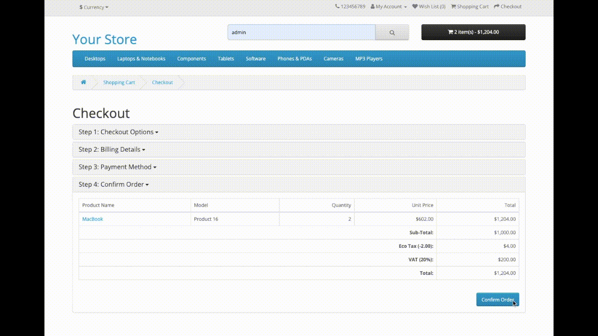

</article>

  

### WHMCS
Midtrans ❤️ WHMCS! This plugin allows secure online payment on your WHMCS! With sleek built-in responsive payment interface (Snap). Midtrans strives to make payments simple for you and your customers. It supports various online payment channels.

#### Requirements
Some of the requirements to continue with the integration process, are listed below.
   * WHMCS v5.3.12 - v7.x or later **|** Tested up to WHMCS v7.6
   * PHP version 5.4 or later
   * MySQL version 5.0 or later
   * Download Midtrans plugin for WHMCS: [Zip file](https://github.com/veritrans/SNAP-whmcs/archive/master.zip) (Open source on [GitHub](https://github.com/veritrans/SNAP-whmcs))

#### WHMCS Plugin Installation and Configuration
To install and configure Midtrans-WHMCS plugin, follow the steps given below.
1. Download the plugin file from the link given above.
2. Extract **Whmcs-master.zip** file.
3. Upload and merge module folder that you have extracted into your WHMCS directory, **Installation and Configuration**.
4. Access your WHMCS administration page.
5. Go to **Setup** > **Payments** >**Payment Gateways**.
6. Click **Midtrans** payment method.
 *Configuration* page is displayed.
7. Perform the following actions on *Configuration* page.
   * Enter **Display Name**.
   * Enter **Midtrans Client Key**.
   * Enter **Midtrans Server Key**.
   * For *Production* environment, select the **Production Mode** check box. For *Sandbox* environment, clear the **Production Mode** check box.
   * Click **Save Changes**.

 The plugin is installed and configured successfully.

#### WHMCS Plugin Notification Configuration
To configure the Midtrans-WHMCS plugin notification URL, follow the steps given below.
1. Login to [Midtrans Dashboard portal](https://account.midtrans.com/).
2. In the **Environment** list, click the appropriate environment.
3. On the Home page, go to **SETTINGS > CONFIGURATION**.
   *Configuration* page is displayed.
4. Enter **Payment Notification URL**.
5. Enter **Finish Redirect URL**.
6. Enter **Unfinish Redirect URL**.
7. Enter **Error Redirect URL**.
8. Click **Update**.
   A confirmation message is displayed.
 The plugin notification URL is configured successfully.

The table given below shows the fields and the URL.

| Field  | URL |
|-------------|-------------|
| Payment Notification URL | [your-site-url]/modules/gateways/callback/veritrans.php |
| Finish Redirect URL | [your-site-url] |
| Unfinish Redirect URL | [your-site-url] |
| Error Redirect URL | [your-site-url] |

> **Note**:
>
> Please make sure to input **http://** or **https://** when filling Notification URL and Redirect URL, according to your web-server configuration.
>
> If you are not sure, try opening your web URL in a browser, and check the URL is **http** or **https** on the address bar.

#### Transaction Test

<article>

1. Perform successful transaction on your online store by entering the card details given below. For more details, refer to [Testing Payment on Sandbox](/en/technical-reference/sandbox-test.md).
  * **Card Number**: 4811 1111 1111 1114
  * **CVV**: 123
  * **Exp. Month**: 01
  * **Exp. Year**: 2025
2. To ensure the proper installation and performance of the plugin, examine few points given below.

| Check Point                 | Error                                     | Troubleshooting                                              |
| --------------------------- | ----------------------------------------- | ------------------------------------------------------------ |
| Order status in CMS backend | Order status not recorded in the backend. | Check endpoint or the *Payment Notification URL* setting on MAP.  Check if your CMS or the *Notification URL* is publicly accessible. |
| Merchant email notification | Notification not received.                | Check *Email Notifications* settings on MAP. For more details, refer to [Configuring Email Notifications](/en/after-payment/dashboard-usage.md#configuring-email-notifications). |
| Customer email notification | Notification not received.                | Check *Email Notifications* settings on MAP. For more details, refer to [Configuring Email Notifications](/en/after-payment/dashboard-usage.md#configuring-email-notifications). |

</article>

  

### Drupal

Midtrans ❤️ Drupal! This is the official Midtrans module for the Drupal E-commerce platform. You can easily integrate your Drupal commerce store with Midtrans payment gateway.

Also Available on [Drupal Project Module](https://www.drupal.org/project/midtrans_commerce)

#### Requirements
Some of the requirements to continue with the integration process, are listed below.
* Drupal v8.x/v9.x **|** Tested up to drupal v8.x and drupal v9.x
  * Note: this guide is for Drupal 8 & 9. Drupal 7 [check here](/en/technical-reference/library-plugin.md#snap-plugin-for-e-commerce-cms).
* Drupal Commerce 8.x-2.xx **|** Tested up to v8.x - 2.x
* PHP v5.6.x or later
* MySQL version 5.0 or later
* Download Midtrans module for Drupal: [Zip file](https://github.com/Midtrans/Midtrans-Drupal8/archive/master.zip) (Open source on [GitHub](https://github.com/Midtrans/Midtrans-Drupal8))

#### Composer Installation
If you are using [Composer](https://getcomposer.org), you can install via composer CLI
1. Open terminal
2. Move to your drupal site folder: `cd /[drupal site folder]/`
2. Run: `composer require drupal/midtrans_commerce`

#### Manual Installation
To install and configure Drupal Commerce Midtrans payment module, follow the steps given below.
1. Download the module file from the link given above.
2. Extract the file and rename the folder to **midtrans_commerce**.
3. Using a FTP client, or your hosting control panel, upload the unzipped module folder to your Drupal modules installation's **[Drupal folder]/modules/contrib/** directory.

#### Plugin Configuration
1. Open Drupal administration page, click **Extend**.
2. Under **COMMERCE (CONTRIB)** group, click **Commerce Midtrans**.
   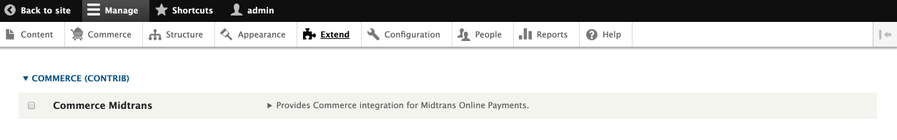
3. Click **Install**.
   Drupal 8 module is installed successfully.
4. Go to **Commerce** > **Configuration** > **Payment** > **Payment gateways**.
   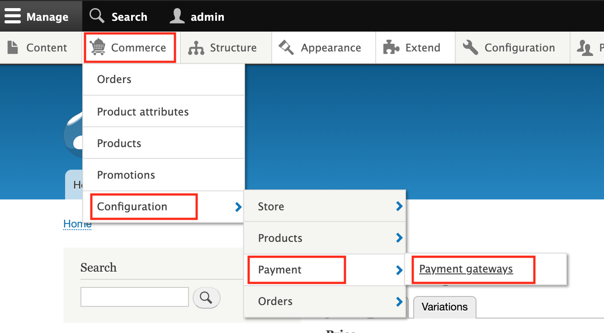
5. Click **Add payment gateway**.
   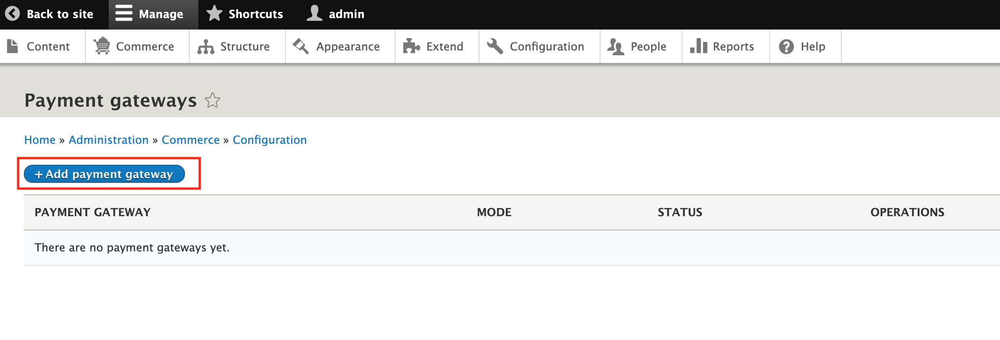
   **Add payment gateway page** is displayed.
6. Perform the following actions on *Payment gateways* page.
  * Enter **Name**. This text appears on the button displayed to the customer.
  * Select **Plugins** radio button.
  * Select **Mode**; *Sandbox* for testing transaction and *Production* for real transaction.
  * Enter **Merchant ID**.
  * Enter **Server key**.
  * Enter **Client key**.
    > **Note**: Other fields are optional. You may leave it as is. You can retrieve *Merchant ID, Server key,* and *Client key* on Midtrans MAP Dashboard.
7. Click **Save**.
   A confirmation message is displayed.

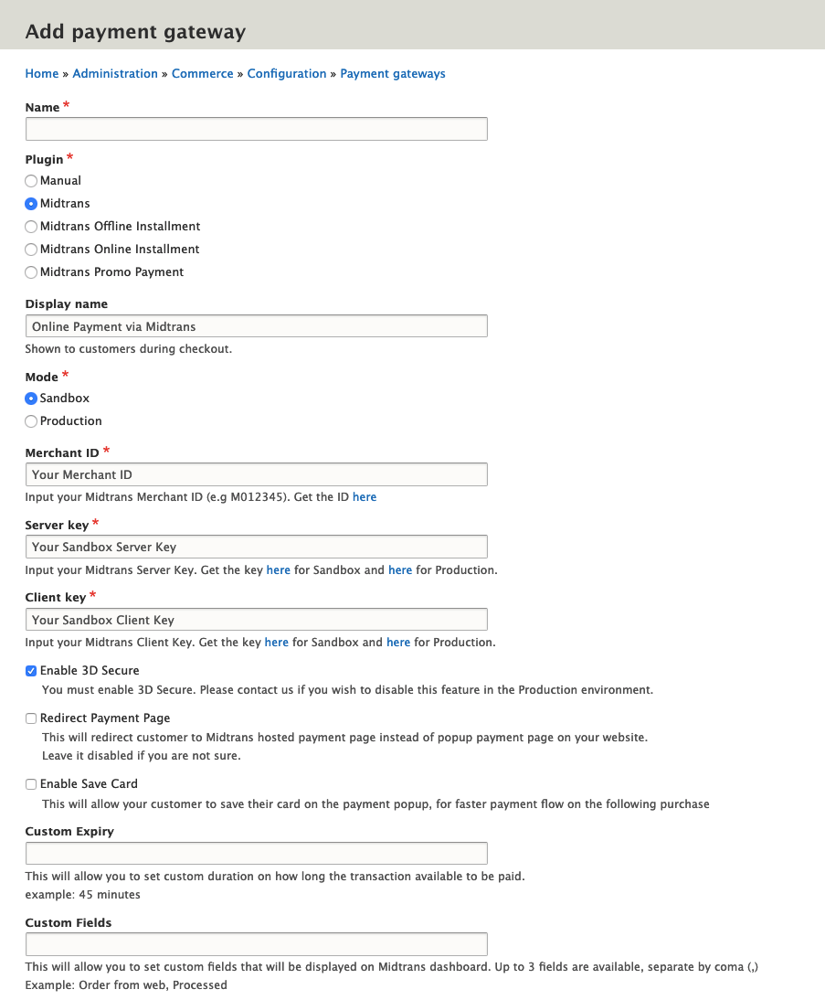
 The module is installed and configured successfully.

#### Drupal Module Notification Configuration

To configure the Midtrans-Drupal module notification URL, follow the steps given below.
1. Login to [Midtrans Dashboard portal](https://account.midtrans.com/).
2. In the **Environment** list, click the appropriate environment.
3. On the Home page, go to **SETTINGS > CONFIGURATION**.
   *Configuration* page is displayed.
4. Enter **Payment Notification URL**.
5. Enter **Finish Redirect URL**.
6. Enter **Unfinish Redirect URL**.
7. Enter **Error Redirect URL**.
8. Click **Update**. A confirmation message is displayed.
 The module notification URL is configured successfully.

The table given below shows the fields and the URL.

| Field                 | URL                            |
| ------------------------ | --------------------------------------- |
| Payment Notification URL | [your-site-url]/payment/notify/midtrans |
| Finish Redirect URL      | [your-site-url]/payment/finish/midtrans |
| Unfinish Redirect URL    | [your-site-url]/payment/finish/midtrans |
| Error Redirect URL       | [your-site-url]/payment/finish/midtrans |

> **Note**:
>
> Please make sure to input **http://** or **https://** when filling Notification URL and Redirect URL, according to your web-server configuration.
>
> If you are not sure, try opening your web URL in a browser, and check the URL is **http** or **https** on the address bar.

#### Transaction Test

<article>

1. Perform successful transaction on your online store by entering the card details given below. For more details, refer to [Testing Payment on Sandbox](/en/technical-reference/sandbox-test.md).
  * **Card Number**: 4811 1111 1111 1114
  * **CVV**: 123
  * **Exp. Month**: 01
  * **Exp. Year**: 2025
2. To ensure the proper installation and performance of the plugin, examine few points given below.

| Check Point                 | Error                                     | Troubleshooting                                              |
| --------------------------- | ----------------------------------------- | ------------------------------------------------------------ |
| Order status in CMS backend | Order status not recorded in the backend. | Check endpoint or the *Payment Notification URL* setting on MAP.  Check if your CMS or the notification URL is publicly accessible. |
| Merchant email notification | Notification not received.                | Check *Email Notifications* settings on MAP. For more details, refer to [Configuring Email Notifications](/en/after-payment/dashboard-usage.md#configuring-email-notifications). |
| Customer email notification | Notification not received.                | Check *Email Notifications* settings on MAP. For more details, refer to [Configuring Email Notifications](/en/after-payment/dashboard-usage.md#configuring-email-notifications). |

#### Payment Example
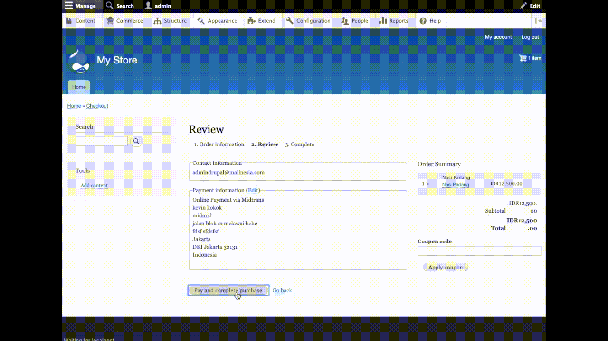

</article>

  

### WordPress - Easy Digital Download
Midtrans ❤️ EDD! Integrate your Easy Digital Download (EDD) store with Midtrans Snap payment gateway. Midtrans strives to make payments simple for both the merchant and the customers. This plugin will allow online payments on your EDD store using various online payment channels.

Midtrans-EDD plugins also available on [WordPress plugins store](https://wordpress.org/plugins/edd-midtrans-gateway/).

#### Requirements
Some of the requirements to continue with the integration process, are listed below.
   * WordPress 3.9.1 or later **|** Tested up to v5.x
   * Easy Digital Downloads 2.0 or later **|** Tested up to v2.x
   * PHP version 5.4 or later
   * MySQL version 5.0 or later
   * PHP CURL enabled server/host
   * Download Midtrans plugin for WordPress EDD: [Zip file](https://github.com/Midtrans/midtrans-edd/archive/master.zip) (Open source on [GitHub](https://github.com/Midtrans/midtrans-edd))

#### WordPress EDD Plugin Installation
To install Midtrans-WordPress EDD plugin, select any **one** of the installation methods given below.

#### A. Simple Installation
To install Midtrans-EDD plugin, follow the steps given below.
1. Login to your WordPress administration panel.
2. Go to **Plugins** > **Add New**.
3. Enter **Midtrans-Easy-Digital-Downloads** in the search bar.
4. Click **Install Now**.
5. Click **Activate**.

 The plugin is installed successfully. Proceed to [WordPress EDD Plugin Configuration](#wordpress-edd-plugin-configuration).

#### B. Manual Installation
The manual installation method involves downloading feature-rich plugin and uploading it to your Webserver through your favorite FTP application. To install WordPress EDD manually, follow the steps given below.
1. Download the plugin file from the link given above and unzip it.
2. Extract the plugin, and rename the folder modules as **edd-midtrans-gateway**.
3. Using an FTP program, or your hosting control panel, upload the unzipped plugin folder to your WordPress installation wp-content/plugins/ directory.
4. Install and Activate the plugin from the **Plugins** menu on the WordPress administration panel.
5. Activate Easy Digital Downloads - Midtrans Gateway plugin from **Plugin** menu in your WordPress administration page.
 The plugin is installed successfully. Proceed to [WordPress EDD Plugin Configuration](#wordpress-edd-plugin-configuration).

#### WordPress EDD Plugin Configuration
To configure Midtrans-EDD plugin, follow the steps given below.
1. On Dashboard, go to **Downloads(1) > Settings(2)**.
 *Easy Digital Downloads Settings* page is displayed.
2. Select **Payment Gateways(3)** tab.
3. Select **General**.
4. For *Sandbox* environment, select the **Test mode** check box. For *Production* environment, click to clear the **Test mode** check box.
5. Under **Payment Gateways**, click **Midtrans (4)**.
6. In the **Default Gateway(5)** list, click **Midtrans**.
7. Click **Save Changes(6)**.
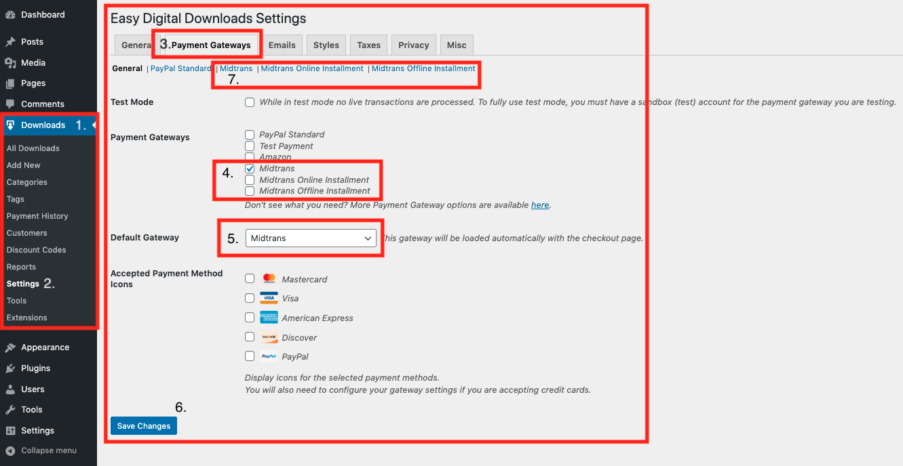
8. Click **Midtrans(7)**.
9. On *Midtrans Settings* page, follow the steps given below.
    * Enter **Checkout Label**.
    * Enter **Merchant ID**.
    * For *Production* Environment, enter **Production Server Key** and **Production Client Key**. For *Sandbox* Environment, enter **Sandbox Server Key** and **Sandbox Client Key**.
10. Click **Save Changes**.

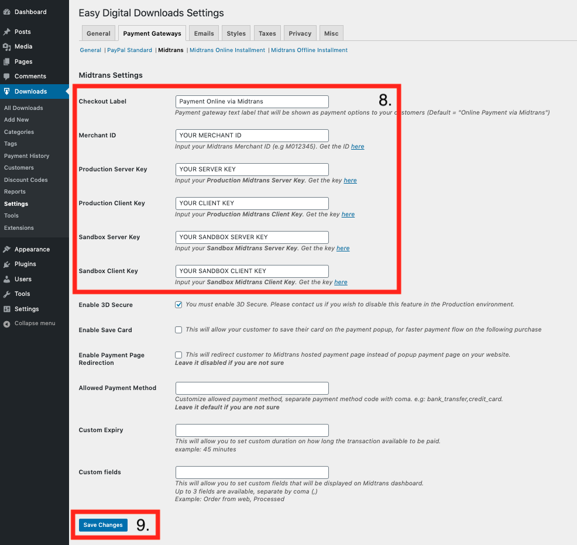
 The plugin is configured successfully.

#### EDD Plugin Notification Configuration
To configure the Midtrans-EDD plugin notification URL, follow the steps given below.
1. Login to [Midtrans Dashboard portal](https://account.midtrans.com/).
2. In the **Environment** list, click the appropriate environment.
3. On the Home page, go to **SETTINGS > CONFIGURATION**.
   *Configuration* page is displayed.
4. Enter **Payment Notification URL**.
5. Enter **Finish Redirect URL**.
6. Enter **Unfinish Redirect URL**.
7. Enter **Error Redirect URL**.
8. Click **Update**. A confirmation message is displayed.
 The plugin notification URL is configured successfully.

The table given below shows the fields and the URL.

| Field                | URL                           |
| ------------------------ | -------------------------------------- |
| Payment Notification URL | [your-site-url]/?edd-listener=midtrans |
| Finish Redirect URL      | [your-site-url]                        |
| Unfinish Redirect URL    | [your-site-url]                        |
| Error Redirect URL       | [your-site-url]                        |

> **Note**:
>
> Please make sure to input **http://** or **https://** when filling Notification URL and Redirect URL, according to your web-server configuration.
>
> If you are not sure, try opening your web URL in a browser, and check the URL is **http** or **https** on the address bar.

#### Transaction Test

<article>

1. Perform successful transaction on your online store by entering the card details given below. For more details, refer to [Testing Payment on Sandbox](/en/technical-reference/sandbox-test.md).
  * **Card Number**: 4811 1111 1111 1114
  * **CVV**: 123
  * **Exp. Month**: 01
  * **Exp. Year**: 2025
2. To ensure the proper installation and performance of the plugin, examine few points given below.

| Check Point                 | Error                                     | Troubleshooting                                              |
| --------------------------- | ----------------------------------------- | ------------------------------------------------------------ |
| Order status in CMS backend | Order status not recorded in the backend. | Check endpoint or the *Payment Notification URL* setting on MAP.  Check if your CMS or the notification URL is publicly accessible. |
| Merchant email notification | Notification not received.                | Check *Email Notifications* settings on MAP. For more details, refer to [Configuring Email Notifications](/en/after-payment/dashboard-usage.md#configuring-email-notifications). |
| Customer email notification | Notification not received.                | Check *Email Notifications* settings on MAP. For more details, refer to [Configuring Email Notifications](/en/after-payment/dashboard-usage.md#configuring-email-notifications). |

#### Payment Example
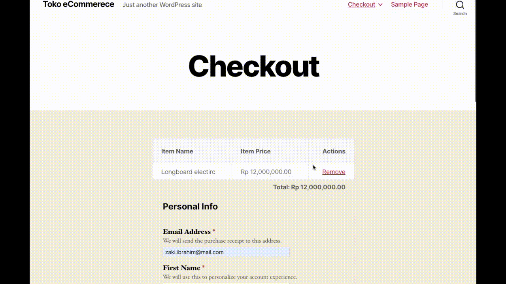

</article>

## Midtrans Payment Plugin Live Demonstration
Want to see Midtrans CMS payment plugins in action? We have some demo web-stores that you can use to try the payment journey directly, click the link below.

#### [Visit Plugin Live Demo](https://plugins-demo.midtrans.com/)

## Feedback And Request
If you have any kind of feedback, feature-request, new CMS that you want us to support, etc. related to Midtrans' CMS payment plugin, please [do let us know by filling this form](https://forms.gle/m3nJC1SNUDCw8Hmq9).