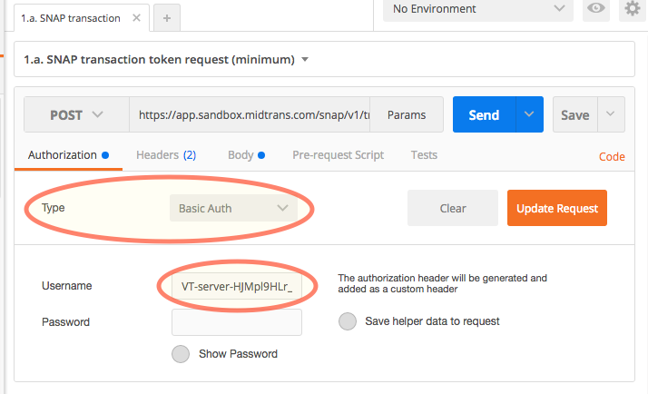

# Midtrans API Postman Collection

[Postman](https://www.getpostman.com/) is a user friendly tool that make it easy for you to quickly send and test REST API request without doing complex programming.

Midtrans provide Postman Collection that you can import and then you can play and test around with Midtrans API in no time.

This Postman collection covers the following API:
* [Snap API](http://snap-docs.midtrans.com)
* [Core API](http://api-docs.midtrans.com)

### Download Link

- Direct Download:

[](https://app.getpostman.com/run-collection/af068be08b5d1a422796)
- Github Source: [Repo Link](https://github.com/midtrans/Midtrans-Payment-API-Postman-Collections)


### Usage Instruction

1. Download and open [Postman](https://www.getpostman.com)
2. Import:
    - Use above links to import/download the collection: 

        [](https://app.getpostman.com/run-collection/af068be08b5d1a422796)
3. [Register to Midtrans](/en/midtrans-account/overview)
4. [Login](http://dashboard.midtrans.com) to Midtrans, switch to **Sandbox**, go to menu `Settings > Access Keys`. Copy your **Server Key**
5. In Postman, open **Midtrans Payment API** folder then choose one request you want to try, click on `Authorization` tab (beside Headers tab)
6. Select **Type** as `Basic Auth`, fill **Username** with your **Server Key** (looks like this `SB-Mid-server-abc123cde456`). Leave **Password** field blank, click **Update Request**



7. Now you can `save` then click `send` the request. You will get server response.

### Production Mode

All endpoint used in this postman collection is for `sandbox transaction`, to switch to `production` change endpoint URL from:

`https://api.sandbox.midtrans.com/../..`
to `https://api.midtrans.com/../..`

Simply remove the `sandbox.` from url.

### Troubleshooting

If you encounter this error message:
```javascript
{
  "error_messages": [
    "Access denied due to unauthorized transaction, please check client or server key",
    "Visit https://snap-docs.midtrans.com/#request-headers for more details"
  ]
}
```
- Please make sure you do step 4-7 properly like instructed in **[Usage Instruction](#usage-instruction)** section.
- Please make sure you are using correct **Server Key** (Serverkey for sandbox & production are different).