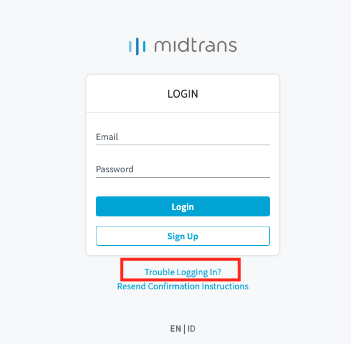
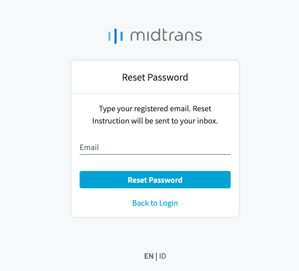

## Akun Midtrans

Sebelum anda melakukan integrasi dengan midtrans, anda wajib melakukan pendaftaran pada halaman Registrasi akun midtrans dibawah ini

#### [Daftar akun Midtrans](https://account.midtrans.com/register)

Jika anda telah melakukan registrasi akun midtrans, anda akan mendapatkan akses untuk masuk ke dalam Midtrans Portal (MAP) berikut dengan mode Production dan Sandbox.

## Akses ke Midtrans Adminstration Portal

Silahkan klik  tombol “Login” pada tombol kanan atas halaman Midtrans (www.midtrans.com). Masukkan email dan password yang anda gunakan untuk membuat akun Midtrans, lalu klik tombol “Login”.

> **Catatan:** Midtrans melakukan beberapa hal berikut untuk menjaga keamanan akun Anda.
> * Jika tidak ada aktivitas yang dilakukan pada MAP Midtrans selama 15 menit, maka akun akan otomatis keluar dari MAP Midtrans.
> * MAP Midtrans akan meminta anda untuk memperbaharui password setiap 90 hari.

## Lengkapi informasi akun midtrans anda

Mohon melengkapi informasi akun midtrans anda pada halaman `Settings` **->** `General Settings` [**Settings > General Settings**](https://dashboard.sandbox.midtrans.com/settings/general_info).

> **Catatan:**
> * Kami sangat tidak menyaranakan penggunan simbol tertentu pada kolom Nama Merchant.
> * Pada kolom URL Website merchant maksimal adalah 25 karakter.

## Melihat informasi *Access Keys*

Access Keys adalah kunci API untuk mengakses API Midtrans. Anda dapat melihat informasi *Access Keys* melalui akun [Midtrans](dashboard.sandbox.midtrans.com) anda pada menu [**Settings > Access Keys**](https://dashboard.sandbox.midtrans.com/settings/config_info).

> **Penjelasan Access Keys**
> - `Client Key`: Kunci API yang digunakan untuk otorisasi konfigurasi pada halaman *frontend* . *Client Key* dapat anda simpan pada halaman *frontend*
> - `Server Key`: Kunci API yang digunakan untuk otorisasi pada saat memanggil API Midtrans melalui *backend* anda. Sifat dari *Server key* sangat rahasia dan tidak dapat disimpan pada halaman *frontend*

!> Setiap merchant memiliki *Access Keys* yang berbeda. Mohon jaga kerahasiaan *Server key* anda.

## Merubah mode MAP Midtrans
Midtrans memiliki dua mode yang dapat digunakan *Production* dan *Sandbox*. Mode *Production* digunakan untuk keadaan sesungguhnya, dimana data yang ditampilkan adalah data transaksi asli. Sedangkan mode *Sandbox* digunakan untuk keperluan simulasi integrasi sistem yang akan menggunakan Midtrans. Pada mode *Sandbox* data yang ditampilkan adalah data *dummy*, anda dapat secara leluasa melakukan transaksi *dummy* dengan semua metode pembayaran yang tersedia di Midtrans. Semua pengaturan yang anda lakukan pada mode *Sandbox* tidak akan berpengaruh terhadap mode *Production*.

Untuk membedakan antara mode *Production* dengan mode *Sandbox*, terdapat dua warna tema yang berbeda. Jika anda menggunakan mode *Sandbox* maka warna tema pada MAP Midtrans akan berubah menjadi Jingga. Namun pada mode *Production* tema warna MAP Midtrans akan berubah menjadi biru gelap. Anda dapat dengan mudah membedakan antara mode *Production* dan *Sandbox* seperti yang terlihat pada gambar dibawah ini. 

## Cara membuka akun yang terkunci (*locked account*)
Midtrans memberikan toleransi hingga 5x (lima kali) kesalahan saat merchant mencoba masuk ke dalam MAP. Jika batas toleransi terlewati, maka akun akan terkunci secara otomatis.

Untuk menggunakan akun kembali, anda dapat mengirim informasi akun yang terkunci ke alamat email support@midtrans.com untuk dilakukan proses *unlock*. Jika proses *unlock* sudah dilakukan, silakan masuk ke dalam MAP kembali menggunakan akun & kata sandi lama Anda.

## Reset Password

Bila Anda lupa kata sandi untuk masuk ke dalam MAP, Anda bisa melakukan reset kata sandi anda dengan me-klik **Trouble Logging in?** yang terdapat pada halaman login.

Isi dengan email yang sudah didaftarkan di Midtrans. Instruksi proses reset password akan dikirimkan ke email Anda, harap cek Kotak Masuk atau Spam dan pastikan kotak masuk anda tidak penuh dan dapat menerima email masuk. Anda akan menerima email baru dengan instruksi bagaimana cara me-reset kata sandi dalam beberapa saat.

> **Info :**
>  Alamat untuk melakukan reset kata sandi hanya dapat digunakan selama 1 jam. Jika lebih dari itu, maka anda dapat mengulangi proses permintaan reset kata sandi pada menu halaman login.