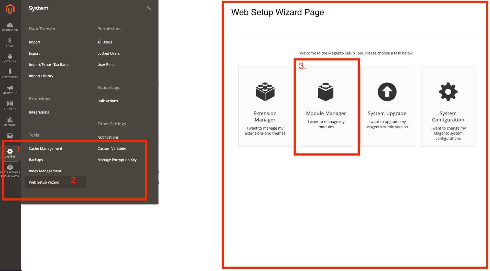
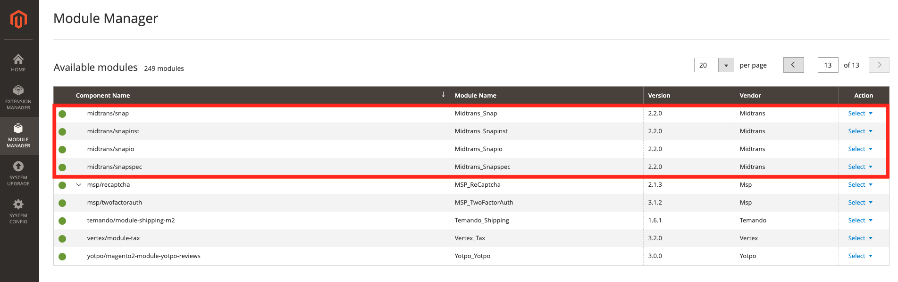
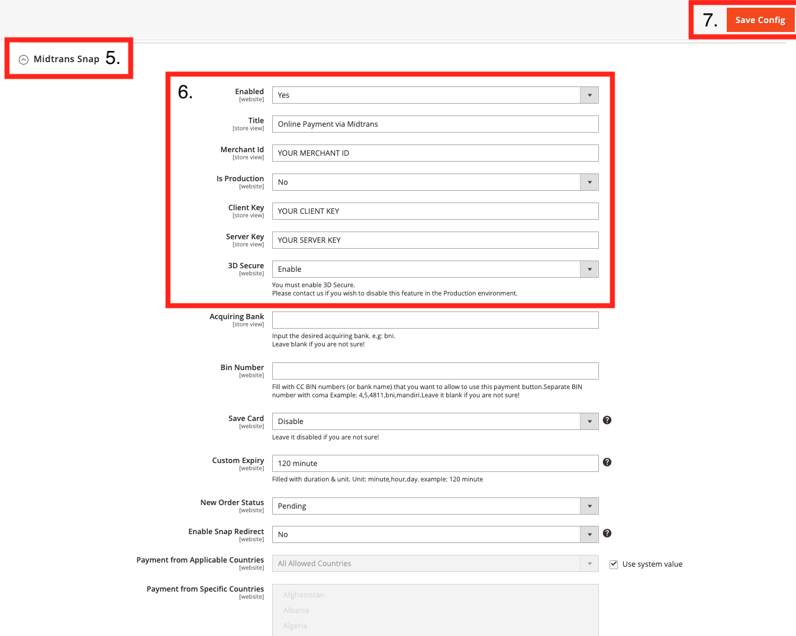

# Integrasi Snap melalui Plugins

The steps to do plugins integration of Snap will be explained below

?>**Note:**
All the steps below are using Midtrans **Sandbox environment**, not production, to easily test the integration process. Make sure to follow [preparation section](/en/snap/preparation.md), before proceeding.

### Prestashop
Midtrans ❤️ Prestashop! Integrasikan website Prestashop Anda dengan Midtrans Snap. Plugin kami memungkinkan website prestashop anda dapat menerima berbagai pembayaran online. Kami berupaya untuk membuat halaman pembayaran sesederhana mungkin, demi pengalaman pembayaran yang menakjubkan.
#### Apa yang diperlukan:
* Prestashop v1.6 keatas.
* PHP minimal v5.4.
* MySQL minimal v5.0.
* Plugin Midtrans untuk Prestashop [ [Github](https://github.com/veritrans/SNAP-Prestashop) | [Zip](https://github.com/veritrans/SNAP-Prestashop/archive/master.zip) ].

#### Proses Instalasi:

1. Ekstrak plugin yang sudah di download, ubah nama folder menjadi **midtranspay**.  Setelah itu Zip kembali folder tersebut menjadi **midtranspay.zip**.
2. Masuk ke halaman administrasi Prestashop Anda, akses menu **Modules - Modules Manager** menu.
3. Klik tombol **Upload a module** dan pilih file **midtranspay.zip** , lalu klik upload

4. Cari modul **Midtrans Pay** pada halaman module manager dan klik configure.
    * Isi **Payment Button Display Title** dengan text yang akan ditampilkan ke pelanggan.
    * Pilih **Environment**, `Sandbox` untuk test transaksi, `Production` untuk transaksi asli.
    * Isi **client key & server key**. Anda dapat menemukan ini di Midtrans MAP Dashboard.
    * **Map payment SUCCESS status to**: pilih status yang Anda ingin tampilkan bila pembayaran sukses.
    * **Map payment FAILURE status to**: pilih status yang Anda ingin tampilkan bila pembayaran gagal.
    * **Map payment PENDING/CHALLENGE status to**: pilih status yang Anda inginkan bila pembayaran terkena status challenge.
    * Konfigurasi lainnya adalah opsional.

#### Prestashop Terima Notifikasi Midtrans
Masuk ke [Midtrans Account](https://account.midtrans.com/login), pilih environment (sandbox/production), lalu masuk ke menu `settings > configuration`

   * Payment Notification URL: 
        `http://[your-site-url]/index.php?fc=module&module=midtranspay&controller=notification`
   * Finish Redirect URL: 
        `http://[your-site-url]/index.php?fc=module&module=midtranspay&controller=success`
   * Unfinish Redirect URL: 
        `http://[your-site-url]/index.php?fc=module&module=midtranspay&controller=success`
   * Error Redirect URL: 
        `http://[your-site-url]/index.php?fc=module&module=midtranspay&controller=failure`
        
#### Prestashop Payment Test
Lakukan transaksi sukses di toko Anda dengan menggunakan nomor kartu kredit dummy berikut (sandbox mode):

Jenis | Visa
------|-----
Nomor Kartu	| 4811 1111 1111 1114
CVV	| 123
Exp. Month	| 01
Exp. Year	| 2025

### Magento 2

Midtrans ❤️ Magento2! Integrasikan website magento Anda dengan Midtrans Snap. Plugin kami memungkinkan website magento anda dapat menerima berbagai pembayaran online. Kami berupaya untuk membuat halaman pembayaran sesederhana mungkin, demi pengalaman pembayaran yang menakjubkan.
#### Apa yang diperlukan::

* Sebuah toko online berbasis Magento. Plugin ini di-test dengan **Magento v2.3.2**
* PHP v5.4 or greater.
* MySQL v5.0 or greater.
* Plugin Midtrans untuk Magento  v2.x [ [Github](https://github.com/Midtrans/Midtrans-Magento2) | [Zip](https://github.com/Midtrans/Midtrans-Magento2/archive/master.zip) ] , Magento v1.9 [ [Github](https://github.com/veritrans/SNAP-Magento) | [Zip](https://github.com/veritrans/SNAP-Magento/archive/master.zip) ] 

#### Instalasi:
#### Langkah Instalasi Sederhana

1. Download dan ekstrak plugin yang telah anda unduh.
2. Masuk ke direktori Magento Anda melalui koneksi FTP.
3. Upload/copy folder `app`, `lib` dan `skin` yang baru diekstrak ke dalam direktori Magento Anda.
4. Masuk ke halaman Admin Magento anda.
5. Buka menu `System (1)` -> `Web Setup Wizard (2)` -> `Module Manager(3)`.

6. Cari modul dengan nama Midtrans_Snap.

7. Untuk mengaktifkan modul klik **Select** -> **Enable**
8. Lakukan langakah ke 5, untuk mengaktifkan modul midtrans lainnya.
9. [Konfigurasi plugin](#konfigurasi-plugin-midtrans-magento-2) Midtrans Magento 2.

`simbol (6),(4) pada setiap langkah adalah nomor yang ada di gambar`

#### Cara instalasi manual:

1. Download dan ekstrak plugin yang telah anda unduh.
2. Masuk ke direktori Magento Anda melalui koneksi FTP.
3. Upload/copy folder `app`, `lib` dan `skin` yang baru diekstrak ke dalam direktori Magento Anda.
4. Pada root direktori Magento, jalankan perintah pada terminal:
    * `php bin/magento module:enable --clear-static-content Midtrans_Snap`
    * `php bin/magento setup:upgrade`
    * `php bin/magento cache:clean`
5. [Konfigurasi plugin](#konfigurasi-plugin-midtrans-magento-2) Midtrans Magento 2.

#### Konfigurasi plugin Midtrans Magento 2

1. Masuk ke halaman Admin Magento.
2. Pilih menu **Stores** (1) -> **Configuration** (2) -> **Sales** (3) -> **Payment** **Method** (4) -> Tab "**Midtrans_Snap**" (5)

3. Isi kolom **Title**, **Merchant Id**, **Client Key**, **Server Key** seperti pada gambar (6)
4. Terakhir anda dapat menyimpan konfigurasi dengan klik tombol **Save Config** (7)
5. Selesai

#### Magento2 Terima Notifikasi Midtrans
Masuk ke [Midtrans Account](https://account.midtrans.com/login), pilih environment (sandbox/production), lalu masuk ke menu `settings > configuration`

   * Payment Notification URL: 
        `http://[your-site-url]/snap/payment/notification`
   * Finish Redirect URL: 
        `http://[your-site-url]/snap/index/finish`
   * Unfinish Redirect URL: 
        `http://[your-site-url]/snap/index/finish`
   * Error Redirect URL: 
        `http://[your-site-url]/snap/index/finish`

#### Magento 2 Coba Transaksi
Lakukan transaksi sukses di toko Anda dengan menggunakan nomor kartu kredit dummy berikut (sandbox mode):

Jenis | Visa
------|-----
Nomor Kartu	|4811 1111 1111 1114
CVV	| 123
Exp. Month	| 01
Exp. Year	| 2025

### Opencart

Midtrans ❤️ Opencart! Integrasikan website opencart Anda dengan Midtrans Snap. Plugin kami memungkinkan website opencart anda dapat menerima berbagai pembayaran online. Kami berupaya untuk membuat halaman pembayaran sesederhana mungkin, demi pengalaman pembayaran yang menakjubkan.

#### Apa yang diperlukan:

* Sebuah toko online berbasis OpenCart. 
* PHP minimal v5.4
* MySQL minimal v5.0.
* Plugin Midtrans untuk OpenCart 

#### Instalasi:
1. Download dan ekstrak plugin dari repositori ini
    * [Opencart v3.0](https://github.com/Midtrans/Midtrans-Opencart3)
    * [Opencart v2.3](https://github.com/Midtrans/SNAP-Opencart-2.3/)
    * [Opencart v2.0, v2.1, v2.2](https://github.com/veritrans/SNAP-Opencart)
2. Masuk ke direktori Opencart Anda melalui koneksi FTP.
3. Upload/copy folder `admin`, `catalog`, dan `system` yang baru diekstrak ke dalam direktori OpenCart Anda.

4. Buka menu **Extensions** -> **Extensions**. pada halaman admin OpenCart.
5. Pilih Filter by Payments, scroll kebawah sampai anda menemukan `Midtrans`
6. Tekan tombol Install yang bewarna hijau dan klik edit plugin.

#### Opencart Terima Notifikasi Midtrans
Masuk ke [Midtrans Account](https://account.midtrans.com/login), pilih environment (sandbox/production), lalu masuk ke menu `settings > configuration`

   * Payment Notification URL: 
        `http://[your shop's homepage]/index.php?route=payment/snap/payment_notification`
   * Finish Redirect URL: 
        `http://[your shop’s homepage]/index.php?route=payment/snap/landing_redir&`
   * Unfinish Redirect URL: 
        `http://[your shop’s homepage]/index.php?route=payment/snap/landing_redir&`
   * Error Redirect URL: 
        `http://[your shop’s homepage]/index.php?route=payment/snap/landing_redir&`
        
#### Opencart Coba Transaksi
Lakukan transaksi sukses di toko Anda dengan menggunakan nomor kartu kredit dummy berikut (sandbox mode):

Jenis | Visa
------|-----
Nomor Kartu	|4811 1111 1111 1114
CVV	| 123
Exp. Month	| 01
Exp. Year	| 2025

### WooCommerce

Midtrans ❤️ WooCommerce! Integrasikan website WooCommerce Anda dengan Midtrans Snap. Plugin kami memungkinkan website WooCommerce anda dapat menerima berbagai pembayaran online. Kami berupaya untuk membuat halaman pembayaran sesederhana mungkin, demi pengalaman pembayaran yang menakjubkan.

#### Apa yang diperlukan:

* Wordpress minimal v3.9.1 **|** Sudah ditest hingga v5.0.0
* [WooCommerce v2](https://github.com/veritrans/SNAP-Woocommerce) **|** Sudah ditest hingga v3.5.2
* PHP minimal v5.4.
* MySQL minimal v5.0.

#### Instalasi:
#### A. Instalasi Sederhana
   * Masuk ke Wordpress admin panel Anda.
   * Masuk menu Plugins, Tekan tombol `new`. Cari dengan nama `Midtrans-WooCommerce` untuk menemukan plugin.
   * Install dan ikuti petunjuknya.
   * Lanjutkan ke Proses Konfigurasi di bawah.

#### B. Instalasi Manual
   * Download dan ekstrak plugin dari link [Zip](https://github.com/veritrans/SNAP-Woocommerce/archive/master.zip).
   * Ekstrak plugin yang baru di unduh, rubah nama folder modul menjadi `midtrans-woocommerce`.
   * Upload folder plugin ke direktori `wp-content/plugins/` pada instalasi Wordpress Anda.
   * Install dan aktifkan plugin melalui menu plugin pada admin panel Wordpress Anda.
   * Lanjutkan ke Proses Konfigurasi.
   
#### WooCommerce Handling Notification
Masuk ke [Midtrans Account](https://account.midtrans.com/login), pilih environment (sandbox/production), lalu masuk ke menu `settings > configuration`

   * Payment Notification URL: 
        `http://[your web]/?wc-api=WC_Gateway_Midtrans`
   * Finish Redirect URL: 
        `http://[your web]/?wc-api=WC_Gateway_Midtrans`
   * Unfinish Redirect URL: 
        `http://[your web]/?wc-api=WC_Gateway_Midtrans`
   * Error Redirect URL: 
        `http://[your web]/?wc-api=WC_Gateway_Midtrans`
        
#### WooCommerce Payment Test
Lakukan transaksi sukses di toko Anda dengan menggunakan nomor kartu kredit dummy berikut (sandbox mode):

Jenis | Visa
------|-----
Nomor Kartu	|4811 1111 1111 1114
CVV	| 123
Exp. Month	| 01
Exp. Year	| 2025

### WHMCS
Midtrans ❤️ WHMCS! Integrasikan website WHMCS Anda dengan Midtrans Snap. Plugin kami memungkinkan website WHMCS anda dapat menerima berbagai pembayaran online. Kami berupaya untuk membuat halaman pembayaran sesederhana mungkin, demi pengalaman pembayaran yang menakjubkan.

#### Apa yang diperlukan:
   * WHMCS v5.3.12 - v6.x (sudah dites hingga WHMCS v7.0.2)
   * PHP minimal v5.4.
   * MySQL minimal v5.0.
   * Plugin Midtrans untuk WHMCS  [ [Github](https://github.com/veritrans/SNAP-whmcs.git) | [Zip](https://github.com/veritrans/SNAP-whmcs/archive/master.zip) ].

#### Instalasi:
   * Download dan ekstrak plugin dari repositori ini.
   * Ekstrak file Whmcs-master.zip yang sudah di-download sebelumnya.
   * Upload dan satukan folder modul yang sudah di ekstrak kedalam direktori WHMCS Anda.
   * Masuk ke halaman admin WHMCS Anda.
   * masuk ke menu `Setup` **->** `Payments` **->** `Payment Gateways`.
   * Klik metode pembayaran **Midtrans**, lalu Anda akan dialihkan ke halaman konfigurasi.
   * Isi data-data yang diperlukan, lalu klik **Save Changes**.

#### WHMCS Terima Notifikasi Midtrans
Masuk ke [Midtrans Account](https://account.midtrans.com/login), pilih environment (sandbox/production), lalu masuk ke menu `settings > configuration` dan `settings` **->** `Snap Preference` **->** `System Settings`

   * Payment Notification URL: 
        `http://[your website url]/modules/gateways/callback/veritrans.php`
   * Finish Redirect URL: 
        `http://[your website url]`
   * Unfinish Redirect URL: 
        `http://[your website url]`
   * Error Redirect URL: 
        `http://[your website url]`
        
#### WHMCS Coba Transaksi
Lakukan transaksi sukses di toko Anda dengan menggunakan nomor kartu kredit dummy berikut (sandbox mode):

Jenis | Visa
------|-----
Nomor Kartu	|4811 1111 1111 1114
CVV	| 123
Exp. Month	| 01
Exp. Year	| 2025

### Drupal 8

Midtrans ❤️ Drupal! Integrasikan website Drupal Anda dengan Midtrans Snap. Plugin kami memungkinkan website Drupal anda dapat menerima berbagai pembayaran online. Kami berupaya untuk membuat halaman pembayaran sesederhana mungkin, demi pengalaman pembayaran yang menakjubkan.

#### Apa yang diperlukan:
   * Drupal v8.x
   * Drupal Commerce 8.x-2.xx
   * PHP minimal v5.4
   * MySQL minimal v5.0.

#### Instalasi :
1. Ekstrak plugin yang sudah di download, rubah nama folder menjadi **commerce_midtrans**.
2. Masuk ke direktori Drupal Anda melalui koneksi FTP. Upload folder tersebut ke **[Drupal folder]/modules/contrib/**.
3. Masuk ke halaman administrasi Drupal Anda, akses menu **Extend**.
4. Cari modul **Commerce Midtrans** dibawah grup COMMERCE (CONTRIB), klik pada field checkbox.

5. Scroll kebawah dan klik **Install**.
6. Masuk ke `Commerce` **->** `Configuration` **->** `Payment` **->** `Payment gateways`.

7. Click **Add payment gateway** button.

8. Cari **Midtrans** dan Klik
9. Pada Midtrans modul, klik Edit untuk masuk ke halaman plugin, lalu masukan data-data yang diperlukan.
    * Isi **Display Name** dengan text yang akan ditampilkan kepada pelanggan.
    * Pilih **Mode**. `Sandbox` untuk test transaksi dan `Production` untuk transaksi asli.
    * Isi **Client and Server key**. Anda dapat menemukan ini di Midtrans MAP Dashboard.
    * Konfigurasi lainnya adalah opsional.

10. Klik save.

#### Drupal Terima Notifikasi Midtrans
Masuk ke [Midtrans Account](https://account.midtrans.com/login), pilih environment (sandbox/production), lalu masuk ke menu `settings > configuration`
   * Payment Notification URL: 
        `http://[your web]/payment/notify/midtrans`
   * Finish Redirect URL: 
        `http://[your website url]`
   * Unfinish Redirect URL: 
        `http://[your website url]`
   * Error Redirect URL: 
        `http://[your website url]`

#### Drupal Coba Transaksi
Lakukan transaksi sukses di toko Anda dengan menggunakan nomor kartu kredit dummy berikut (sandbox mode):

Jenis | Visa
------|-----
Nomor Kartu	|4811 1111 1111 1114
CVV	| 123
Exp. Month	| 01
Exp. Year	| 2025

### Easy Digital Download

Midtrans ❤️ EDD! Integrate your Easy Digital Download store with Midtrans Snap payment gateway. We strive to make payments simple for both the merchant and customers. This plugin will allow online payment on your EDD store using various online payment channel. Our EDD plugins also available on [Wordpress plugins store](https://wordpress.org/plugins/edd-midtrans-gateway/) 

#### Apa yang diperlukan:
   * Wordpress minimal v3.9.1.
   * Easy Digital Downloads minimal v2.0.
   * PHP minimal v5.4.
   * MySQL minimal v5.0.

#### Instalasi:

#### Instalasi Sederhana:

1. Masuk ke halaman admin wordpress anda.
2. Masuk menu Plugins, Tekan tombol `new`. Cari dengan nama `Midtrans-WooCommerce` untuk menemukan plugin.
3. Install dan ikuti petunjuknya.
4. Lanjutkan ke [Proses Konfigurasi](#konfigurasi-midtrans-easy-digital-download) di bawah.

#### Instalasi Manual:

The manual installation method involves downloading our feature-rich plugin and uploading it to your webserver via your favorite FTP application.

1. Download dan ekstrak plugin dari repositori ini.
2. Ekstrak plugin yang baru di unduh, ubah nama folder modul menjadi midtrans-edd.
3. Upload folder plugin ke direktori wp-content/plugins/ pada instalasi Wordpress Anda.
4. Install dan aktifkan plugin melalui menu plugin pada admin panel Wordpress Anda.
5. Masuk ke menu `Downloads` **->** `Settings` **->** `Payment Gateways`, masukan data-data yang diperlukan.

#### Konfigurasi Midtrans Easy Digital Download
1. Masuk ke halaman admin Wordpress anda.
2. Pilih menu **Download (1)** -> **Settings (2)** -> Choose Tab **Payment Gateways (3)** 
3. Aktifkan module `Midtrans` denga meng-klik checkbox (4)
4. Pilih `Midtrans` sebagai Default Gateway (5)
6. Klik tombol **Save Changes (6)** 

7. Untuk melakukan konfigurasi Modul Midtrans, anda dapat klik link `Midtrans` seperti pada gambar (7)
8. Masukan data akun Midtrans seperti access key dan konfigurasi lain yang anda inginkan.
9. Klik tombol **Save Changes (9)** untuk menyimpan konfigurasi anda

#### Easy Digital Download Handling Notification
Masuk ke [Midtrans Account](https://account.midtrans.com/login), pilih environment (sandbox/production), lalu masuk ke menu `settings > configuration`
   * Payment Notification URL: 
        `http://[Your Website URL]/?edd-listener=midtrans`
   * Finish Redirect URL: 
        `http://[Your Website URL]`
   * Unfinish Redirect URL: 
        `http://[Your Website URL]`
   * Error Redirect URL: 
        `http://[Your Website URL]`

#### EDD Coba Transaksi
Lakukan transaksi sukses di toko Anda dengan menggunakan nomor kartu kredit dummy berikut (sandbox mode):

Jenis | Visa
------|-----
Nomor Kartu	|4811 1111 1111 1114
CVV	| 123
Exp. Month	| 01
Exp. Year	| 2025

